# UT2.5: Componentes hardware: fuentes, sai, chasis, placas base

## Elementos internos de un SI

- El **microprocesador** es el cerebro de un sistema informático, la parte más importante del mismo, como ya hemos visto. Generalmente posee varios núcleos y elementos integrados, como memoria caché o gráficas integradas. También se le denomina CPU (*Central Process Unit*) o UCP (unidad central de proceso).

    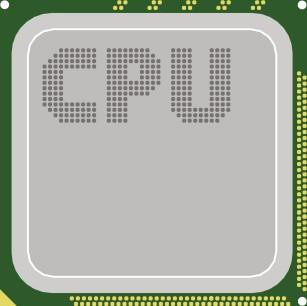

- La **memoria RAM** (*Random Access Memory*) está presente en la mayoría de dispositivos electrónicos (dentro del procesador como caché, en unidades SSD como *buffer* o caché, en tarjetas gráficas como memoria de vídeo, etc.). No obstante, cuando se habla de memoria RAM, la mayoría de las veces se refiere a la memoria principal del equipo. Existen diversas tecnologías de RAM que veremos en unidades posteriores.

    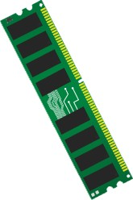

- Los **conectores** o puertos físicos son aperturas en la parte trasera, frontal o lateral del un dispositivo a través en los cuales se puede conectar un dispositivo por medio de un cable. El número y tipos de puertos en un computador determinan los tipos de dispositivos que se pueden conectar.

    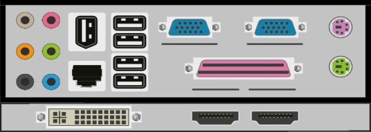

- La **caja y el chasis** son estructuras metálicas que sirven de soporte para montar y proteger otras partes. Son estructuras rígidas y resistentes, que no se doblan fácilmente. Además de elemento protector sirven como elemento de refrigeración. En servidores se utilizan los **racks**, con medidas estandarizadas por la industria.

    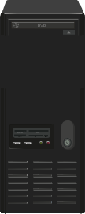

    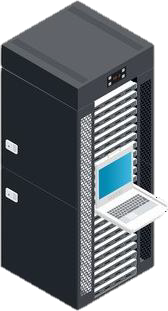

- La **fuente de alimentación** a su vez proporciona electricidad a los componentes internos del SI.
    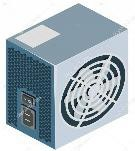 

- La **placa base** (*mainboard*) es el elemento principal de cualquier ordenador o computadora. A ella se conectan todos los demás dispositivos, como pueden ser el disco duro, la memoria o el microprocesador, y hace que todos estos componentes funcionen en equipo. De ella dependerán los componentes que podremos instalar y las posibilidades de ampliación del ordenador. Físicamente, es una placa de material sintético formada por un circuito impreso, en la que se halla un conjunto de chips, el chipset, la BIOS, los puertos del ratón y del teclado, los conectores IDE y SATA, el zócalo del microprocesador, los zócalos de memoria, los puertos paralelo y serie, etc.

    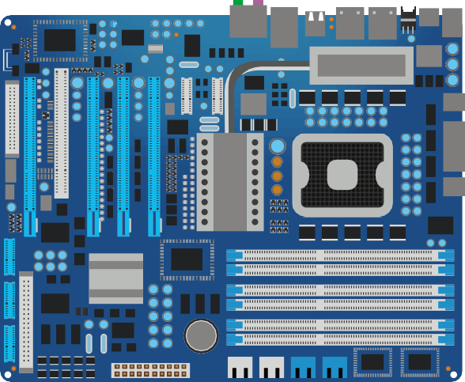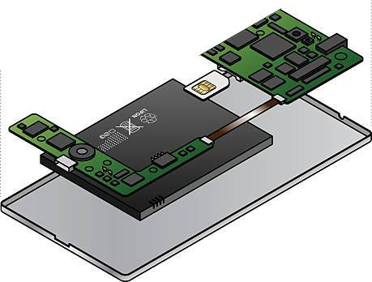


- Las **unidades de almacenamiento** o memoria secundaria tales como SSD, discos duros y dispositivos ópticos como DVD almacenarán cualquier tipo de información para que persista y no se pierda. Su relación con el resto de dispositivos es crítica para garantizar una capacidad y rendimiento de datos en el sistema, especialmente en servidores de datos.

    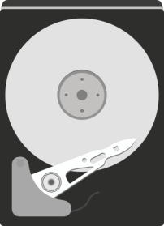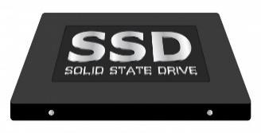

    

- La **tarjeta gráfica**, también conocida como tarjeta de vídeo es la responsable de mostrar texto, imágenes y gráficos en el dispositivo de salida (monitor o pantalla). Muchos procesadores actuales en dispositivos móviles o portátiles ya integran esta función; sin embargo, la mayoría de ordenadores potentes o consolas utilizan tarjetas gráficas para potenciar y mejorar la salida de datos hacia el monitor.

    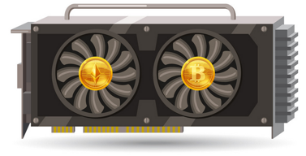

- Las **tarjetas de expansión** son muy variadas y de diversos tipos, casi tantas como dispositivos computacionales existen. Pueden usarse para ampliar puertos, capturar o emitir video, interfaces de red o salidas auxiliares.

    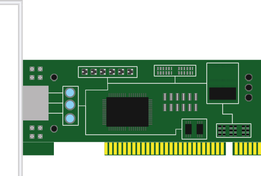


## Fuente de alimentación

```note
En electrónica, una **fuente de alimentación** o power supply unit (PSU) es el dispositivo que convierte corriente alterna (CA), en una o varias corrientes continuas (CC), que alimentan los circuitos de un dispositivo electrónico.
```

Si bien existen (o existieron) diferentes tipos de fuentes de energía para las computadoras, debemos saber que todas ellas poseen el mismo principio de funcionamiento y partes principales: **etapa primaria** y **etapa secundaria.**

-   La **etapa primaria** o **fase de rectificación** es la parte del circuito donde ingresa la corriente alterna de la línea eléctrica. Por seguridad, posee un fusible, y es aquí donde se encuentran los diodos rectificadores que convierten la corriente alterna en continua.
-   La **etapa secundaria** rectifica y filtra la corriente que irá a los componentes internos del ordenador. Algunos de los componentes de la fuente producen excesivo calor, por lo cual poseen disipadores y uno o más ventiladores para expulsar el aire caliente.

    

### Esquema fuente

Esquema de la **etapa primaria** o **rectificadora** de una fuente de alimentación:

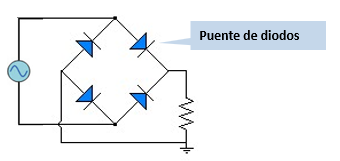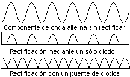

Esquema completo de todas las **fases** de una fuente de alimentación:

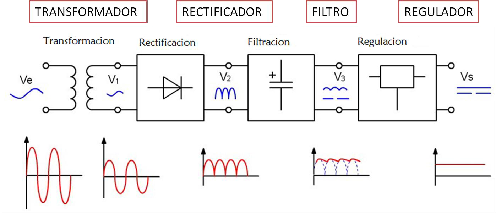

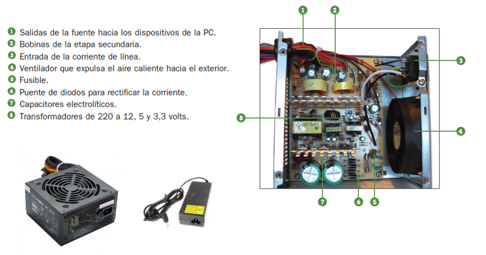

### Características

-   Las fuentes de alimentación para dispositivos electrónicos pueden clasificarse básicamente como fuentes de alimentación **lineales** o fuente de alimentación de tipo **conmutadas**.
-   Un punto crítico de estos elementos de alimentación es el de la **potencia** de la fuente de alimentación, medida en watios. Tiene que ser lo suficientemente potente como para suministrar energía a todos los componentes del equipo. En el mercado podremos encontrar fuentes genéricas de unos *300-400W* y fuentes de marca y calidad a partir de *500W* a *850W*.
-   En la actualidad con el uso de tarjetas gráficas y servidores muy exigentes de última generación demandan un alto consumo energético, es conveniente elegir una fuente de alimentación que permita el uso de estos dispositivos sin apuros y/o con redundancia.
-   En el mercado también se da una importancia cada vez mayor al nivel de ruido    que emiten estos dispositivos, y se intenta instalar fuentes silenciosas.

### Formato ATX

La mayor parte de fuentes tiene un formato ATX (*Advanced Technology eXtended*) Las características del estándar **ATX**, con respecto al obsoleto AT, son prácticas y ventajosas, ya que permiten el apagado del equipo por software.

Se puede programar mediante aplicaciones especiales el apagado de equipos a una determinada hora, junto con la posibilidad de encender el equipo vía ratón, teclado, red o establecer la hora a la que deseamos que se encienda a diario.

Para fuentes muy compactas existe el formato de fuentes conocido como **SFX.**

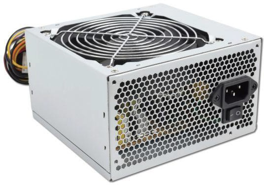

### Formato modular

Las fuentes **modulares** son otro tipo de fuentes que permiten conectar en forma opcional cada cable a su salida y traen consigo cables con conectores *Molex, Serial-ATA y PCI-E*, que vienen sueltos, pudiendo conectarse a la fuente solo si se los necesita. Así, ningún cable innecesario quedará colgando ni obstruyendo la correcta circulación del aire. Es una idea muy práctica para optimizar la ventilación en el interior de las torres.

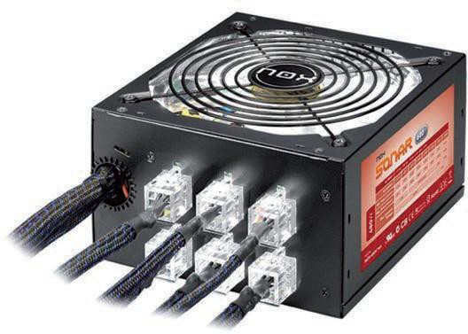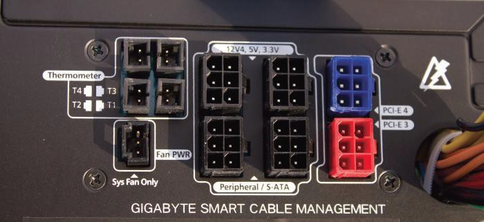

### Formato portátil

Hay múltiples formatos de fuentes portátiles, dependiendo el tamaño del dispositivo:

-   Para ordenadores portátiles
-   Para smartphones o tablets (cargador usb)
-   Para servidores

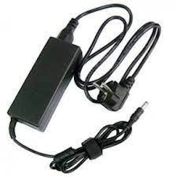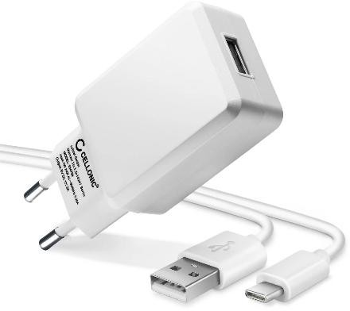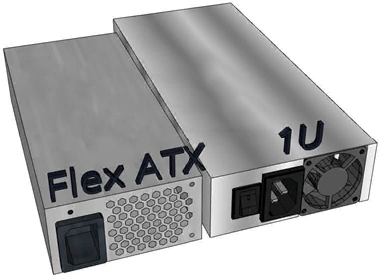

### Conectores de la fuente

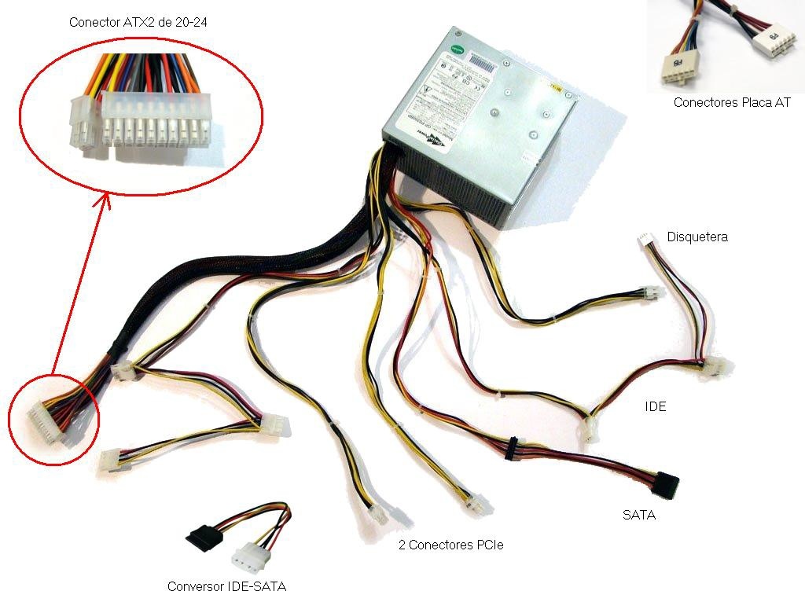

Este conector es el que lleva la alimentación principal desde la fuente a la placa base. Está compuesto por un conector principal de 20+4 pines que proporciona **12V** a la placa base.

### Fuentes de buena calidad

El factor determinante que mide si una fuente es de buena calidad es su **eficiencia**. Una fuente de alimentación con una eficiencia del 80% proporciona el 80 por ciento de su voltaje nominal como potencia efectiva para el sistema, mientras que pierde el otro 20% como calor.

**80 PLUS** es una prueba de certificación que verifica la eficiencia real de la fuente de alimentación para un ordenador. Si una empresa opera un gran número de ordenadores o servidores, el uso de fuentes de alimentación con Certificación 80 PLUS puede ahorrar dinero a largo plazo.

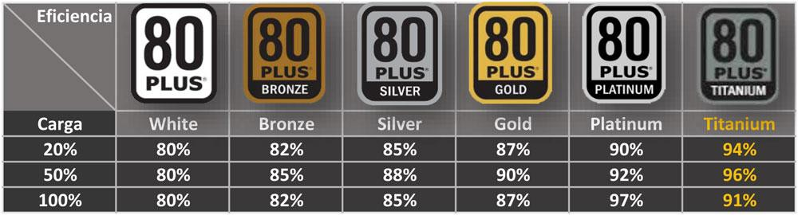


## Sistemas de Alientanción

```note
Los Sistema de alimentación ininterrumpida (SAI), son dispositivos que gracias a
sus baterías, proporcionan alimentación a los dispositivos que estén conectados a ellos de forma constante, incluso cuando se corta el suministro eléctrico.
```

Otra función importante de los SAI es la de **regular la señal eléctrica** que llega a nuestro equipo, de forma que lo haga de una forma constante y sin picos y bajos de intensidad, para así preservar la fuente de alimentación y otros componentes como la placa base.

Los SAI dan energía eléctrica a equipos críticos, como pueden ser aparatos médicos, industriales o informáticos que, como se ha mencionado, requieren tener siempre alimentación y que ésta sea de calidad, debido a la necesidad de estar en todo momento operativos y sin fallos (picos o caídas de tensión).

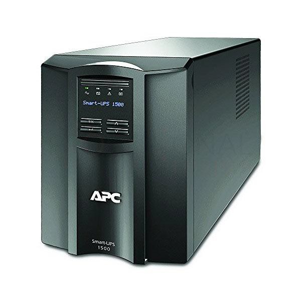

Defectos o alteraciones en la señal eléctrica que llega a un hogar o CPD:

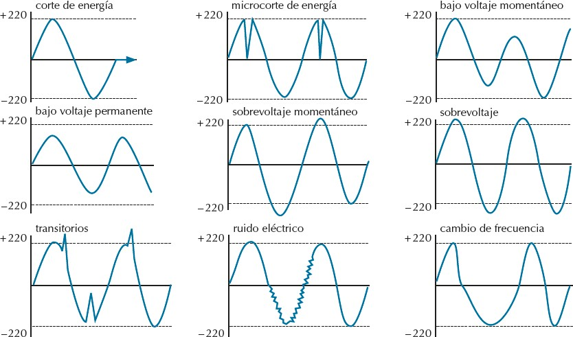

### Tipos de SAI

Otro parámetro importante, a veces crítico, es la **cantidad de tiempo** que puede suministrar energía la batería de un SAI.

Los SAI deben contar con un sistema de conversión entre corriente alterna y corriente continua, ya que las baterías siempre irán alimentadas en continua, y la fuente de alimentación de nuestro PC se alimentará en corriente alterna.

Existen los siguientes tipos de SAI:

- SAI offline (Stand-by)
- SAI en línea interactivo (inline)	
- SAI online 

#### SAI offline (Stand-by)

Los SAI offline son el modelo más simple que podemos encontrar en el mercado, y se llama así porque no protege activamente los equipos de sobretensiones prolongadas ni filtra la señal de corriente hasta llegar a ellos. En este caso es un equipo que solamente nos protege de cortes de corriente, mediante una batería de corta duración, y de picos de tensión y sobretensiones puntuales a lo sumo.

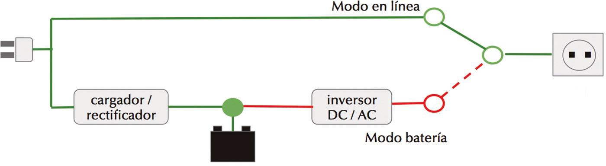

#### SAI en línea interactivo (inline)

Son equipos de protección más sofisticados que los standby. Estos SAI protegen también de las infratensiones y sobretensiones prolongadas además de ruidos en la señal. Para hacer esto el equipo cuentan con un **regulador de voltaje**, que hace las veces de filtro para estabilizar la corriente que pasa a través del SAI hacia el equipo. De esta forma **la señal eléctrica se regula y corrige** para eliminar picos peligrosos de la señal.

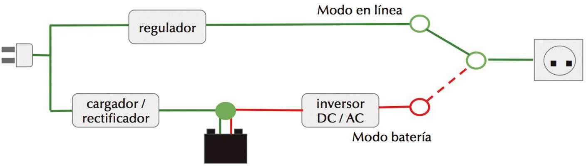

#### SAI online

El SAI más completo de todos y que proporciona mayor protección. Con ellos, además de las acciones anteriores, también protegerá de distorsiones de onda alterna, variaciones de frecuencia y microcortes de corriente.

Para ello estos SAI utilizan un sistema que de conversión completa de la corriente de entrada en una señal totalmente nueva. La electricidad primero es transformada en corriente continua para que sea almacenada y pasa a través de las baterías, luego es nuevamente transformada en corriente alterna para que sea suministrada al equipo conectado.

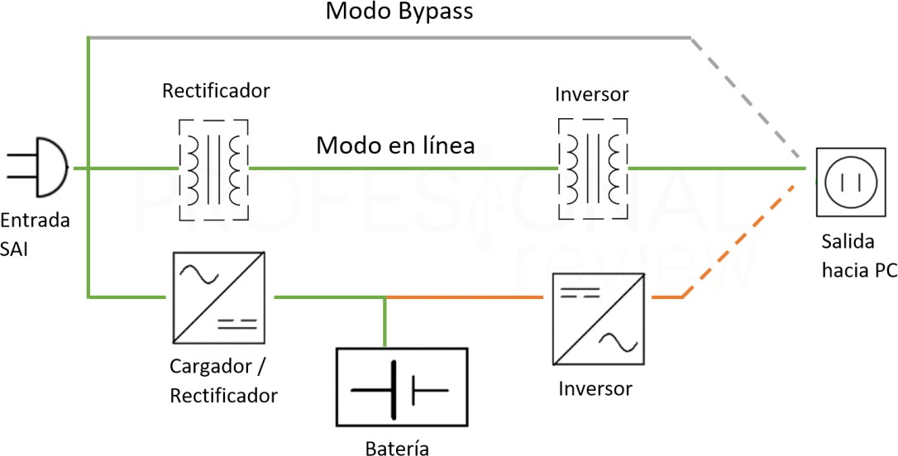

## Cajas y chasis

```note
La caja y el chasis son estructuras metálicas o de cualquier otro material que sirven de soporte para montar, refrigerar y proteger el resto de partes internas de la multitud de sistemas informáticos existentes en la actualidad. 
```

En cuanto al material de las cajas, las más comunes están hechas de chapa troquelada y plástico en el frontal. La chapa troquelada es un material muy económico que no ofrece mucha rigidez, aunque muchas otras están hechas de aluminio. Los teléfonos móviles suelen tener chasis de aluminio, materiales cerámicos y cristal, los portátiles mientras que los servidores utilizan bastidores llamados rack para almacenar los diferentes componentes que se pueden agrupar en un CPD.

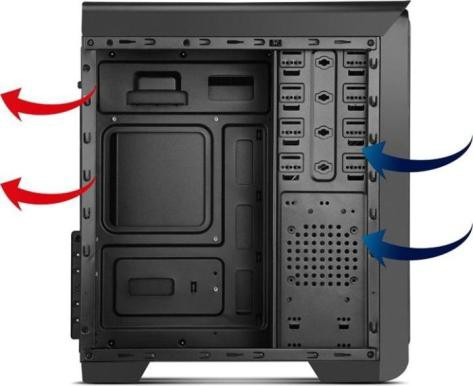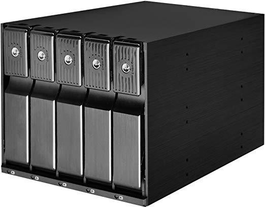

El **tamaño** de las carcasas viene dado por el factor de forma de la placa base y el
uso final de dicho dispositivo comercial:

### Formato torre

El formato más conocido. Normalmente una carcasa contiene cajas para las fuentes de alimentación y bahías de unidades. En el panel trasero se puede localizar conectores para los periféricos procedentes de la placa base y de las tarjetas de expansión. En el panel frontal encontramos, en muchos casos, botones de encendido y reinicio y LED que indican el estado de la máquina, del uso del disco o la actividad de red.

Entre los tantos formatos de **torres** de sobremesa, los más habituales son:

-   **Formato estándar**. Las cajas más utilizadas son las ATX y micro-ATX. La ventaja de este tipo de cajas es que pueden albergar los formatos de placa base más comunes que veremos más adelante.
-   **Formato pequeño**. Cajas mini-ITX. Suelen soportar placas base mini-ITX, las cuales son muy usadas cuando se desea un formato reducido. Este tipo de cajas suele tener una fuente de alimentación de poca potencia (alrededor de 150 W).

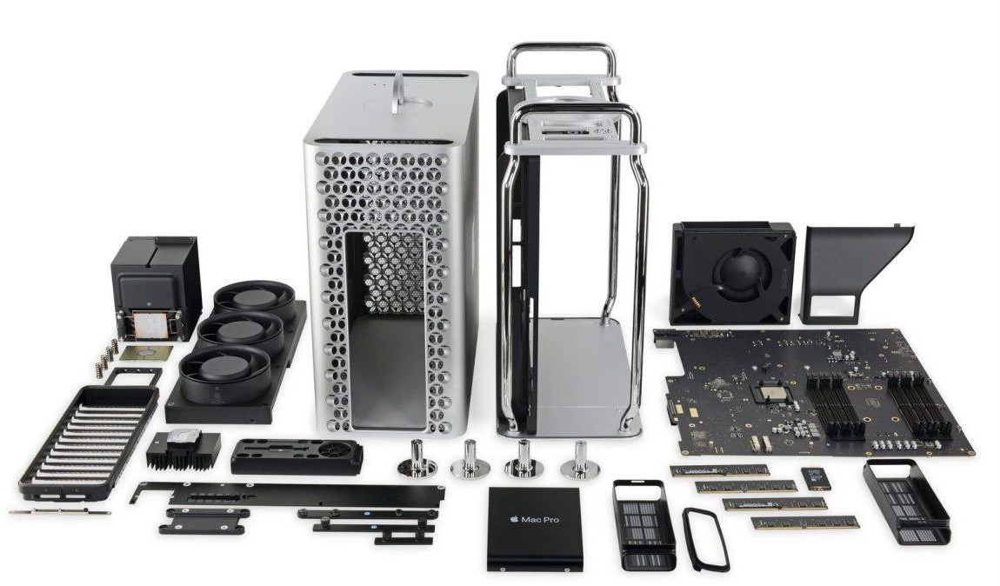

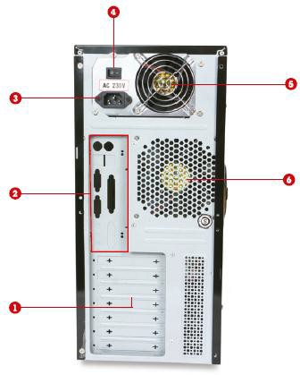 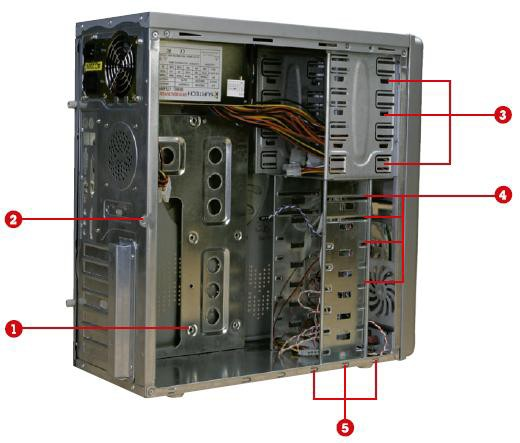

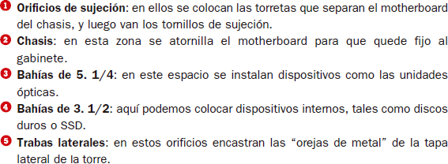 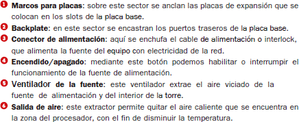

Una **correcta refrigeración de los componentes** del equipo se antoja muy relevante si queremos que estos funcionen siempre de manera óptima y no averíen antes de tiempo.

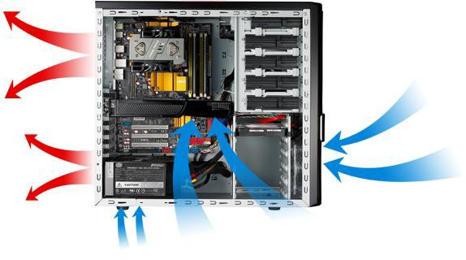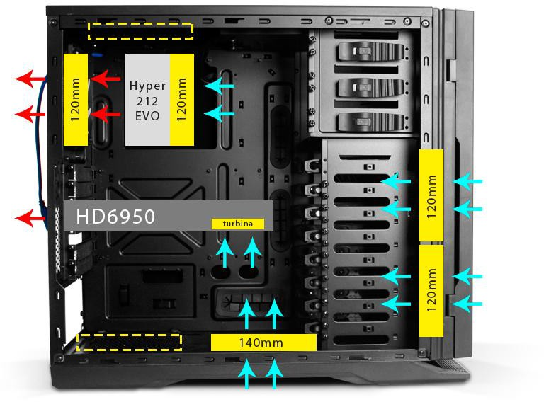

### Formato servidor

El formato para servidor está pensando para equipos que procesan mucha carga de información y programas, pensando en la comunicación con los equipos conectados a este. Están preparados para soportar mayores cargas de trabajo. Existen muchos formatos de servidor dependiendo su uso; torre, rack, blade, etc.

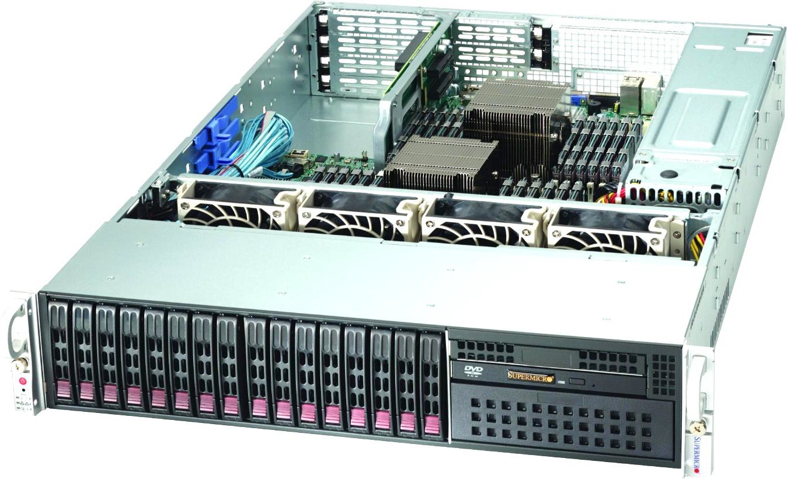

### Formato racks

Un **rack** o armario rack, es un tipo de estructura diseñada especialmente para alojar en su interior dispositivos tecnológicos, como equipos o servidores, así como equipos de red, como switches o routers, entre otros, utilizado generalmente en salas de comunicaciones de empresas o en sus CPD (centro de procesamiento de datos). Veremos su configuración en posteriores unidades.

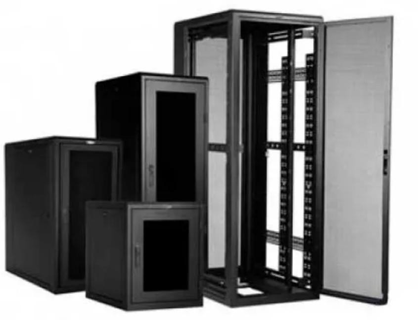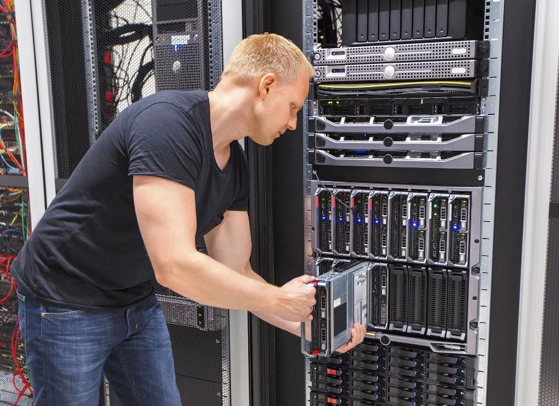

```note
El interior de un armario rack tiene 4 bastidores que forman un armazón de 19 pulgadas de anchura. Esta medida es estándar y universal.
```

La parte delantera de los racks es una puerta, habitualmente de cristal o un material transparente, que permite visualizar el contenido del armario sin tener que abrirlo.

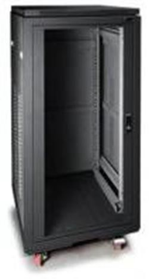

Las paredes, puerta y el techo son desmontables para facilitar la instalación de los elementos que se colocarán dentro.

Además, el suelo y el techo pueden tener una abertura para pasar todo el cableado.

```note
Los bastidores tienen agujeros cada 5 cm, esta distancia se llama unidad U, de modo que la altura de un armario se mide en unidades U. 
```

### Formato portátil

Los ordenadores portátiles son una versión compactada de un PC. Tiene todos sus componentes esenciales, pero ubicados en un espacio mucho más reducido y la utilización de baterías. El hecho de tener un espacio limitado genera el retos de la refrigeración de sus componentes, especialmente CPU y GPU si es independiente.

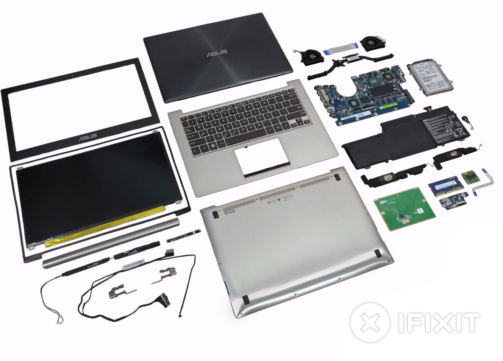

### Modding

El **modding** es la técnica que permite realizar modificaciones a un ordenador para lograr una estética con mayor espectacularidad y funcionalidad. Todas aquellas personas que realizan modding se les llama *modder*.

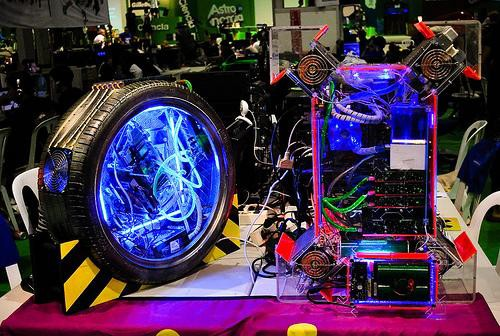 


## Placas base

```note
La **placa base** (motherboard) es el elemento principal de cualquier dispositivo computacional. Contiene un circuito impreso, junto con los chipsets, al que se conectan todos los demás dispositivos, como discos, la memoria o el microprocesador, y hace que todos estos componentes funcionen en equipo.
```

El modelo de placa base a su vez determinará los componentes que podremos instalar y sus posibilidades de ampliación o reemplazo.

La placa base, además incluye un chip con el firmware llamado BIOS (UEFI), que permite configurar funcionalidades básicas, de arranque y carga del SO.

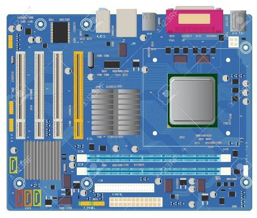

Una placa base tiene al menos los siguientes componentes:

-   Conectores de energía a la fuente de alimentación.
-   Zócalo de CPU
-   Ranuras de memoria RAM.
-   Ranuras de expansión y de la tarjeta gráfica
-   Chipsets.
-   Buses y puertos de E/S.

### Formato forma

Familias de **factores forma** de placas base para ordenadores personales, portátiles o servidores:

-   E-ATX, ATX, Micro-ATX, Mini-ATX, Flex-ATX
-   ITX, Mini-ITX, Nano-ITX, Pico-ITX
-   BTX
-   DTX

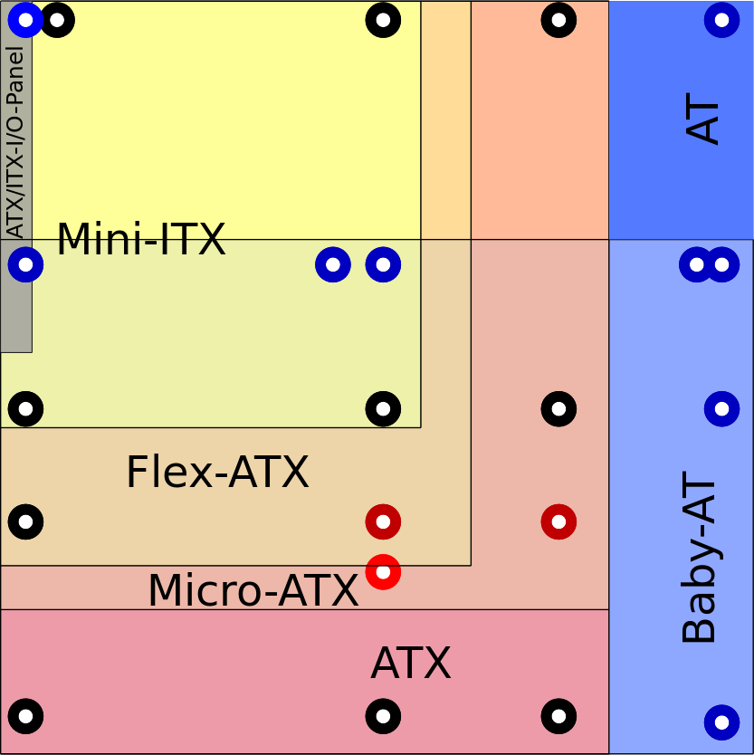

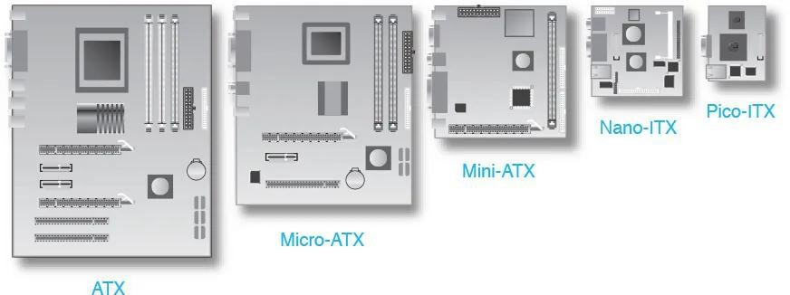
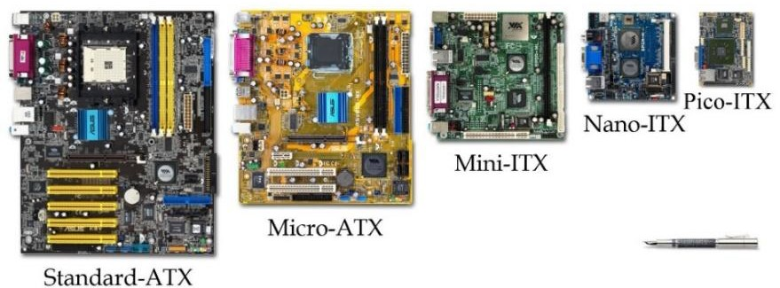

### Esquemas

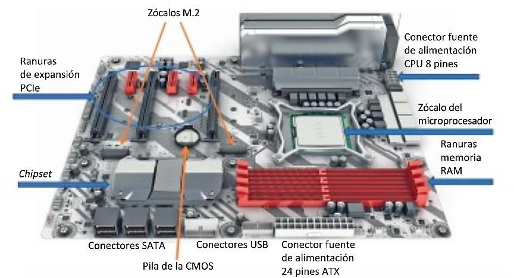

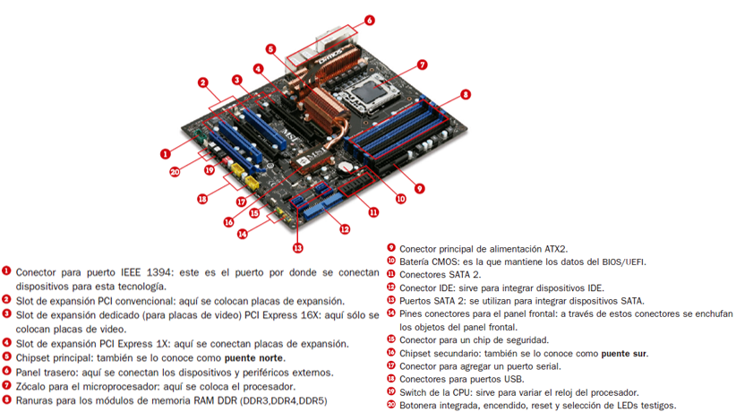


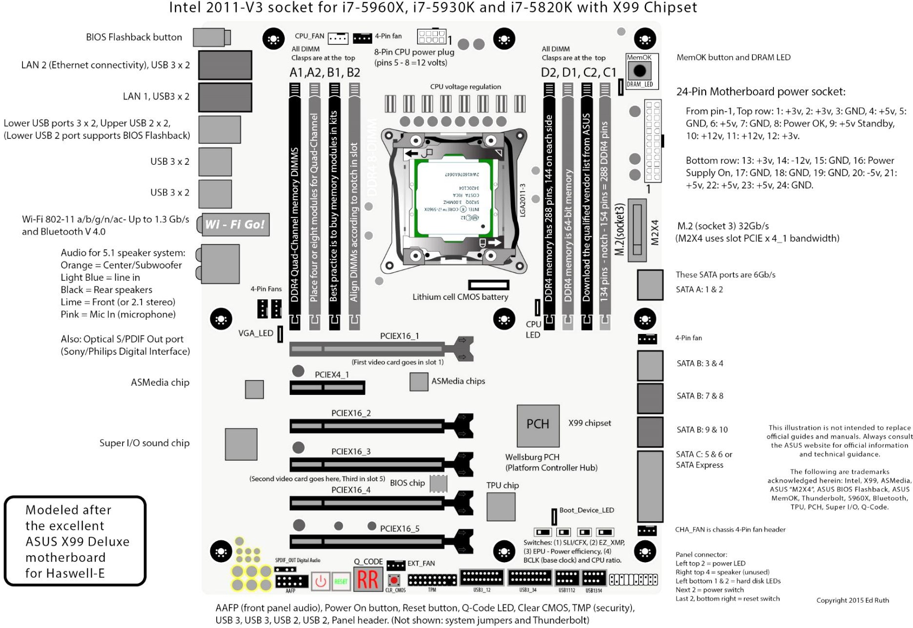


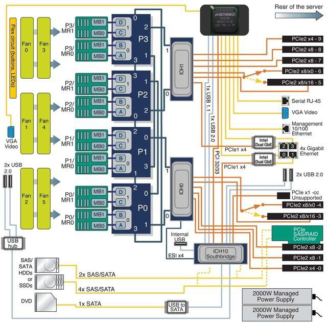

### El chipset

```note
Se conoce como chipset al conjunto de chips integrados en la placa que se encargan de controlar y administrar las comunicaciones y los flujos de datos entre el microprocesador y los demás componentes de la placa base. 
```

Antiguamente se dividía en **northbridge** y **southbridge,** aunque actualmente va unificado en **un solo chip**.


> Del tipo de *chipset* dependerá el procesador o memoria que admite la placa, frecuencia del FSB *(Front Side Bus),* adaptador gráfico,etc.

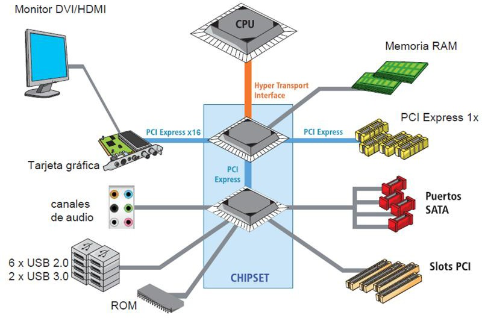

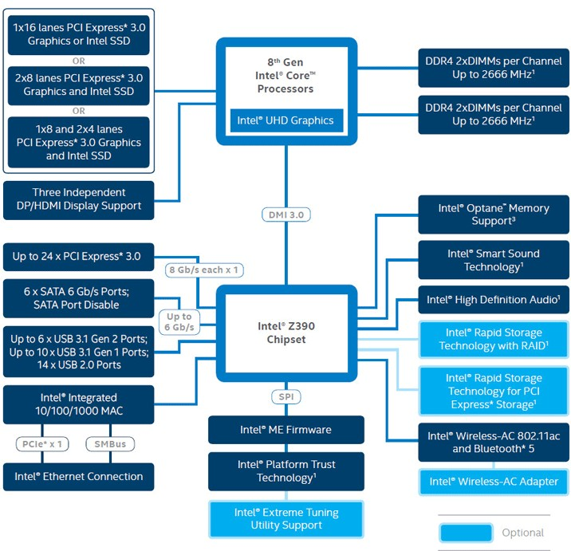

### Socket (zócalo) de la CPU

El zócalo, o **socket** en inglés, es un tipo de conector generalmente propietario donde se coloca el microprocesador en la placa base, quedando fijado, sin obligación de soldarse. Funciona como interfaz entre el circuito integrado de la placa base y el microprocesador, además de proporcionarle energía.

Los sockets tanto para fabricantes Intel como para AMD, cuentan con una base que posee ranuras de contacto (donde se insertan los **pines** o contactos de la pastilla del procesador) y un sistema de **anclaje** conocido como guillotina. Los mecanismos de retención del integrado y de conexión dependen de cada tipo de zócalo o placa base específica.

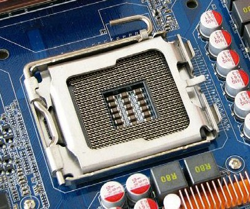

> Las placas con sockets para procesadores Intel son incompatibles con los que poseen sockets para AMD, y viceversa.

En el caso de muchos portátiles y los teléfonos móviles tanto la memoria como dichos procesadores están directamente **soldados** a la placa base.

### Ranura de video 

El **dispositivo de video** es otro de los cinco componentes críticos del ordenador. Algunos microprocesadores incluyen un procesador gráfico en el encapsulado que permite al sistema la colaboración estrecha entre este procesador y el microprocesador principal. Al estar en el mismo encapsulado, la información entre uno y otro fluye de forma rápida y eficiente. Esto es crítico en dispositivos móviles o smartphones, los cuales no disponen de tarjetas gráficas adicionales.

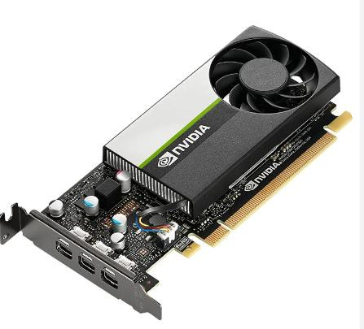

En equipos que requieren una gráfica potente existe una ranura de video cuya misión es conectar a altísima velocidad el microprocesador con la **tarjeta gráfica** externa utilizada.

El puerto **PCI-Express** la ranura de video utilizada para la interconexión de la tarjeta de vídeo con la placa base.


### Ranuras DIMM de memoria

La memoria RAM es otro de los dispositivos críticos de cualquier equipo informático. Las ranuras o zócalos donde se insertan los módulos de memorias RAM se denominan **ranuras DIMM**. Existen diversos zócalos de memoria dependiendo de su tecnología y formato forma.  

El **dual channel** es una tecnología para memorias aplicada en las computadoras u ordenadores personales, la cual permite el incremento del rendimiento gracias al acceso simultáneo a dos módulos distintos de memoria.

Veremos las características de la memoria más detalladamente en el apartado dedicado a memoria RAM.

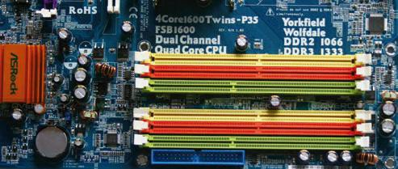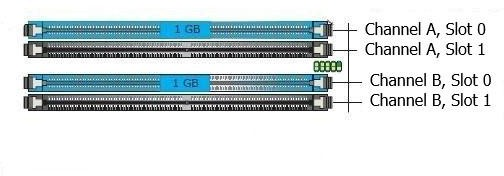

### Ranuras de almacenamiento

Las ranuras de almacenamiento en una placa base son fundamentales para la conectividad de **dispositivos de almacenamiento** como SSDs, discos duros y otros componentes de almacenamiento.

Las dos ranuras almacenamiento más utilizadas son:

-   **SATA**: Sirven para conectar mediante un cable de color rojo dispositivos de almacenamiento tradicionales, como discos duros (HDD) o unidades de estado sólido (SSD).

    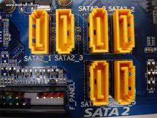

-   **PCI Express**: Originalmente diseñado para tarjetas gráficas y otros periféricos de alta velocidad, como tarjetas de red, se ha adaptado también para dispositivos de almacenamiento, especialmente con el auge de los SSD NVMe.

    

### Ranuras de expansión

Una ranura o **slot de expansión** es un elemento de la placa base de un ordenador que permite conectar a ésta una tarjeta adaptadora adicional o de expansión.

A lo largo de la historia de la computación han existido una enorme cantidad de ranuras de expansión, pero muchas de ellas han quedado en desuso y, en la actualidad, hay dos slots que predominan en las placas base: el más antiguo pero vigente se llama **PCI** y su evolución, el **PCI Express**.

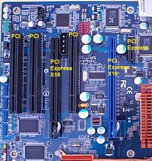

### Conectores traseros

Las placas base tienen una serie de **conectores externos traseros**, que estudiaremos más adelante cuando veamos el tema de los tipos de conectores.

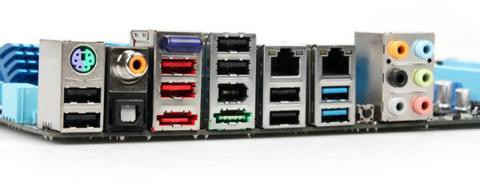

### ROM (BIOS/UEFI)

Este dispositivo es esencial para la placa base y se usa para controlar el hardware elemental y el proceso de arranque. En la **ROM** reside un programa llamado **BIOS/UEFI**.

Su función primordial es la de inicializar los componentes de hardware y lanzar el sistema operativo del dispositivo. Además, con la carga de la BIOS/UEFI desde la ROM se inicializarán otras funciones de gestión importantes como la gestión de energía, virtualización y el arranque seguro.

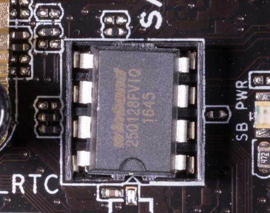


### Recorrido de los datos

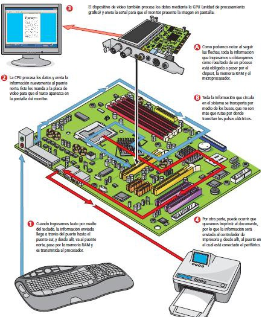
