# UT2.6: Componentes hardware - Microprocesadores y memorias

## El microprocesador

```note
El microprocesador es el componente principal del ordenador. Dirige y controla todos los componentes, se encarga de llevar a cabo las operaciones matemáticas y lógicas en un corto periodo de tiempo y además decodifica y ejecuta las instrucciones de los programas cargados en la memoria RAM.
```

Los microprocesadores son los circuitos integrados más complejos, que han ido evolucionando con el paso del tiempo incluyendo más y más transistores con una tecnología de fabricación cada vez más reducida.

En principio tenemos que hacer una diferenciación elemental entre el **microprocesador**, que es un elemento de hardware, y la **CPU** (unidad central de procesamiento), que es un concepto lógico.

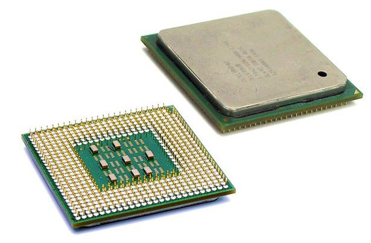

Actualmente, el objetivo de la ingeniería informática es conseguir el mayor **rendimiento** a través de un microprocesador con el mayor número de núcleos posible especializados, mayor **frecuencia** de reloj y con un **consumo energético** reducido.


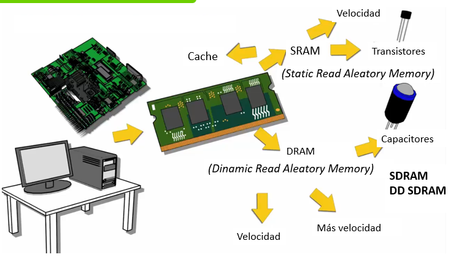

Estamos viviendo una época de cambios, de nuevas tecnologías y sobre todo de nuevos microprocesadores y arquitecturas que están consiguiendo aumentar la potencia por cada chip permaneciendo vigente por el momento la Ley de Moore.

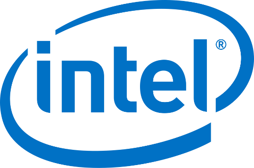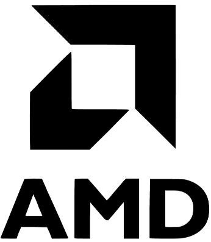

Sin embargo, la capacidad de los procesadores no será suficiente por sí sola para manejar la enorme cantidad de datos que se generará en los próximos años. Por ello, se están desarrollando soluciones complementarias como la computación paralela, la computación en la nube, la inteligencia artificial y los procesadores especializados (GPU, TPU, NPU, etc.) que permiten aumentar la capacidad de cómputo de forma más eficiente.

### Partes lógicas


Las **partes lógicas** que integran un procesador, ya conocidas son:

-   **Unidad de Control**: se encarga de buscar las instrucciones en la memoria principal y pasarlas al decodificador para ejecutarlas.
-   **Decodificador de instrucciones**: es el encargado de interpretar en implementar la instrucción.
-   **Unidad Aritmético-Lógica**: la parte de la CPU encargada de realizar las operaciones aritméticas y lógicas sencillas.
-   **Unidad de coma flotante o coprocesador** (*FPU*): realiza las operaciones en coma flotante, es decir aquellas operaciones matemáticas demasiado complejas y con decimales. Es conocido como coprocesador matemático y es el origen de las tarjetas gráficas modernas.
-   **Registros y memoria caché**: En los registros se almacena y se opera con los datos, mientras que la memoria cache sirve para acelerar el sistema.


### Partes físicas

En cuanto a las **partes físicas** de un procesador, observables a simple vista:

-   **Encapsulado**: es lo que rodea a la oblea de silicio en sí, para darle consistencia, impedir su deterioro (por ejemplo, por oxidación con el aire) y permitir el enlace con los conectores externos que lo acoplarán a su zócalo o a la placa base.
- **IHS** (*Integrated Heat Spreader*): Actualmente los procesadores incluyen un difusor de calor integrado, muy parecido a un disipador, difundiendo el calor del núcleo por toda su superficie para transmitir el calor desde una mayor superficie.
-   **Pines o contactos**: también conocidos como E/S (entrada/salida) o I/O en inglés. Son las patillas o contactos de conexión entre la CPU y el socket por dónde pasa la información y las diferentes señales de comunicación.

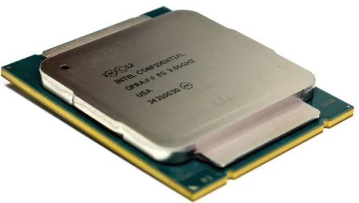

## Características del microprocesador

A continuación, veremos y describiremos sus principales **características**:

-   Velocidad e IPC del microprocesador
-   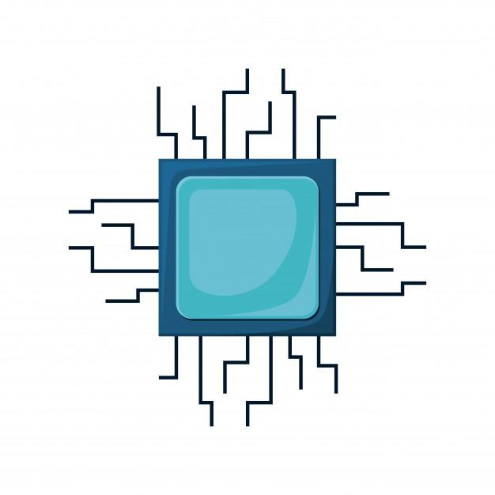Arquitectura CISC o RISC.
-   Tecnología de fabricación.
-   Memoria caché.
-   Núcleos del procesador.
-   big.LITTLE.
-   Nombre comercial o nombre clave.
-   Hyperthreading o SMT (Intel y AMD).
-   Potencia (TDP) y TurboBoost.
-   Refrigeración y Overclocking.
-   Otros elementos integrados.

### Velocidad e IPC

La **velocidad** o frecuencia mide en Megahercios (MHz) o Gigahercios (**GHz**) y es la que marca el ritmo de trabajo del procesador (reloj interno).

No obstante, hay que tener en cuenta que la velocidad por sí misma no refleja la velocidad del microprocesador, también intervienen su tecnología y el número de núcleos del mismo.

Es importante destacar que los micros modernos tienen dos velocidades:

-   **Velocidad interna**: es la velocidad a la que funciona el micro internamente. Por ejemplo, *2 GHz* o *3,20 GHz*.
-   **Velocidad externa** o del bus de sistema: también llamada **velocidad FSB**, es la velocidad a la que el micro se comunica con la placa base, inferior a la interna. Por ejemplo, *800 MHz, 1333 MHz o 1600 MHz*.

El concepto de **IPC** es fundamental para entender el rendimiento real de un procesador. IPC significa “Instrucciones por ciclo de reloj” y mide cuántas instrucciones es capaz de ejecutar un procesador en cada ciclo de reloj.

En otras palabras:

-   El **IPC** refleja **la eficiencia de la arquitectura interna** del procesador.
-   La **velocidad o frecuencia (GHz)** indica **cuántos ciclos por segundo** ejecuta el procesador.

El **rendimiento total** del procesador se puede expresar de forma simplificada así:

        Rendimiento ≈ Frecuencia × IPC × Núcleos activos

En cada nueva generación de procesadores, los fabricantes (Intel, AMD, Apple, ARM, etc.) intentan **aumentar el IPC**, aunque la frecuencia máxima apenas cambie.

### Arquitectura CISC o RISC

Hoy podemos distinguir entre dos tipos fundamentales de arquitecturas de **64 bits**:

-   **Arquitectura CISC** (*Complex Instruction Set Computer*): Usa instrucciones complejas y muy potentes, lo cual complica mucho el diseño de este tipo de microprocesadores. Algunos chips que usan la arquitectura CISC son los Motorola 68000 y toda la familia **Intel** x86 y **AMD**.
 -   **Arquitectura RISC** (*Reduced Instruction Set Computer*): Utiliza instrucciones muy simples y con un número limitado de instrucciones. Esta arquitectura destaca por ser *Open Source* y por estar orientada a ser totalmente modular. Se ejecutan muchas instrucciones en muy poco tiempo. Chips que usan esta arquitectura son los **PowerPC** y toda la familia **ARM** (*Snapdragon, Exynos, Kirin, A10, A11…)*


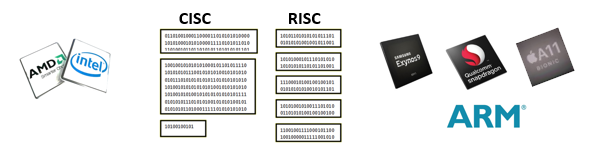


| **CISC**                                                                                  | **RISC**                                                                                                  |
|-------------------------------------------------------------------------------------------|-----------------------------------------------------------------------------------------------------------|
| Tienen conjunto de instrucciones muy variado y completo para diversas tareas específicas. | Un solo conjunto de instrucciones simple para múltiples tareas.                                           |
| Tienen las mayores tasas de rendimiento.                                                  | Tienen la mejor eficiencia energética.                                                                    |
| Ejecutan tareas de procesamiento en un menor número de líneas.                            | En un solo ciclo de reloj se completan las instrucciones, pero necesitan varias para completar una tarea. |
| Son más costosos y su diseño es mucho más complejo.                                       | Su desarrollo tiene un menor costo económico y su diseño es modular y más simple.                         |
| Los chipsets CISC son más lentos: sus instrucciones requieren más ciclos.                 | Los chipsets de esta arquitectura de son más rápidos. Permiten mayor velocidad reloj en Ghz.              |
| Utilizan más transistores que los RISC.                                                   | Utilizan menos transistores en su estructura.                                                             |
| Intel x86, AMD Ryzen                                                                      | Familias ARM, RISC-V, PowerPC                                                                             |

Aunque tradicionalmente se diferenciaban claramente, hoy las fronteras entre CISC y RISC se han ido difuminado y se puede hablar de **arquitecturas híbridas**:

-   Los procesadores **x86 modernos** traducen internamente las instrucciones CISC a microinstrucciones tipo RISC.

-   Los procesadores **ARM modernos** incorporan instrucciones más complejas, acercándose a CISC en funcionalidad.

Hoy ya no se puede hablar de CISC o RISC puros, sino de procesadores híbridos, que buscan combinar lo mejor de ambos mundos: la compatibilidad de CISC con la eficiencia y simplicidad de RISC.

La arquitectura **RISC-V** es especialmente interesante en la actualidad por ser abierta (open source) y en rápida expansión en ámbitos educativos, de investigación y diseño de hardware libre.

### Tecnología de fabricación

Se expresa en **nanómetros** (un nanómetro o *nm* es la milmillonésima parte de un metro: 10-9 metros) e indica el tamaño de las puertas lógicas o elementos más pequeños que posee un microprocesador.

Que un microprocesador tenga una tecnología de **5 nanómetros** no quiere decir que todas las puertas lógicas tengan ese tamaño exacto, sino que tendrán un tamaño aproximado a 5 nanómetros.

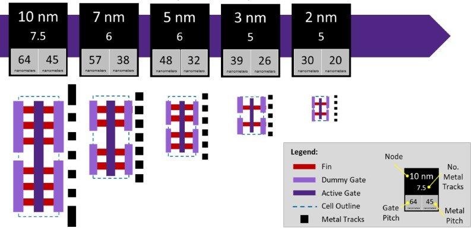

### Memoria caché


Una de las características de los microprocesadores es la **memoria caché**, muy rápida y de pequeño tamaño, tal y como vimos en unidades anteriores.

Existen diversos niveles de caché denominados **L1**, **L2** y **L3**:

-   **La caché L1** funciona a la máxima velocidad y es la más cercana al núcleo del procesador. Su tamaño se mide en KB (*32-64KB*). Hay tantas caché L1 como núcleos del microprocesador.
-   **La caché L2** es algo más lenta que la L1 y está conectada al microprocesador mediante su bus trasero. Tamaño de unos pocos MB (*1MB*)
-   **La caché L3** es más lenta que la L2, pero de mayor capacidad. Se comparte entre los núcleos y su tamaño se mide en varios MB (*4-64MB*)

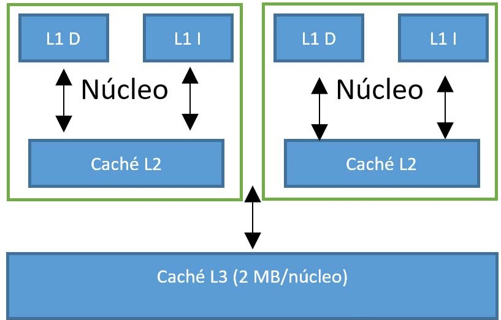

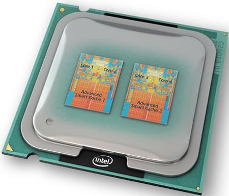

### Núcleos del procesador

Los procesadores más antiguos eran **mononúcleo** (single core) es decir, de un único núcleo. Los actuales van mucho más allá. Un procesador está formado por varios bloques, entre los que se encuentran los denominados **núcleos** o cores. Dichos núcleos se encargan de ejecutar las instrucciones, es decir son CPU que pueden ser consideradas como micros en miniatura.

A más núcleos, más unidades de procesamiento independientes y, por tanto, mayor cantidad de instrucciones se podrán procesar de forma simultánea, lo que se conoce como **paralelización**.

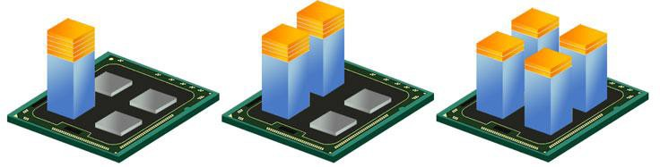


### big.LITTLE 

Los procesadores con arquitectura **ARM** introdujeron en 2011 una tecnología exclusiva llamada big.LITTLE. Esta arquitectura combina dos tipos de núcleos (cores) dentro de un mismo procesador, organizados en grupos que se activan según las necesidades de rendimiento o eficiencia energética.

-   El grupo de **cores big** (grande), que está compuesto por los núcleos más potentes (por ejemplo, *ARM Cortex-A15, Cortex-A57*), se encarga de las tareas más pesadas, como videojuegos, o uso multimedia intensivo, aunque como es lógico, consume más energía.
-   El grupo **LITTLE** (pequeño) que actúa en aquellas situaciones en las que no es necesaria tanta potencia o en reposo, y prioriza un consumo energético bajo.

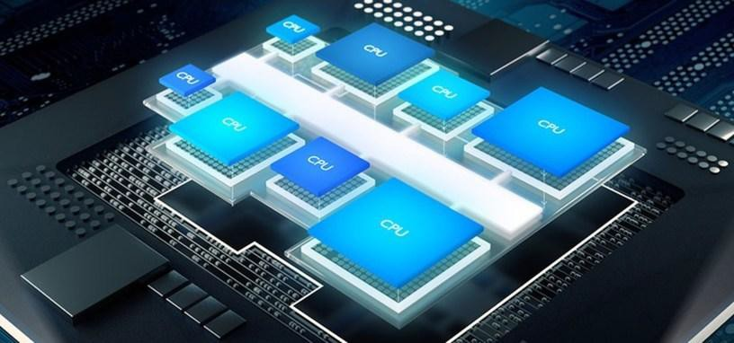

Gracias a esta arquitectura, los procesadores ARM pueden equilibrar el rendimiento y la eficiencia, alternando o combinando ambos tipos de núcleos, lo que resulta ideal para dispositivos móviles y portátiles.

### Nombre comercial

Entender el **nombre comercial** siempre cambiante de los procesadores en el mercado es objeto de un profundo estudio, que no haremos en este curso.

Veamos un ejemplo de un modelo de Intel y el significado de sus siglas:

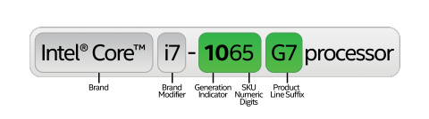

-   **Intel Core**: Nos indica la arquitectura a la que pertenece
-   **i7**: Familia de procesadores dentro de Intel Core. Esta familia tiene 8 núcleos
-   **10**: El primer número siempre indica la generación, en este caso, la décima.
-   **65**: indica que está en la zona alta en cuanto a rendimiento, dentro de la gama i7
-   **K**: esta letra significa que la CPU no tiene la velocidad bloqueada (Unlocked), así que se puede hacer overclocking para aumentar su rendimiento. Está pensado para juegos.

### HyperThreading o SMT

Los términos *HyperThreading (HT)* en **Intel** o *SMT (Simultaneous multithreading)* en **AMD** son nombres comerciales de una tecnología llamada **MultiThreading**.

```note
Dicha tecnología permite duplicar las unidades lógicas por cada núcleo, es decir, permite a un núcleo realizar dos tareas (hilos) simultáneamente. 
```

Dicha idea fue planteada por Sun Microsystem y se aprovecha que cuando trabaja la ALU no trabaja la UC, con lo que se trata de mantener a ambas siempre ocupadas, dándoles dos **hilos** de instrucciones a la vez en distintos momentos (por ejemplo, mientras una decodifica la otra lleva a cabo la ejecución de sus operandos en la ALU)

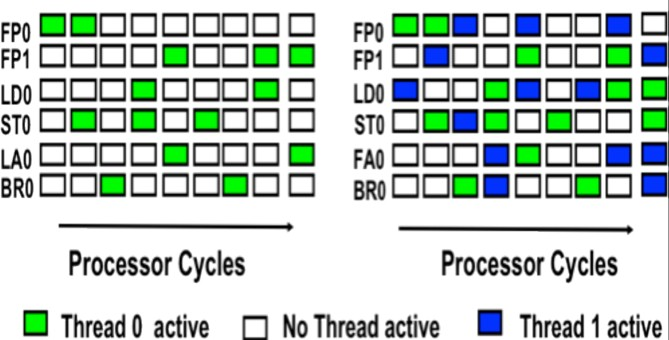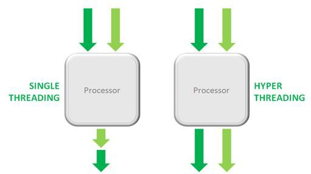 


### Potencia (TDP) y Turbo Boost

La potencia o **TDP** (*Thermal Design Power*) se define como la máxima potencia que es capaz de usar un dispositivo, la medida normalmente se da en Watios, en este caso de un procesador. Cada elemento de la placa base tiene un consumo TDP.

**Turbo Boost** es una tecnología que consiste en acelerar de forma temporal la máxima frecuencia a la que funcionan determinados núcleos del **procesador** cuando estos requieren mayor rendimiento.

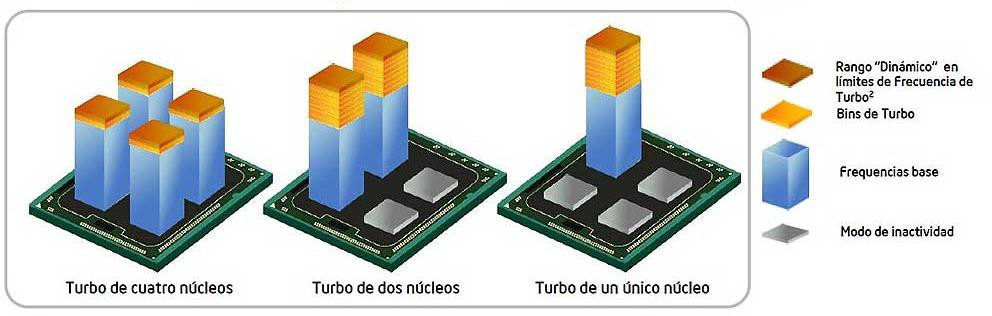


### Refrigeración y Overclocking

Debido a la enorme velocidad que alcanza la CPU y que el paso de corriente genera calor es necesario **refrigerar** el procesador. Existen diversas formas de hacer esto:

-   Mediante refrigeración pasiva (superficies metálicas)
-   Mediante refrigeración activa (ventiladores)
-   Mediante refrigeración líquida.

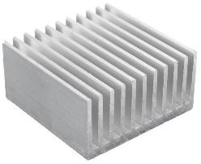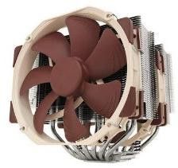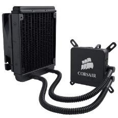

El **overclocking** es la acción de aumentar la velocidad del reloj de un componente de un ordenador aumentado para ello su voltaje.

Para *overclockear* un procesador es necesario aumentar su voltaje, lo que se conoce como un aumento del **Vcore**, lo cual aumentará su frecuencia o GHz.

El overclocking puede suponer una pérdida de estabilidad o acortar la vida útil del componente e incluso fundirlo si no se lleva bien a cabo.

### Otros elementos integrados

Con el paso del tiempo, los microprocesadores han dejado de ser únicamente una CPU encargada de ejecutar instrucciones y operaciones lógicas.Hoy en día, incorporan en el mismo chip otros componentes especializados que mejoran el rendimiento general y la eficiencia energética del sistema.

- Muchos procesadores actuales incluyen una **unidad gráfica integrada** (Integrated Graphics Processing Unit o iGPU). Esta unidad permite realizar tareas de procesamiento gráfico sin necesidad de una tarjeta gráfica dedicada (GPU independiente).
- Las **NPU** (Neural Processing Unit) son un tipo de coprocesador especializado en ejecutar operaciones de **inteligencia artificial** y aprendizaje automático.
- Módulos de **seguridad** (TPM o fTPM): implementan funciones de cifrado, autenticación y arranque seguro.


## SoC

```note
Las siglas de SoC (System on a Chip) se refieren a un sólo chip que integra todos los elementos necesarios para que un dispositivo pueda funcionar autónomamente.
```

En el SoC de un microprocesador, especialmente en aquellos de dispositivos como teléfonos móviles o tabletas donde se intenta concentrar su contenido, suelen integrar varios de los componentes fundamentales de un ordenador, como la CPU, un procesador gráfico integrado (IGP, diferente y sobre todo menos potentes que las GPU de tarjetas gráficas dedicadas), memoria, puertos de entrada salida, un módem, un DSP o chips dedicados a la seguridad.

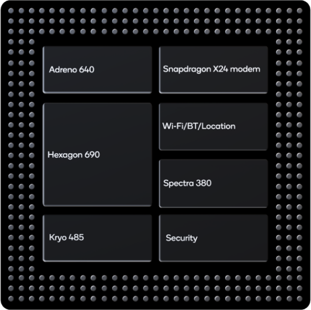


Los **SoCs** han emergido de forma espectacular con la revolución móvil y con los diseños de ARM y desarrollos de fabricantes como Qualcomm, MediaTek, Apple, Samsung o Huawei, que han sacado mucho partido de este concepto para lograr procesadores que en realidad son mucho más que eso.

Los Qualcomm *Snapdragon 8xx,* los Apple *Bionic Axx*, o los recientes M1/M2 de Apple, por ejemplo, son un buen ejemplo de este tipo de concepto: engloban una CPU con núcleos basados en los diversos Cortex-AXX de ARM en muchos casos, pero también motores neuronales para el ámbito de la inteligencia artificial, chips gráficos (como los Mali), módems para la conectividad LTE/5G o procesadores de señal digital (DSP), entre otros muchos componentes.

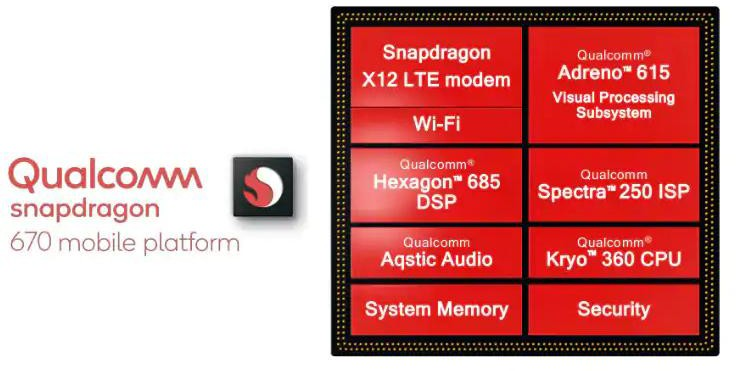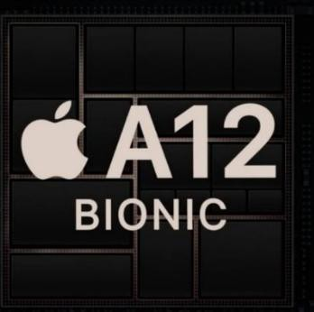


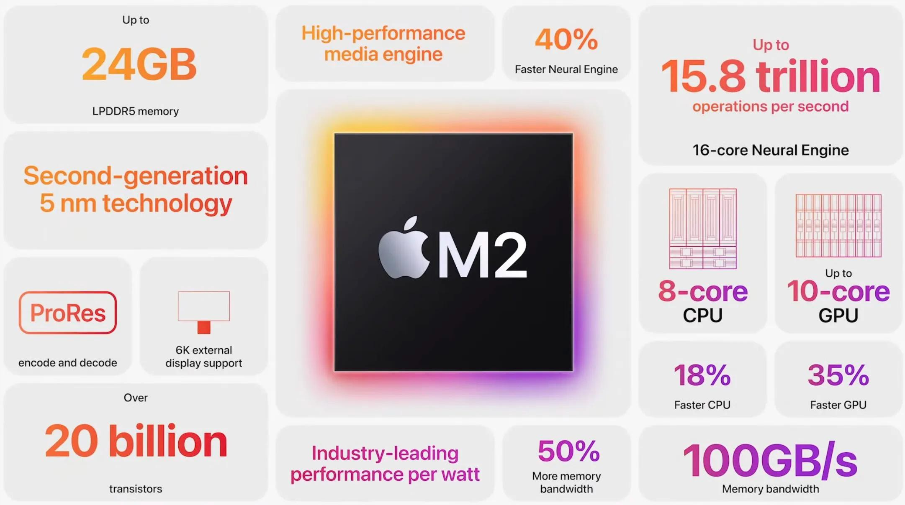

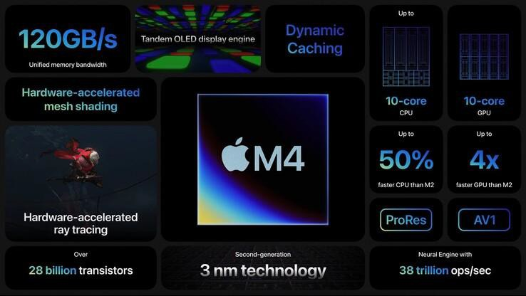


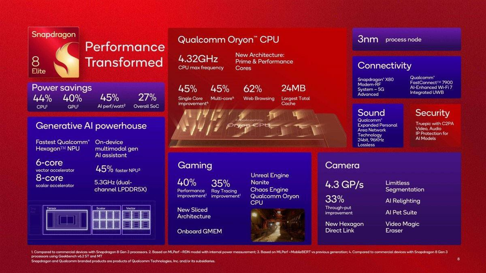


## La memoria RAM

```note
La memoria RAM (Random Access Memory) o memoria de acceso aleatorio, es la memoria principal de trabajo de un dispositivo, donde se almacenan de forma temporal el SO, los programas y los datos que se están utilizando en ese momento.
```

Se denomina de **acceso aleatorio** porque se puede leer o escribir en una posición de memoria con un tiempo de espera igual para cualquier posición, no siendo necesario seguir un orden para acceder a los datos de una forma más rápida.

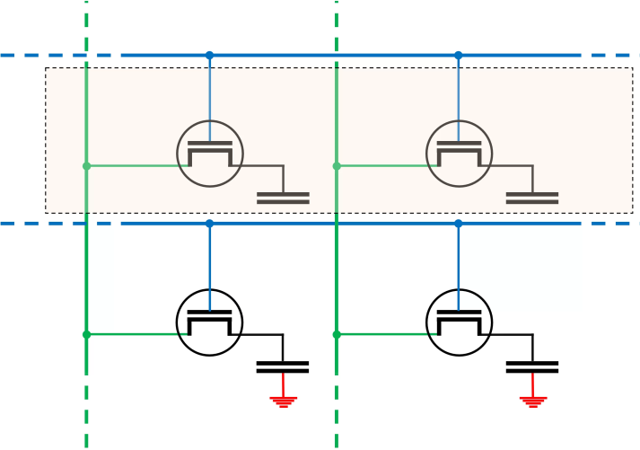

Esquema de **celda** de una memoria básica Esquema de una memoria RAM en una **matriz** de 4x4 celdas

 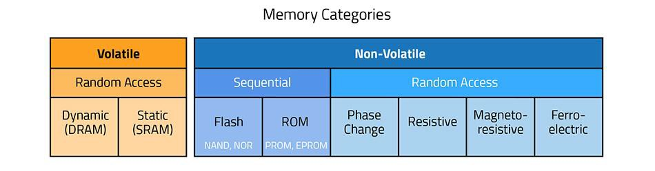

### Memoria estática SRAM

La memoria **SRAM** *(Static Random Access Memory)* es uno de los dos tipos básicos de memoria, junto con el DRAM. Comenzó a utilizarse en 1990 y a día de hoy sigue presente en cámaras o teléfonos móviles, pero especialmente en la **memoria caché** de los procesadores, o de discos u otros dispositivos.

Es un tipo de memoria que utiliza transistores y necesita un flujo **de energía constante** para funcionar, al contrario que la RAM dinámica que luego veremos y por eso se le llama *Static RAM* (RAM estática).
-   Las **ventajas** de este tipo de memoria es que tiene tiempos de acceso muy bajos.
-   Las **desventajas** incluyen un **alto consumo energético**, con capacidades de almacenamiento bajas, y unos costes de fabricación elevados.

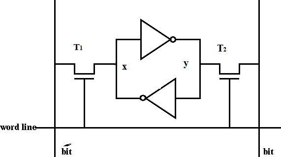

### Memoria dinámica DRAM

La memoria **DRAM** *(Dynamic Random Access Memory)* es el otro tipo básico de memoria RAM, que se utilizó desde principios de 1970 hasta mediados de los años 90 y del que ahora dependen los nuevos tipos de RAM modernas.

Este tipo de memoria necesita un **refresco periódico (dinámico)** de los datos en su interior ya que tienen **condensadores** que periódicamente se van descargando, y la falta de energía significa pérdida de datos. No necesita un aporte continuo de energía, al contrario que la SRAM.

-   Las **ventajas** de este tipo de memoria es que es relativamente barata de fabricar, consume menos y permite mayores capacidades.
-   Las **desventajas**, es que tienen unos tiempos de acceso más elevados, con lo cual es algo más lenta.

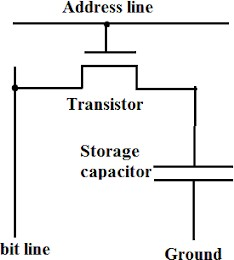

### Memoria dinámica SDRAM

La memoria **SDRAM** *(Synchronous Dynamic Random Access Memory)* es un tipo de memoria DRAM que funciona en **sincronía** con el procesador, lo que significa que espera a la señal de reloj antes de responder, teniendo como beneficio que permitía al procesador ejecutar órdenes en paralelo.

Este tipo de memoria se utiliza desde 1993 hasta día de hoy, tanto en ordenadores como en videoconsolas, y casi todos los siguientes tipos de memoria **RAM** están basados en este tipo.

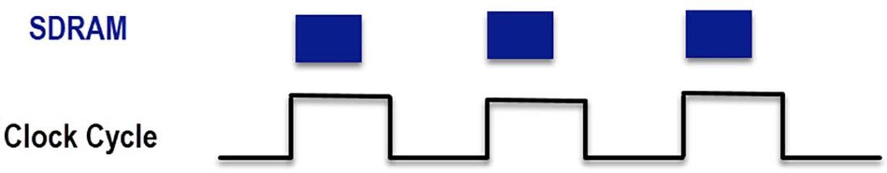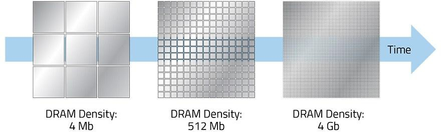

### Memoria dinámica SDRAM DDR

La memoria **SDRAM DDR** *(Double Data Rate SDRAM)* es el tipo de memoria que se estandarizó a partir del 2000, y a partir de aquí surgieron sus generaciones siguientes: *DDR2, DDR3, DDR4 y DDR5*.

Opera de la misma manera que la SDR SDRAM solo que el **doble de rápida**, es decir, será capaz de realizar dos instrucciones de lectura y dos de escritura por cada ciclo de reloj del procesador para la DDR, cuatro para la DDR2 y así sucesivamente.

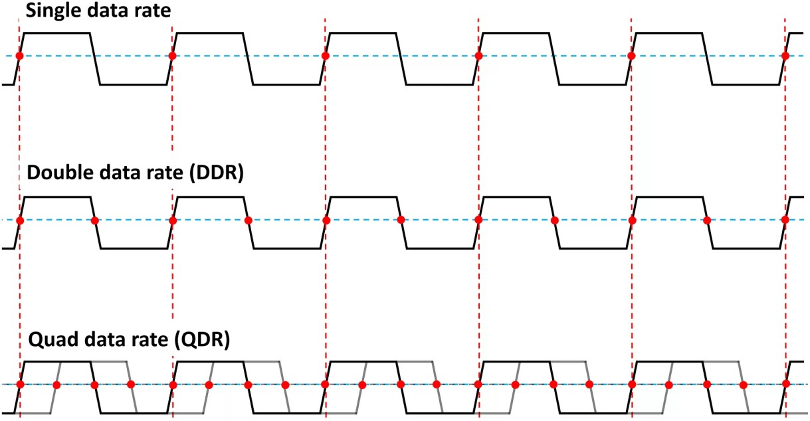

### SRAM vs DRAM


### Dual, Triple, Quad Channel

Las técnicas de *Dual channel, triple channel, quad channel*, etc. permiten la lectura y escritura de forma independiente y al mismo tiempo de varios módulos de forma simultánea. El ancho de banda aumenta al aumentar el **acceso concurrente**.


Para aprovechar estas configuraciones:
- Los módulos deberán tener la **misma capacidad** y preferiblemente la misma marca y modelo.
- Si se combinan memorias de distinta velocidad, el sistema funcionará a la del módulo más lento.


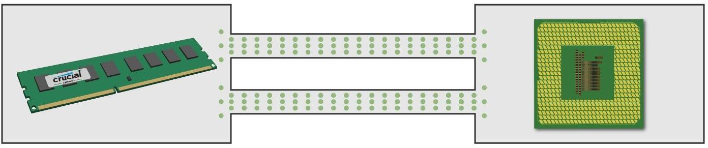
