# UT2.7: Componentes hardware - Conectores, gráfica, almacenamiento, periféricos 

## Conectores

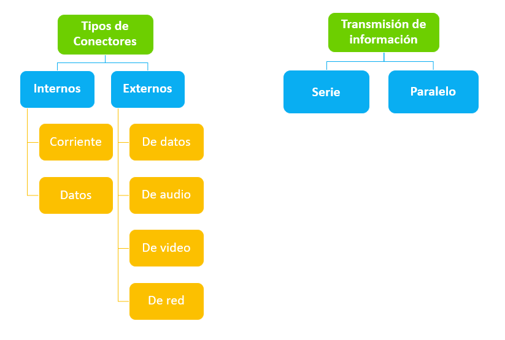

### Transmisión de la información

#### Transmisión de datos cableado en serie

-   Se envían datos bit a bit a una frecuencia convenida.
-   Se simplifica el control de la transmisión.
-   Los buses o puerto serie suelen funcionar a una velocidad mayor que el bus o puerto paralelo equivalente, ya que pueden aumentar su frecuencia.

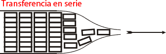

#### Transmisión de datos cableado en paralelo

-   Se envían más datos a la vez que en la conexión en serie.
-   Válido para distancias cortas.
-   Se produce una distorsión de señal entre cableado al aumentar su frecuencia.
-   Problemas de sincronización de datos. Los datos han de salir y llegar a la vez para poder reconstruirse.
-   Cableado aparatoso y más costoso.


## Conectores internos

Son los **conectores internos** de corriente y de datos que se utilizan en una placa o entre componentes dentro de la carcasa.

Existen los siguientes tipos de conectores internos:

-   **Conectores de corriente**: Alimentación ATX de la placa
-   **Conectores de cabecera**: Panel de encendido, control, audio
-   **Conectores de discos o dispositivos**: SATA o el M.2

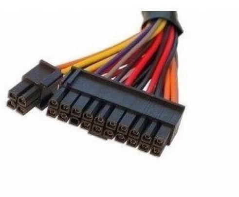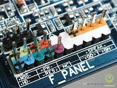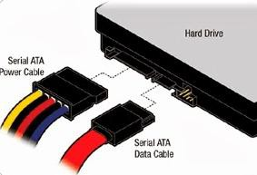

> El otro conector interno de datos más famoso, del que ya hemos hablado, es el archiconocido PCI-Express

## Conectores externos

Los **conectores externos** o periféricos son los que nos solemos encontramos en la parte trasera o frontal de un equipo. La gran mayoría de dispositivos que se conectan a estos puertos son los periféricos, como es el caso de los monitores, impresoras, teclados, ratones, etc.

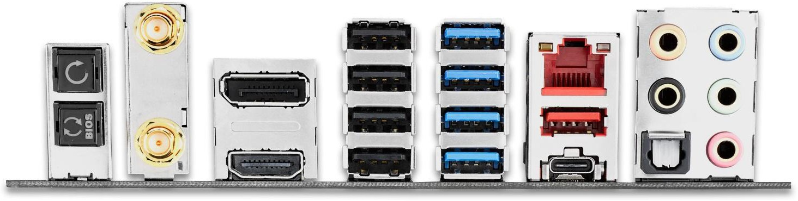


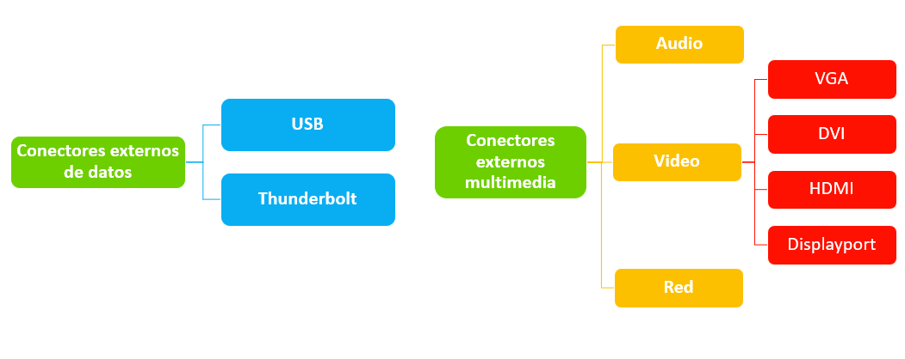

### USB

El **USB** (*Universal Serial Bus*), es el estándar que define los conectores, cables y protocolos usados para conectar, comunicar y proveer de alimentación eléctrica entre computadoras, periféricos y dispositivos electrónicos. Su primera especificación se publicó en 1996 siendo actualmente la revisión **USB 3.2** la más extendida, con velocidades de hasta 20 Gbps, aunque la USB 4 (presentada en 2019) comienza a implantarse en equipos lentamente.

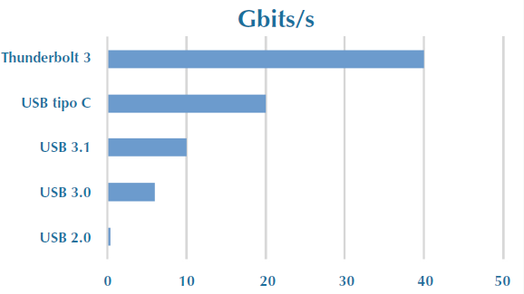


Tipos de conectores USB según su factor forma y velocidades:

#### Conector tipo A

Es el conector más común y tradicional, utilizado principalmente en ordenadores, teclados, ratones, memorias USB y otros periféricos. Puede encontrarse en las versiones siguientes de USB:

-   **USB 1.0 / 2.0:** color blanco o negro.
-   **USB 3.0 / 3.1 / 3.2:** color azul (aunque esto no siempre es obligatorio).
-   **USB 3.x “SuperSpeed”** alcanza hasta **5–20 Gbps** según la versión.

    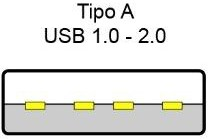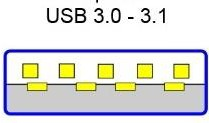 

#### Conector tipo B

Utilizado normalmente en impresoras, escáneres y algunos discos duros externos. Prácticamente en desuso.
-   El conector **tipo B** de **forma cuadrada** se utiliza para USB 1.0 y 2.0 aunque existe también una versión de mayor velocidad (3.0)

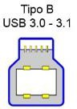

#### Conector tipo C

Es el tipo de conector más moderno, y actual sucesor de los MicroUSB. Se caracteriza por ser completamente reversible, por lo que puede conectarse siempre por cualquiera de sus lados. Obligatorio en la UE desde 2025 para dispositivos móviles y portátiles.

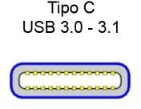

#### Conector Mini USB

Fue el primer tipo de USB que se redujo de tamaño para conectar periféricos más pequeños.

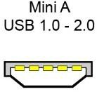

#### Conector Micro USB

Sucesor del Mini USB, ha sido muy popular y utilizado en antiguos dispositivos como smartphones o tablets.

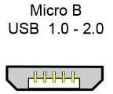

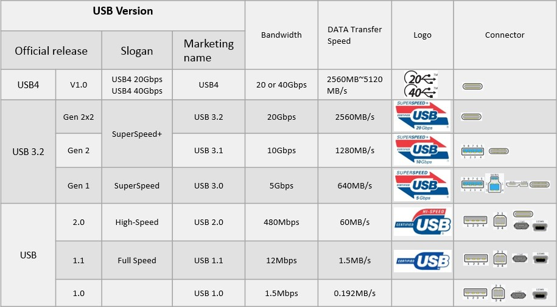

### Thunderbolt

**Thunderbolt** es un estándar creado por Intel y Apple en 2011 (culminación de Light Peak) para designar a un tipo de conector de alta velocidad que hace uso de tecnología óptica. Su objetivo es unificar datos, vídeo, audio y energía en una única interfaz de alta velocidad, ofreciendo un rendimiento superior al de USB.

-   Una de sus principales ventajas respecto de otras interfaces es que dinámico; combina datos, video, audio, y el de energía en una sola conexión.
-   Tiene una baja latencia ya que internamente usa la interfaz **PCI Express**.
-   Posee un elevado ancho de banda (10-40Gbps) superior a USB 3.0 y FireWire.
-   El problema que plantea en comparación con el USB-C y USB 3.0, es que es **exclusivo de Intel**. Esto significa que aún no lo veremos en equipos AMD, lo que limita su uso.

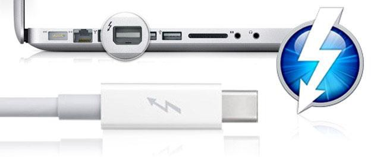

Thunderbolt ha pasado por cuatro versiones y actualmente va por **Thunderbolt 4**.

Una de las grandes ventajas de Thunderbolt es que da la posibilidad de enchufar dispositivos **en cadena**. Por ejemplo, podremos conectar un disco a un monitor por USB, y el monitor al portátil mediante Thunderbolt (más concretamente a través de DisplayPort) y entonces los datos del disco se verán reflejados en el ordenador.

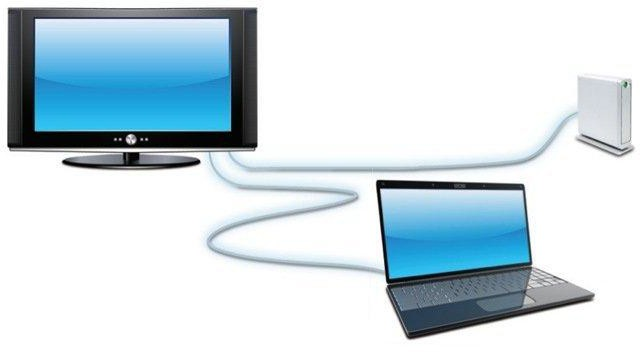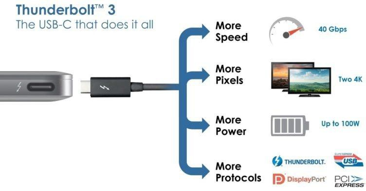

### Thunderbolt vs USB tipo C

Desde **Thunderbolt 3**, el conector físico es **idéntico** al **USB tipo C**, lo que facilita su uso. Sin embargo, no todos los puertos USB-C son Thunderbolt, aunque todos los puertos Thunderbolt usan conector USB-C.

Para evitar la confusión, el USB Implementers Forum decidió unificar ambos estándares en **USB 4**, que integra completamente Thunderbolt 3. Esto significa que:

-   Los dispositivos **USB 4** son compatibles con **Thunderbolt 3**.
-   Los puertos **Thunderbolt 4** son compatibles con USB 4, USB 3.x y Thunderbolt 3.

    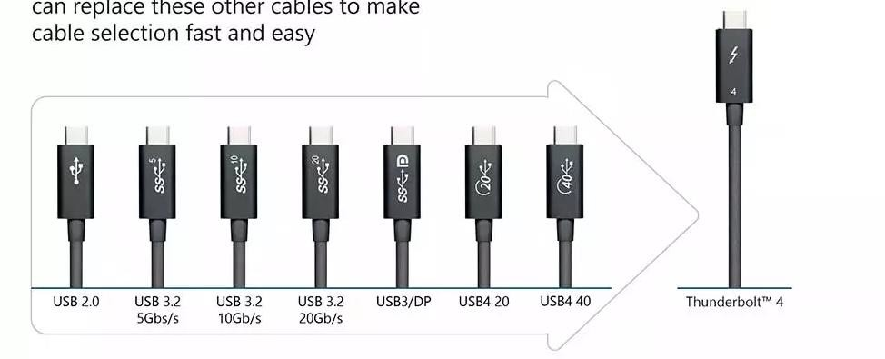

### Audio analógico

Los conectores de audio son un estándar **analógico** que utilizan todas las placas base a través de sus tarjetas de sonido:

- **Naranja**: Conector de salida de los altavoces centrales y del amplificador de graves. Configuración de audio 5.1/7.1 canales. 
- **Negro**: Conector de salida de los altavoces traseros. Configuración de audio de 4/5.1/7.1 canales.
- **Gris**: Conector de salida de los altavoces laterales. Configuración de audio de 7.1 canales.
- **Verde**: Conector de salida de línea. Es el conector de salida de **línea predeterminado**. Utiliza este conector de audio para unos auriculares, etc.
- **Rosa**: Conector de entrada de micrófono. Es el conector de entrada de **micrófono predeterminado**.
- **Azul**: Conector de entrada de línea. Utiliza este conector de audio para dispositivos mp3, otro micrófono, etc.

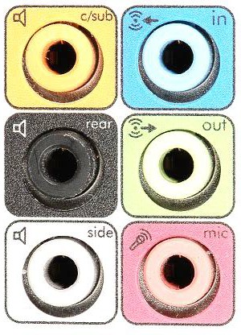

### VGA

El conector VGA *(Video Graphics Array)* es un puerto **analógico** de salida de video.

-   El puerto VGA y su cable suelen ser de color azul y consta de tres hileras con un total 15 pines.
-   Se encuentra en la mayoría de las tarjetas gráficas, monitores de computadoras, y otros dispositivos de vídeo.
-   Actualmente acepta una resolución máxima de **2048x1536** píxeles.
-   Al ser una transmisión **analógica** la calidad de imagen depende de aspectos como la calidad de cable y su longitud, o las interferencias electromagnéticas.
-   Está cayendo prácticamente en desuso por ser analógico y soportar menor resolución que **DVI-D**, el **HDMI** o el **DisplayPort**.

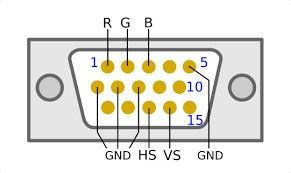 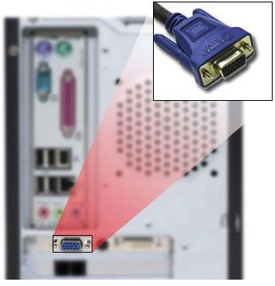

### DVI

El conector DVI *(Digital Visual interface)* apareció con el estreno del formato **digital** en 1999.

-   Es capaz de transmitir vídeo digital sin comprimir a una resolución máxima de **2560 x 1600** píxeles a 60 Hz o más. Tiene como ventajas que puede pasar de los de 144 Hz, cosa que no es posible hacer con un simple HDMI o un cable VGA.
-   Al tratarse de una señal digital no sufre interferencias ni depende de la calidad del cable o su longitud como el estándar VGA, pero lógicamente la señal pierde intensidad con la distancia. Los expertos recomiendan n más de 4.5 metros en resoluciones 1080p. A 720p la distancia aumenta a 15 metros.

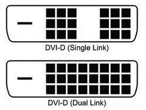 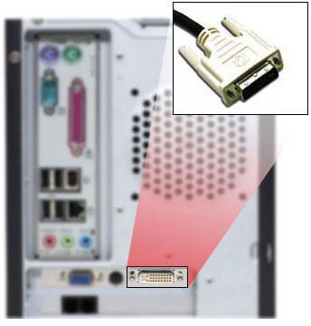

### HDMI

HDMI (*High-Definition Multimedia Interface*) es una interface de un todo en uno que sirve para transmitir audio y vídeo **digital** en un solo cable.

-   HDMI nació en 2002 por la aparición de la resolución HD (1280 x 720) y Full-HD (1920 x 1080), con el objetivo de reunir en un solo conector el audio y el vídeo.
-   Una de las particularidades del HDMI es que tanto el audio como el vídeo están encriptados por la protección anticopia **HDCP**, que no permiten copiar el contenido que transmite.
-   Existan varias versiones de HDMI. En las versiones más recientes HDMI (la 2.1) se da soporte a resoluciones **4K**, **8K** y al HDR dinámico.

 

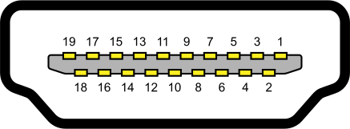

### DisplayPort

**DisplayPort** es la evolución de HDMI pero como estándar propio para ordenadores. Muy usado en segundos monitores. Aparece en 2007.

-   Lo encontraremos, salvo excepción, en la tarjeta gráfica y se trata de un puerto por el que el fabricante no tendrá que pagar ninguna licencia por utilizarlo, debido a que usa un **estándar abierto** y gratuito.
-   Incluye de forma opcional una protección contra copia llamada **DPCP**
-   Su tecnología de compresión de imagen permite hacer streamings a 8K y 60 Hz.
-   Es compatible con VGA, DVI y HDMI mediante adaptadores (es lo que se conoce como Modo Dual o DisplayPort++).

    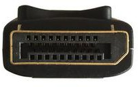 

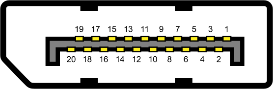

### Puerto RJ45

El conector **RJ45** (*Registered Jack*) es el principal conector usado en la conexión de tarjetas de red Ethernet.

-   Este conector se emplea con cables de par trenzado (categorías **4, 5, 5e** y **6**), por lo que el mismo conector se puede emplear para tipos de comunicación diferente, dependiendo del orden de conexión de los pares trenzados.
-   Posee ocho "pines" o conexiones eléctricas, que normalmente se usan como extremos de cables de par trenzado.

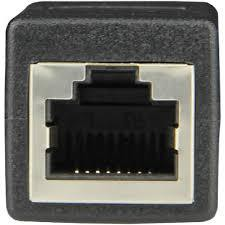 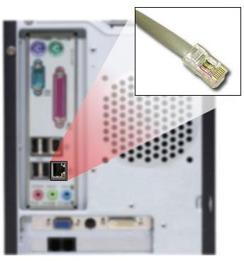

-----

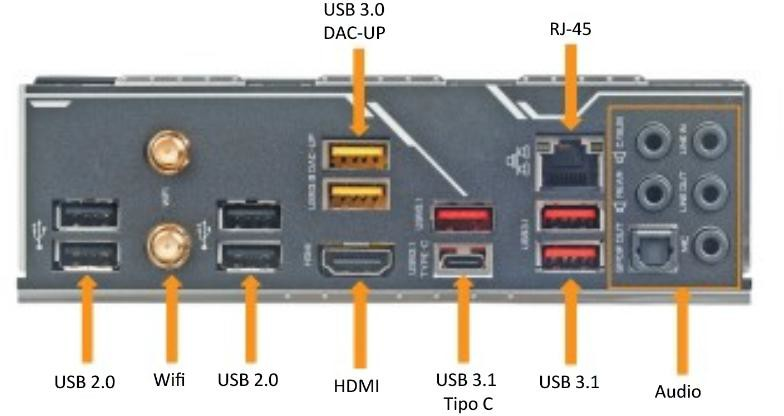

## Tarjeta gráfica

```note
Una tarjeta gráfica, tarjeta de vídeo, adaptador de pantalla o simplemente GPU (por el nombre de su procesador gráfico) es una tarjeta de expansión o un circuito integrado en el procesador que se encarga de procesar los datos que le envía el ordenador y transformarlos en información visible en un dispositivo de salida.
```

La **GPU** es el corazón de la tarjeta gráfica. Originalmente, funcionaba como un **coprocesador de la CPU**, especializado en cálculos en coma flotante necesarios para representar gráficos 2D y 3D.

Hoy en día, las GPU modernas son **procesadores masivamente paralelos**, con **miles de núcleos** capaces de ejecutar muchas operaciones simultáneamente.

Esto las hace extremadamente eficientes para:

-   Renderizar gráficos en videojuegos y animaciones 3D.
-   Procesar vídeo y efectos visuales.
-   Realizar cálculos científicos, simulaciones o **entrenamiento de modelos de**

    **Inteligencia Artificial (IA)** (*GPGPU: General-Purpose GPU Computing*).

### Arquitectura paralela

Su arquitectura paralela está **optimizada para repetir operaciones similares sobre grandes volúmenes de datos**, a diferencia de las CPU, que están optimizadas para tareas secuenciales y más variadas.

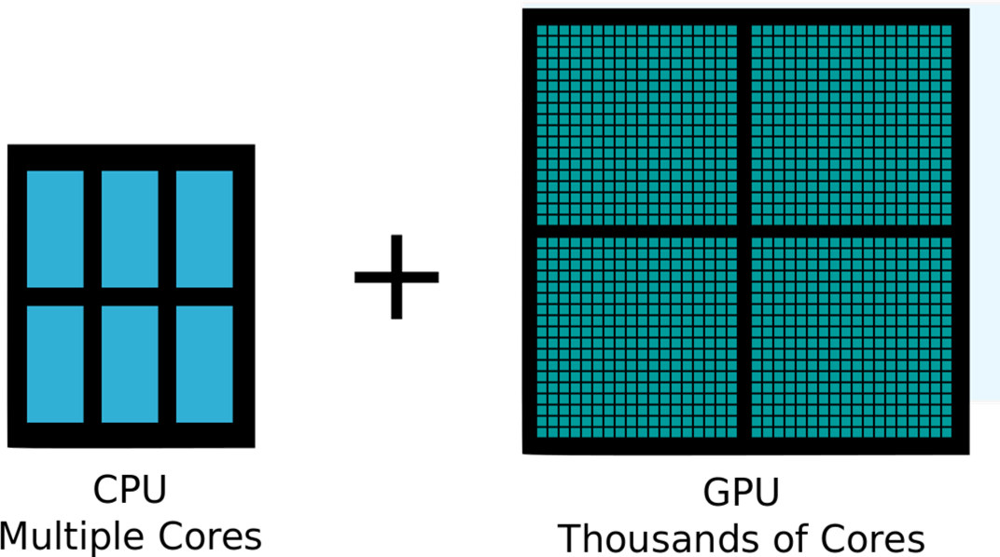

Al igual que vimos en la CPU, veremos el flujo de instrucciones y datos en la GPU que en realidad parte de la GPU y la memoria:

1.  Se **copian los datos** a procesar de la  memoria de la CPU a la de la GPU.
2.  La CPU envía las **instrucciones** de dibujado del programa para que sean procesadas por la GPU.
3.  Se **ejecutan** las instrucciones en la GPU mediante hilos del kernel en paralelo repartidos entre los diferentes cores.
4.  Devuelve datos resultantes procesados a la memoria principal.

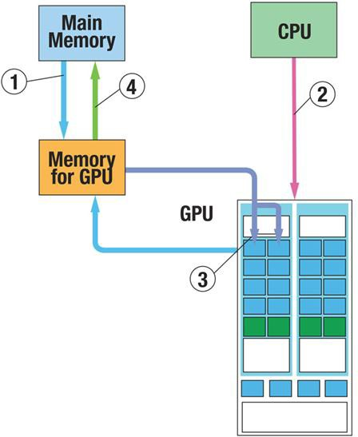

### Tarjetas gráficas integradas

Las **gráficas integradas** se encuentran **dentro del procesador** o, en algunos casos antiguos, en el **chipset** de la placa base. 
Hoy en día, tanto Intel como AMD (en sus *APU*, *Accelerated Processing Unit*) y los procesadores ARM integran GPU en el mismo chip o SoC.

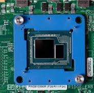

Sus principales características:
-   Comparten la **memoria RAM del sistema** para procesar gráficos.
-   Tienen **bajo consumo energético** y **rendimiento limitado**, pero suficiente para tareas cotidianas: ofimática, navegación web, vídeo, etc.
-   Al estar en el mismo encapsulado que la CPU, la comunicación entre ambos es más rápida y eficiente.
-   Reducen el **coste** total del equipo y el consumo eléctrico.

### Tarjetas gráficas dedicadas

Las tarjetas gráficas dedicadas se identifican a simple vista en una placa. Son tarjetas de vídeo que tienen su propia GPU, memoria gráfica llamada **VRAM**, salidas de vídeo y sistema de refrigeración y que se conectan a la placa base a través del puerto **PCI-Express** (antiguamente era el *AGP*).

Proporcionan un rendimiento muy superior a los gráficos integrados, pero también son bastante más caras y su consumo energético suele ser elevado.

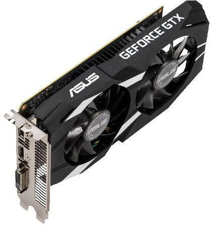

### Características

Al igual que con las CPU, sus principales **características** son:

-   Velocidad o frecuencia de la GPU
-   Nombre comercial
-   Frecuencia boost
-   Núcleos (cores) de la gráfica
-   Tecnología de fabricación.
-   Cantidad y tipo de memoria VRAM
-   Refrigeración
-   Consumo y TDP
-   Resolución de salida
-   Configuraciones multi-GPU
-   Conectores (a PCI-e)
-   API para gráficos
-   Tecnologías de renderizado asistido por IA
-   Aplicaciones más allá de los gráficos

### Núcleos (cores) de la gráfica

Las gráficas están formadas por **miles de pequeños núcleos** o unidades de procesamiento que trabajan en **paralelo**.

Estos **núcleos** gráficos son los encargados de ejecutar las operaciones matemáticas necesarias para procesar y renderizar imágenes, vídeo o cálculos complejos.

Cada núcleo de la GPU realiza cálculos muy **simples** (suma, multiplicación, operaciones vectoriales o matriciales), pero muchos de ellos **a la vez**.

Por ejemplo:
-   Para generar una imagen 3D, la GPU debe calcular la posición, color, sombras y textura de **millones de píxeles y vértices**.
-   En lugar de hacerlo uno a uno (como haría una CPU), la GPU divide la tarea entre **miles de núcleos** que lo hacen **simultáneamente**.

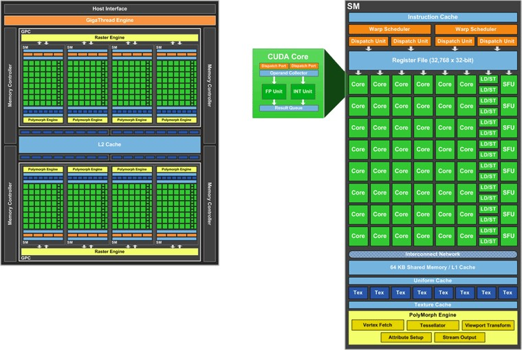

### Resolución de salida

Existe una amplia gama de **resoluciones** (medidas en *pixels* de alto por largo) de salida que una gráfica puede generar de salida hacia un monitor o pantalla.

Las más conocidas son:

-   **VGA** (SD): *640x480 pixels*
-   **SVGA**: *800x600 pixels*
-   **720p** (HD): *1280x720* pixels
-   **1080p** (FHD): *1920x1080 pixels*
-   **2K**: *2048 x 1080 pixels*
-   **1440p** (QHD): *2560 x 1440*
-   **4K**: *3840 x 2160 pixels*


### API para gráficos

Una **API** (*Application Programming Interface*) es un conjunto de definiciones y protocolos que se utiliza para desarrollar e integrar el motor gráfico de dibujado de gráficos en cualquier equipo. Partimos de varias APIs en el mercado:

-   **DirectX**: Lanzada por Microsoft en el 1996. Va por su versión DirectX12. Funciona sólo en Windows y Xbox aunque es prácticamente un estándar. Usada por la mayoría de videojuegos comercializados para Windows dado su buen rendimiento.
-   **OpenGL**: Creada por Silicon Graphics a principios de los años 1990; es gratuita, libre y multiplataforma. Se utiliza en Windows, Mac y Linux. Es utilizada en aplicaciones de CAD, VR y motores de videojuegos. Va por su versión OpenGL 4.6
-   **Vulkan**: basada en parte en OpenGL o AMD y pensada originalmente para Android. Vulkan es una API multiplataforma para el desarrollo de aplicaciones con gráficos 3D. Fue anunciada por primera vez en la GDC de 2015 por el Khronos Group.
-   **Metal**: pensada y optimizada para el ecosistema de Apple (Mac e iOS). Se basa originalmente en OpenCL (el precedesor de OpenGL)

### Aplicaciones más allá de gráficos

Gracias a su diseño paralelo, los núcleos de la GPU también se utilizan para:

-   **Entrenamiento de redes neuronales** (IA y Machine Learning).
-   **Cálculos científicos y simulaciones físicas.**
-   **Minería de criptomonedas.**
-   **Renderizado 3D y procesamiento** de vídeo.

> Esta capacidad se conoce como **GPGPU** *(General Purpose GPU Computing).*

## Unidades de almacenamiento

Las **unidades de almacenamiento permanente** o **memoria secundaria** almacenan información en grandes cantidades para que persista y no se pierda.
Veremos diversos dispositivos como Discos Duros, discos SSD, memorias flash y dispositivos ópticos como el DVD o el BluRay (BD).
Su relación con el resto de dispositivos es crítica para garantizar una capacidad y rendimiento de datos en el sistema, especialmente en servidores de datos.


El **precio por GB** de los medios de almacenamiento secundario ha caído muchísimo a lo largo de los años, desde los 10 millones de dólares por GB de 1956 a los 3 céntimos de dólar actuales. Los medios magnéticos son los medios de almacenamiento masivo de información por excelencia. Sus principios tecnológicos del almacenamiento de tipo magnético apenas han variado aunque se acercan a su límite físico en cuanto a capacidad de almacenamiento, velocidades o tamaños.

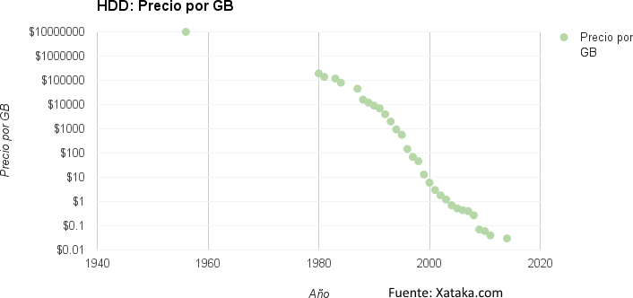

### Discos duros (HDD)

```note
Los **dispositivos magnéticos** son aquellos dispositivos de almacenamiento de datos en los que se utilizan propiedades magnéticas de los materiales para almacenar la información digital.
```

Los dispositivos de almacenamiento magnéticos han ido evolucionando mejorando la tecnología, la capacidad y los tiempos de acceso y transmisión. En la actualidad, los **discos duros** *(Hard Disk Drive)* son los únicos dispositivos magnéticos utilizados. Tanto las cintas magnéticas como los discos flexibles ya han quedado obsoletos. Los discos duros contienen partes mecánicas y electrónicas, por lo tanto, son un sistema de grabación magnético y digital.

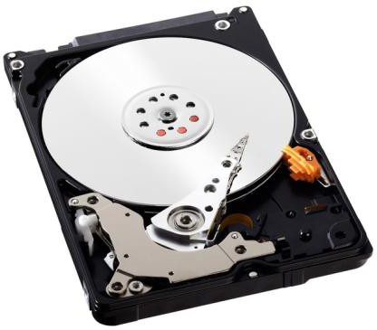

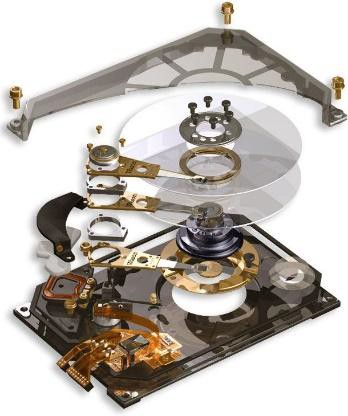 

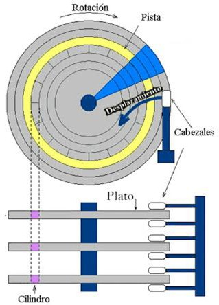

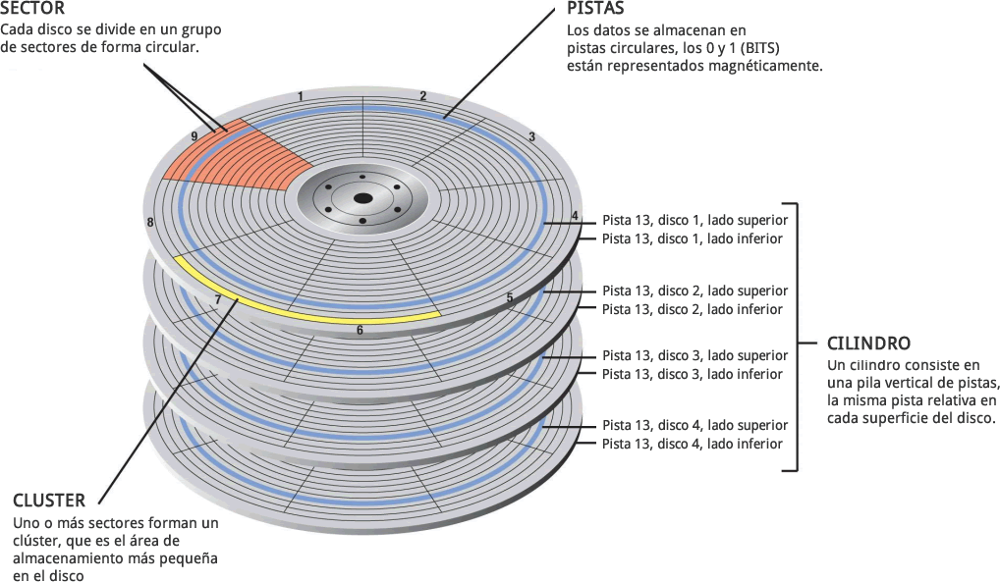

### Discos en estado sólido (SSD)

```note
Los discos **SSD** (Solid State Drive) a diferencia de los discos duros tradicionales, son unidades de almacenamiento puramente electrónicas que utilizan memoria en estado sólido para almacenar la información.
```

Estas unidades contienen en su interior:
-   Memoria NAND flash. Ya las hemos estudiado. Son su base de almacenamiento.
-   Memoria volátil SDRAM. Usada como caché, mejora su rendimiento.
-   Un controlador. Es el cerebro de la unidad SSD. Su velocidad y eficiencia también dependerá del mismo.

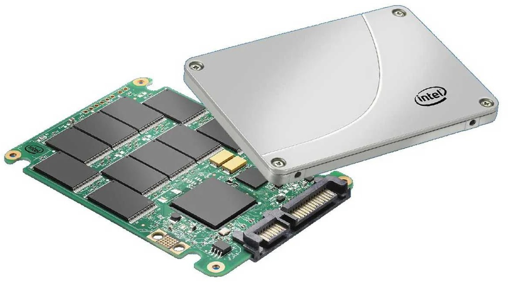

La **memoria NAND** es un tipo de memoria Flash cuya denominación hace referencia al tipo de puerta lógica booleana que usa y que ya conocemos.

Cuando se comenzó a fabricar, este tipo de memoria podía ser de tipo NOR o NAND, según el tipo de transistor que se empleara en su construcción. Aunque las puertas NOR presentaban ciertas ventajas, la memoria fabricada con transistores **NAND** es más fácil de producir, más barata y con densidades mayores, así que ese es el tipo de memoria Flash que empleamos en la actualidad en almacenamiento, salvo en BIOS donde suele usarse la NOR.

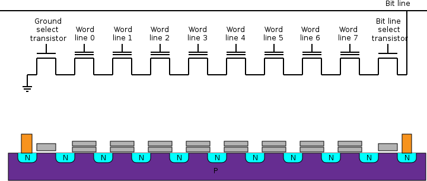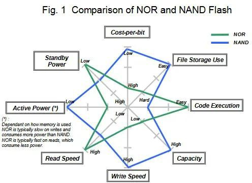

### Rendimiento SSD

El **rendimiento** de estas unidades SSD se mide principalmente por su capacidad para realizar operaciones de entrada y salida de datos con rapidez y eficiencia:

-   **IOPS** *(Input/Output Operations Per Second),* que indican cuántas operaciones de lectura o escritura puede ejecutar el dispositivo por segundo, especialmente relevantes en accesos aleatorios típicos de sistemas operativos o bases de datos.
-   La **velocidad de lectura y escritura secuencial**, expresada en megabytes por segundo (MB/s), refleja la rapidez con que el SSD puede transferir grandes volúmenes de información de forma continua, algo fundamental en tareas como la carga de archivos o aplicaciones.
-   Otro factor clave es la **memoria caché**, que actúa como un área de almacenamiento temporal de alta velocidad para reducir la latencia.

En conjunto, estos tres indicadores, IOPS, velocidad secuencial y eficiencia de la caché, determinan el rendimiento global del SSD, ofreciendo un equilibrio entre rapidez, capacidad de respuesta y fiabilidad en el acceso a los datos.

### Tecnología de celdas SSD 

La tecnología de celdas SSD indica cuántos **bits de información** puede almacenar cada celda, lo que afecta directamente a la velocidad, durabilidad y precio.

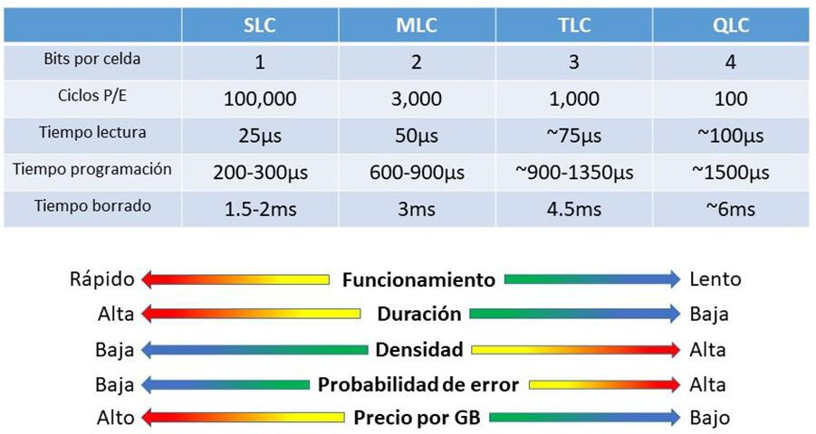

### Unidades M.2 NVMe

Las unidades SSD SATA han dejado paso a las unidades con socket tipo **M.2 NVMe** que vimos en unidades anteriores. La diferencia entre una unidad SSD SATA y una NVMe es básicamente su altísima velocidad al ir en un puerto **PCI Express**. Las unidades M.2 también tienen la ventaja de estar a ras de la placa y ser compactas.

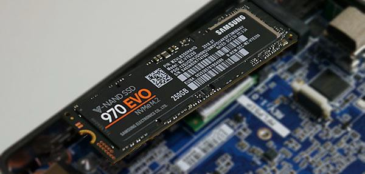


Estas unidades han sido diseñadas desde cero aprovechando que el puerto PCI Express tiene una latencia muy baja y gran paralelismo para mejorar la capacidad de transferencia y su eficiencia energética en modo suspensión.

### Tarjetas de memoria

Las **tarjetas de memoria** son dispositivos de memoria ultraportátiles de pequeño tamaño, con gran capacidad de almacenamiento, bastante resistentes a golpes y de bajo consumo. Las generalmente dispositivos como cámaras, drones y algunos teléfonos móviles como almacenamiento externo.

Existen multitud **formatos** y entre los más conocidos está la **familia SD**:

-   SDHC (*Secure Digital High Capacity*): Hasta 32GB
-   SDXC (*Secure Digital Xtra Capacity*): Hasta 2TB

La **familia SD**, tienen a su vez las variantes de forma conocidas por casi todos nosotros: **mini-SD** o **micro-SD**.

 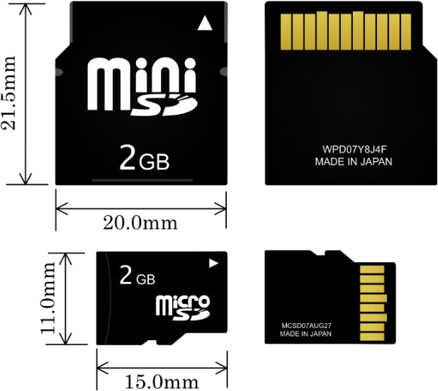


### Dispositivos ópticos

Los **dispositivos ópticos** (CD, DVD y BluRay) han pasado su época de gloria, cuando suponían el medio preferido de instalación para los sistemas operativos, videojuegos y programas con un soporte de almacenamiento con mucha capacidad y a un coste por bit reducido.

A diferencia de los medios magnéticos de la época, tenían la ventaja de que el soporte además de muy barato, con unos cuidados básicos, podía durar muchos años sin que la información se degradase tanto con el paso del tiempo.


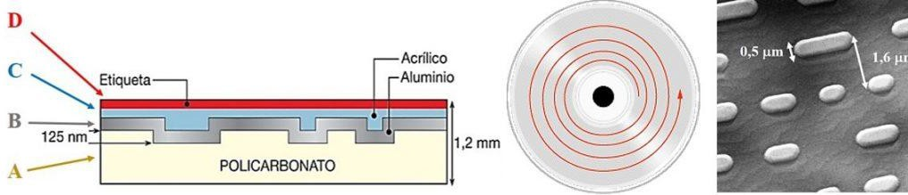

La **capacidad de almacenamiento** de cada medio óptico depende de si admite una o dos capas o utiliza doble capa a la hora de grabar y leer luego los datos:

| **Tipo de disco**       | **Capacidad** | **Capacidad audio** | **Capacidad video** |
|-------------------------|---------------|---------------------|---------------------|
| CD, CDR                 | 700 MB        | 1h 18min            | 15 min              |
| DVD, DVDR               | 4.7 GB        | 9h 30min            | 2h 15min            |
| DVD 1 cara, doble capa  | 8.5 GB        | 17h 30min           | 4h                  |
| DVD 2 caras             | 9.4 GB        | 19h                 | 4h 30min            |
| DVD 2 caras, doble capa | 17 GB         | 35h                 | 8h                  |
| Blu-Ray                 | 25 GB         | 45h                 | 12h                 |
| Blu-Ray doble capa      | 50 GB         | 90h                 | 24h                 |


## Tarjetas de red

```note
Las tarjetas de red se utilizan para conectar ordenadores entre sí con la finalidad de compartir recursos (por ejemplo, impresoras o archivos) y poder formar una red.
```

Las tarjetas de red también se llaman adaptadores de red o **NIC** (*Network Interface Card)*. Hay diversos tipos de tarjetas de red, en función del tipo de cable o arquitectura que se utilice en la red (coaxial fino, coaxial grueso, fibra óptica, etc.), pero hoy día el más utilizado es del tipo Ethernet con un conector RJ-45. Asimismo, está extendido el uso de redes Wi-Fi y Bluetooth integrados. Los estudiaremos más en profundidad en próximas unidades.

Actualmente, la mayoría de las placas base ya tienen integrada una tarjeta de red con conector **RJ-45** y ciertos dispositivos las **inalámbricas.** Las tarjetas de **servidor** profesionales vienen con varias tomas y preparadas para conexiones con fibra.

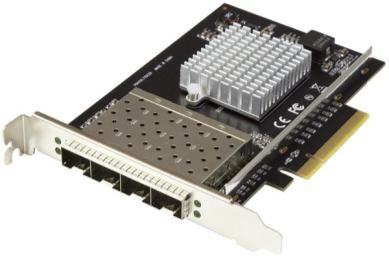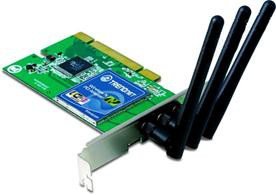

### Velocidad de las tarjetas de red 

La determina el protocolo utilizado:

-   **Ethernet**: hasta 10 Mbps 10Base5, 10Base2, 10BaseT
-   **Fast Ethernet**: hasta 100 Mbps 100Base-TX
-   **Gigabit Ethernet**: hasta 1000 Mbps 1000Base-T, 1000 Base-SX, 100 Base-EX..
-   **10-Gigabit Ethernet**: hasta 10 Gbps 10GBase-T, 10GBase-SR..

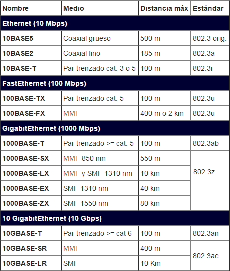

## Periféricos

```note
Los periféricos son dispositivos hardware con los cuales el usuario puede interactuar con el ordenador (teclado, ratón, monitor), almacenar o leer datos y/o programas (dispositivos de almacenamiento o memorias auxiliares),imprimir, etc.
```


Los periféricos se conectan con el ordenador, la CPU y sus componentes, a través de los **puertos** o conectores externos gracias a la **unidad de entrada/salida** ambos vistos en unidades anteriores.

Los periféricos de entrada/salida necesitan un tipo de software especial para comunicarse adecuadamente con el SO llamado **driver.**

Los **periféricos** pueden clasificarse en los siguientes tipos:

-   Periféricos de **entrada**
-   Periféricos de **salida**
-   Periféricos de **almacenamiento**
-   Periféricos de **comunicación**
-   Periféricos **híbridos**

## El monitor o pantalla

El monitor o pantalla de un ordenador es el principal dispositivo de salida (interfaz), que muestra datos o información al usuario.

También puede considerarse un periférico de *Entrada/Salida* si el monitor tiene pantalla táctil o multitáctil, o si se trata de la pantalla de una tablet o smartphone.

La historia de los monitores siempre ha ido muy pareja al de las tarjetas gráficas. Al principio estas sólo podían trabajar con texto y no fue hasta varios años después cuando gracias a las tarjetas CGA consiguen llegar hasta los cuatro colores.

Después se pasó a 16, luego a 256, y a 65536 colores llegando a la actualidad donde cualquier monitor puede mostrar sin problemas unos 17 millones de colores distintos en altas resoluciones y nuevas tecnologías como el HDR.


### Características

Características técnicas subyacentes a un monitor o pantalla:

- Tamaño. 
- Relación de aspecto.
- Resolución
- Luminosidad o brillo
- Profundidad de color
- Contraste (estático y dinámico)
- Tiempo de respuesta
- Tasa de refresco
- Espectro de color
- Angulo de visión
- Conectores
- Ahorro energético


El **tamaño de la pantalla** es la distancia en diagonal de un vértice de la pantalla al opuesto y se mide en pulgadas.


La **proporción** o relación de aspecto es una medida de proporción entre el ancho y el alto de la pantalla, así por ejemplo una proporción de 4:3 (cuatro tercios) significa que por cada 4 píxeles de ancho tenemos 3 de alto, una resolución de 800x600 tiene una relación de aspecto 4:3, sin embargo estamos hablando de la proporción del monitor.


Estas dos medidas describen el tamaño de lo que se muestra por la pantalla, históricamente hasta no hace mucho tiempo y al igual que las televisiones los monitores de ordenador tenían un proporción de 4:3. Posteriormente se desarrollaron estándares para pantallas de aspecto panorámico 16:9 (a veces también de 16:10 o incluso 21:9 ultrapanorámico) hasta entonces solo usado en el cine.


| **Relación de aspecto** | **Anchura** (en píxeles) | **Altura** (en píxeles) | **Descripción**                  | **Pulgadas Monitor** |
|-------------------------|--------------------------|-------------------------|----------------------------------|----------------------|
| **4:3**                 | *640*                    | *480*                   | Definición estándar (SD)         | 14’’                 |
| **16:10**               | *1280*                   | *800*                   | Alta definición (HD)             | 17’’ y 19’’          |
| **16:9**                | *1280*                   | *720*                   | Alta definición (HD)             | 17’’ y 19’’          |
| **16:9**                | *1920*                   | *1080*                  | Alta definición (FHD)            | 24’’,25’’,26’’       |
| **16:9**                | *2560*                   | *1440*                  | 2K (QHD)                         | 27’’, 28’’, 32’’     |
| **16:10**               | *2560*                   | *1600*                  | Wide 2K (WQHD)                   | 27’’, 28’’           |
| **16:9**                | *3840*                   | *2160*                  | Ultra alta definición (UHD) o 4K | 27’’, 32’’, 34’’     |
| **21:9**                | *5120*                   | *2160*                  | Ultra Wide (WUHD)                | 34’’                 |
