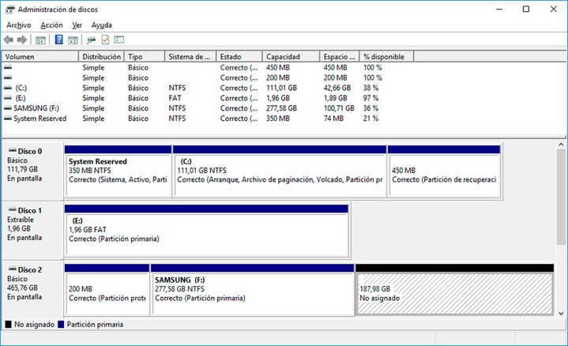
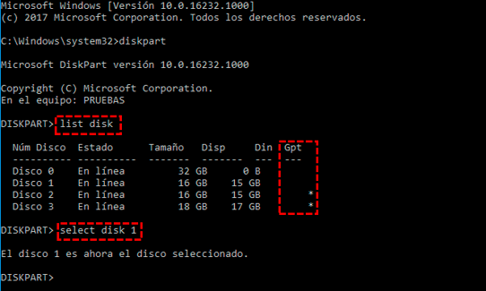
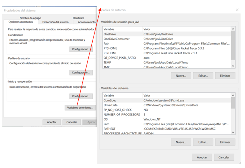

# UT4.5 Operaciones básicas de gestión y almacenamiento en Windows y consola CMD

## Introducción

La consola de comandos, **CMD**, símbolo del sistema o también conocido como **Command prompt** es un intérprete de línea de comandos que lleva acompañando al sistema operativo de Microsoft durante décadas. Tanto es así que es el Shell original para el sistema operativo Microsoft DOS y el Shell predeterminado en Windows hasta la compilación *14791* de Windows 10, momento en el que **Windows Powershell** pasó a ser la opción predeterminada del sistema.

Con el símbolo del sistema podemos lanzar o ejecutar comandos básicos, preparar scripts relativamente sencillos y realizar muchas de las tareas que podemos hacer desde la interfaz gráfica del sistema operativo de Microsoft. Ahora bien, cuando necesitamos realizar desarrollos más avanzados, acceder a ciertas áreas del sistema o automatizar tareas es donde deberíamos usar Windows PowerShell.


La **consola de comandos** (CMD) permite realizar tareas repetitivas de forma rápida. Escribimos el comando (y sus modificadores en su caso), presionamos **ENTER** y la aplicación CMD hará de intérprete para su ejecución.

Algunas **características** de la consola de Windows:

-   No diferencia entre mayúsculas y minúsculas.
-   Al escribir un nombre de archivo o carpeta con espacios conviene escribirlo siempre “*entrecomillado*”.
-   Los nombres pueden ser de hasta **255 caracteres**.
-   Al eliminar un archivo este no va a la Papelera y se elimina.
-   Algunas operaciones requieren iniciar la consola como administradores (abrir con botón derecho\>**Ejecutar como administrador**)

Se puede configurar el **aspecto** así como ciertas propiedades de la consola de comandos haciendo clic en **propiedades** o en configuración, en Windows Terminal.


> 💡 La ruta en el disco actual indicada en la consola, y que indica estar a la espera de órdenes después del >, se denomina **PROMPT**.


### Carpetas del sistema

Existen **carpetas especiales** en todos los SO Windows:

| **Descripción**                                 | **Ruta**                                                                            |
|-------------------------------------------------|-------------------------------------------------------------------------------------|
| Carpeta principal del SO Windows                | **C:\\Windows**                                                                     |
| Carpeta de **archivos principales** del sistema | **C:\\Windows\\System**                                                             |
|                                                 | **C:\\Windows\\System32** (versiones de 32 bits)                                    |
| Archivos de **programas** instalados            | **C:\\Program Files** (en SO de 64bits, los programas de 64 bits)                   |
|                                                 | **C:\\Program Files (x86)** (en SO de 64bits, los programas de 32 bits)             |
| Archivos de programa, datos comunes             | **C:\\Program Files\\Common Files**                                                 |
| Datos de programas compartidos                  | **C:\\ProgramData**                                                                 |
| Fuentes del sistema                             | **C:\\Windows\\Fonts**                                                              |
| Herramientas administrativas compartidas        | **C:\\ProgramData\\Microsoft\\Windows\\Start Menu\\Programs\\Administrative Tools** |
| Programas en el menú de Inicio                  | **C:\\ProgramData\\Microsoft\\Windows\\Start Menu**                                 |
| Programas que inician con Windows (antiguo)     | **C:\\ProgramData\\Microsoft\\Windows\\Start Menu\\Programs\\Startup**              |
| Carpetas personales de los **usuarios**         | **C:\\Users**                                                                       |
| Datos de restauración del sistema               | **C:\\System Volume Information**                                                   |


### Carpetas del usuario local

Las carpetas de **usuario locales** se encuentran en el interior del directorio con el nombre del usuario local del equipo, en la ruta C:\\Users\\NombreUsuario.

| **Descripción**                   | **Ruta**                                                                                    |
|-----------------------------------|---------------------------------------------------------------------------------------------|
| Carpeta de perfil usuario         | **C:\\users\\usuario**                                                                      |
| Escritorio                        | **C:\\users\\usuario\\desktop**                                                             |
| Mi música                         | **C:\\users\\usuario\\music**                                                               |
| Mis documentos                    | **C:\\users\\usuario\\documents**                                                           |
| Mis imágenes                      | **C:\\users\\usuario\\images**                                                              |
| Descargas                         | **C:\\users\\usuario\\downloads**                                                           |
| Archivos temporales               | **C:\\Users\\usuario\\AppData\\Local\\Temp**                                                |
| Datos de programa                 | **C:\\Users\\usuario\\AppData**                                                             |
| Programas que inician con Windows | **C:\\Users\\usuario\\AppData\\Roaming\\Microsoft\\Windows\\Start Menu\\Programs\\Startup** |


## Operaciones generales en consola CMD de Windows

> 💡 La ruta en el disco actual indicada en la consola, y que indica estar a la espera de órdenes después del >, se denomina **PROMPT**.


### Navegación por directorios

```tip
Para navegar o moverse de directorio en la consola de comandos se utiliza el comando **CD** (CHDIR) y el comando **CD..**
```

Navegar usando el Explorador de archivos como hemos visto es intuitivo y natural.

Generalmente cuando el usuario abre la consola, el directorio donde comienza es su <u>directorio personal</u>. Desde ahí uno puede moverse a los diferentes directorios donde se tenga acceso usando el comando.

El comando **CD..** navega al directorio padre (el anterior).

El comando **CD\\** navega al directorio raíz.  

### Creación de directorios

```tip
En el entorno de consola de comandos de Windows (CMD), para la creación de directorios se utiliza el comando **MD** (MKDIR). 
```

En el entorno gráfico, para crear una carpeta dentro de otra, tendremos que tener abierta aquella dentro de la cual queremos crear otra u otras carpetas. Esta carpeta principal, llamada carpeta padre, será de la que «cuelgue» la estructura de carpetas.


La sintaxis del comando **MD** es la siguiente: 

        MD nombre_directorio

### Consulta de directorios

```tip
En el entorno de consola de comandos de Windows, para la consulta del contenido de un directorio se utiliza el comando **DIR**. 
```

El **Explorador de Windows** a su vez permite mostrar la información de archivos y carpetas en iconos/listas personalizables.

Su sintaxis: 

        DIR [parámetros]


### Estructura de directorios

```tip
En el entorno de consola de comandos de Windows (CMD), utilizaremos el comando **TREE** para visualizar el árbol de directorios completo.
```


En la parte izquierda de la ventana del Explorador, se visualiza la estructura de directorios, unidades, así como accesos rápidos o bibliotecas.

Su sintaxis: 

        TREE [parámetros]


### Borrado archivos/directorios

```tip
El comando **RD** (RMDIR) se utiliza para borrar directorios ya vacíos.
```

```tip
El comando **DEL** (DELETE) se utiliza para borrar ficheros individualmente, o el contenido desde cierto directorio.
```

Al eliminar una carpeta o fichero desde la interfaz gráfica se mandará por defecto a la **papelera de reciclaje**. Si pulsamos a la vez la tecla *Mayús+Supr* se borrará el contenido seleccionado sin pasar por la papelera.


### Mover/copiar archivos/directorios

```tip
Para mover ficheros en la consola se utiliza el comando **MOVE**.
```

```tip
Para copiar ficheros en la consola se utilizan los comandos **COPY** y **XCOPY**.
```

La diferencia entre el comando **COPY** y el comando **XCOPY** radica en que uno, en el caso del comando COPY, no puede copiar subdirectorios y el **XCOPY** sí permite realizar **copia de archivos y subdirectorios** existente así como de **archivos ocultos** usando los parámetros apropiados. XCOPY además es más rápido.

La sintaxis de dichos comandos es la siguiente:

        COPY archivo_origen destino [parámetros] 
        XCOPY archivo_origen destino [parámetros]

Así por ejemplo:

    C:> COPY fichero.txt C:\Users\Javier\Desktop (ruta absoluta)
    C:> COPY fichero.txt Users\Javier\Desktop (ruta relativa)


**ROBOCOPY** es uno de los comandos disponibles más poderosos, útiles y empleados en la línea de comandos de Windows.

La aplicación Robocopy.exe, incluida en todas las versiones de Windows, permite copiar carpetas y directorios ya sea en un ordenador local o en la red. No copia archivos aislados. 

La sintaxis de dicho comando es la siguiente:

        ROBOCOPY origen destino [parámetros]


        C:> ROBOCOPY D:\PRUEBAHOY "\\sflimfs0\datalima\Sistemas y Tecnologia\PRUEBAHOY" /MIR /SEC /SECFIX


### Renombrar archivos/directorios

```tip
Para renombrar ficheros en la consola se utiliza el comando **REN**.
```

        C:> REN fichero.txt nuevonombre.doc

Para realizar esta operación en entorno gráfico, simplemente seleccionaremos la carpeta con el botón izquierdo del ratón y pulsaremos la tecla **F2**. De esta forma editamos el nombre de la carpeta para poder cambiarlo. Otra forma de hacerlo es haciendo un doble clic lento sobre el nombre de la carpeta/archivo o eligiendo la opción *Cambiar nombre* en el menú contextual de dicho elemento.

> A la hora de renombrar archivos hay que tener presente que si tenemos **accesos directos** que apuntan a un archivo y lo renombramos o movemos, el sistema realizará un cambio de ruta de forma automática, incluso si lo cambiamos de unidad.


### Comandos útiles consola CMD

```tip
Para mostrar un texto en consola se usa el comando **ECHO**
```

        C:> ECHO HOLA

💡 Si escribimos **ECHO.** simplemente aparecerá una línea en blanco de separación, muy útil para separar contenido.

```tip
Para visualizar el contenido de un fichero de texto se utiliza el comando **TYPE**
```

        C:> TYPE fichero_texto.txt


Para crear un **fichero de texto vacío**, se puede hacer de varias formas:

        C:> COPY CON fichero.txt

        C:> ECHO. > fichero.txt


Otra forma sería abriendo el *bloc de notas* de Windows con un fichero como parámetro y a continuación guardarlo desde la interfaz.

        C:> notepad fichero.txt

```tip
Para mostrar o cambiar la hora se utiliza **TIME** y para la fecha **DATE**.
```


```tip
Para mostrar la versión del Sistema Operativo en la consola se utiliza VER.
```


```tip
Para borrar el contenido de la pantalla de la consola se usa el comando **CLS**
```

```
Para reiniciar o apagar nuestro equipo se usa el comando **SHUTDOWN**
```

El comando SHUTDOWN utiliza la siguiente sintaxis:

    SHUTDOWN [-s\|-r] -t Tiempo -c "Comentario"

    \-s indica que apagaremos el equipo
    \-r indica que queremos reiniciarlo
    \-t debe ir seguido de los segundos que demore en apagar.


```tip
Para comparar el contenido de dos ficheros de texto y mostrar las diferencias entre ellos se utiliza el comando **FC**
```

        C:> FC fichero1.txt fichero2.txt


## Gestión de almacenamiento en Windows

### Administrador de discos

El administrador de discos de Windows de la interfaz gráfica se usa para la administración de particiones en unidades de almacenamiento locales y se puede invocar mediante el comando diskmgmt.msc



### Diskpart

```tip
En el entorno de CMD, el comando principal es **DISKPART**, una herramienta interactiva para administrar discos y particiones.
```



Pasos para utilizar la herramienta *Diskpart*:

- Paso 1. Abrir la herramienta
- Paso 2. Listar el contenido de los objetos disponible, como un disco, una partición o incluso un disco virtual, con comandos:
    - list disk
    - list volume
    - list partition
    -list vdisk
- Paso 3. Enfocarse en un objeto: el disco, el volumen o la partición:
    - select disk (presenta el número de disco seleccionado)
    - select volume (presenta el número de volumen seleccionado)
    - select partition (presenta el número de la partición seleccionada)
- Paso 4. Ejecutar las acciones específicas de la sintaxis de Diskpart tales como:
    - Format
    - Create
    - Delete

## Permisos NTFS

El sistema de **permisos** de carpetas y usuarios en Windows es relativamente complejo y es una característica de su sistema de archivos **NTFS**.

Cada carpeta en Windows tiene un **propietario**, que es su creador, ya sea el propio SO (*SYSTEM*), un instalador (*TrustedInstaller*) o un usuario concreto (*javier*).

Cada carpeta o archivo puede tener a su vez varios usuarios o grupos de usuarios a los cuales se les puede asignar determinados permisos.

Dichos **permisos básicos** en Windows son:

- Control total
- Modificar
- Lectura y ejecución
- Mostrar el contenido de la carpeta
- Ejecutar

Usamos los permisos **NTFS** para especificar:

-   Usuarios y grupos que acceden a archivos y carpetas
-   Acciones que puedan realizar sobre ellos
-   Cada permiso tendrá 3 posibles estados:

    - Conceder ✅
    - Denegar ❌
    - Dejar en blanco, con lo que decidirá otra regla


-   Los permisos se aplicarán a dos niveles:
    -   A nivel de carpeta
    -   A nivel de archivos.


    

### Listas ACL

Para asignar permisos en Windows, se utilizan Listas de control de acceso o **ACLs.**

Todos los objetos de tipo fichero o carpeta se encuentran protegidos por un **SD** (Security Descriptor). 

```note
💡 Las **ACL** (*Access Control Lists*), son listas de condiciones que poseen los descriptores de seguridad (SD) y que permiten designar permisos de acceso a cualquier elemento del sistema o directorio en general.
```

La **lista ACL** contiene un listado de todas las cuentas de usuario, grupos y equipos a los que se ha concedido acceso al archivo o carpeta, y el tipo de acceso concedido.


Para que un usuario pueda acceder a un archivo o carpeta:

-   La lista ACL debe contener una entrada, denominada entrada de control de acceso (Access Control Entry, **ACE**), para la cuenta de usuario, grupo o equipo al que pertenece el usuario.
-   La entrada debe permitir específicamente el tipo de acceso solicitado por el usuario para que éste pueda tener acceso al archivo o carpeta.
-   Si no existe ninguna entrada ACE en la lista ACL, Windows denegará al usuario el acceso al recurso.


### Propietario carpeta o archivo

Para cambiar el **propietario** de una carpeta o archivo haremos clic en Cambiar siendo usuario administrador. Desde la ventana que se abrirá escribiremos el nombre o grupo de usuarios a los que asignar la propiedad:


El orden de interpretación de los permisos, en caso de conflicto, es el siguiente:

-   Accesos denegados explícitos (*DENY ONLY*).
-   Accesos autorizados explícitos (*ALLOW ONLY*).
-   Accesos denegados heredados.
-   Accesos autorizados heredados.

```warning
Si hay por tanto permisos denegados explícitos y a su vez autorizados, la anulación siempre tendrá preferencia sobre las demás.
```

En caso de querer acceder a una carpeta en la cual no tenemos permisos o no somos administradores aparecerá el siguiente mensaje.


Para modificar los permisos de una carpeta se debe entrar en sus propiedades dentro de la pestaña **seguridad** y a continuación en **Editar** para el usuario buscado.

En caso de no tener permisos en la carpeta y querer cambiar su **propietario** o editar permisos especiales desde un menú mucho más complejo, seleccionaremos **opciones avanzadas**:


Existen otra serie de permisos para usos específicos, son los llamados permisos especiales:

-   Atravesar carpeta/Ejecutar archivo
-   Mostrar carpeta/Leer datos
-   Leer atributos
-   Leer atributos extendidos
-   Crear archivos/Escribir datos
-   Crear carpetas/Anexar datos
-   Escribir atributos
-   Escribir atributos extendidos
-   Eliminar subcarpetas y archivos
-   Eliminar
-   Permisos de lectura
-   Cambiar permisos
-   Tomar posesión


### Herencia de permisos

La **herencia de permisos** puede resultar confusa o compleja en Windows. 

> 💡 Al crear un archivo o carpeta en un volumen NTFS ese objeto **hereda automáticamente los permisos de su carpeta contenedora.**

De la misma forma cuando asignamos permisos a una carpeta contenedora, los permisos se propagan automáticamente hacia los archivos y subcarpetas contenidas en el recurso.


-   Los permisos de NTFS son acumulativos.
-   Los permisos de archivo son independientes de los permisos de carpeta.
-   El permiso denegar invalida otros permisos lo cual a veces es confuso.


### Deshabilitar herencia

Se puede comprobar de forma sencilla la herencia de una carpeta o archivo en la columna “*Heredada de”* de opciones avanzadas en las propiedades de la carpeta:


💡 Si queremos anular dicho comportamiento por defecto haremos clic en el botón Deshabilitar herencia y convertiremos los permisos heredados en permisos explícitos.

## Comandos de permisos

```tip
Podemos usar el comando ICACLS para modificar permisos de sistema de archivos **NTFS** en un equipo que está ejecutando un SO Windows.
```

        ICACLS nombre_objeto [modificadores] [opciones]

Donde modificadores puede ser:

    /GRANT: Conceder permisos.
    /DENY: Denegar permisos.
    /SAVE: Guarda las ACLS de los objetos en el fichero que se le indique.
    /RESTORE: Recupera las ACLS almacenadas en el archivo especificado.
    /SETOWNER: Cambiar el propietario de los objetos que se le especifiquen.
    /INHERITANCE: e|d|r Habilitar/deshabilitar herencia/quitar ACE heredadas.
    
Y opciones puede ser:

    /T Indicar que las operaciones se realicen recursivamente
    /C Continuar las operaciones aunque encuentre errores

Significado de las **letras** de los permisos sobre ficheros:

- N sin acceso
- F acceso completo (total)
- M modificar acceso
- RX acceso de lectura y ejecución
- R acceso de solo lectura
- W acceso de solo escritura
- D acceso de eliminación

Significado de la máscara de **derechos de herencia** que aplican solo a directorios: 

- O herencia de objeto 
- NP no propagar herencia 
- CI herencia de contenedor 
- I permiso heredado del contenedor principal 

```warning
En caso de conflicto entre usuario, grupos y sus reglas, **las reglas de prohibición tienen mayor prioridad** que las que permitan el acceso.
```

Así para el siguiente caso de ejemplo:

```
BUILTIN\Administradores:(F)           
NT AUTHORITY\SYSTEM:(F)            
BUILTIN\Usuarios:(RX)            
NT AUTHORITY\Authenticated Users:(M)
```

Significado de los permisos mostrados:
- Los administradores (BUILTIN\Administradores) y el sistema (NT AUTHORITY\SYSTEM) tendrán control total (F).
- Los usuarios estándar (BUILTIN\Usuarios) solo pueden leer y ejecutar (RX).
- Los usuarios autenticados (NT AUTHORITY\Authenticated Users) pueden modificar (M).


Veremos a continuación, algunos ejemplos prácticos:

-  Para permitir al usuario Victor permitir modificar (**M**) el contenido de la carpeta C:\\USERS\\JAVIER\\DIRECTORIO

        ICACLS C:\Users\Javier\Proyecto /GRANT VICTOR:M

-  Para otorgar al grupo PROFESORES permiso de Control total (**F**) y aplicar toda la configuración a las subcarpetas:

        ICACLS C:\ejercicios /GRANT PROFESORES:F /C /T

-  Para guardar el estado de todos los permisos de la carpeta y subcarpetas del propio Windows:

        ICACLS C:\Windows\* /SAVE Copia_acls /T
        

-  Eliminar el control total del usuario Ana del contenido de una carpeta indicado y subcarpetas:

        ICACLS D:\Documentos /REMOVE ANA:F /C /T


```tip
El comando **TAKEOWN** se utiliza para **cambiar el dueño** de un fichero o directorio. 
```

Para poder hacerlo deberemos ser usuarios administradores y estar usando una unidad con sistema de archivos **NTFS**

        TAKEOWN /F "D:\System Volume Information" 

### Resumen comandos

| **Operaciones (Acciones)**                | **Comando**                                |
|-------------------------------------------|--------------------------------------------|
| Gestor de usuarios                        | NETPLWIZ                                   |
| Visualizar usuarios del sistema           | NET USER                                   |
| Visualizar grupos del sistema             | NET LOCALGROUP                             |
| Añadir/borrar usuario                     | NET USER nombre /ADD \| /DELETE            |
| Añadir/borrar grupo                       | NET LOCALGROUP nombre /ADD \| /DELETE      |
| Gestión de permisos                       | ICACLS [carpeta o fichero] /GRANT \| /DENY |
| Cambiar dueño carpeta/archivo             | TAKEOWN                                    |


## Variables de entorno

```note
Una **variable** es una letra o cadena de caracteres que contiene valores, que pueden variar en cualquier su valor y utilizados por el sistema operativo para determinadas tareas.
```

Una **constante** en cambio es una letra o cadena de caracteres que contiene valores que no pueden variar, es decir que su valor será siempre el mismo.

Ejemplos: 

    DATOS= 5 
    PI=3.1416 
    E= 3.81 
    DATOS="ENTORNO WINDOWS"
    USUARIO="JAVIER"

> Los SO Windows definen las variables de entorno siempre en mayúsculas. 

Las variables de entorno se crean por la necesidad de acceder al contenido de valores dinámicos, distintos en cada sistema, son parámetros preestablecidos a rutas, valores o aplicaciones que cambian según el entorno, equipo o sistema o el usuario que los utilice. 

Existen dos tipos de variables de entorno: 
- **Variables del sistema**: variables utilizadas de forma global por el sistema operativo y sus componentes.
- **Variables de usuario**: Entorno personal del usuario actualmente logueado (scripts, ficheros por lotes). 

> La ruta local del directorio personal será diferente en cada equipo, porque incluye el nombre del usuario que difiere en cada ocasión.

En el Shell gráfico de Windows: Este equipo (botón derecho) > Propiedades > Configuración avanzada del sistema > Variables de entorno.



Para visualizar dichas variables desde la consola CMD de Windows se utilizará el comando **SET**, el cual también podrá utilizarse para asignar nuevas variables necesarias y que veremos más adelante.

### Variables de entorno en CMD

```tip
Para visualizar las variables de entorno del sistema se utiliza el comando **SET**.
```

Para asignar una nueva variable de entorno se utilizará *SET nombrevariable = “valor”*

    C:> SET TIEMPO=60

Para asignar el nombre de una variable mostrando justo antes un mensaje al usuario se utilizará *SET /P nombrevariable = Introduzca el valor:*

    C:> Introduzca el valor: _
    
Para realizar operaciones aritméticas se utilizará *SET /A*

    C:> SET /A resultado=2+3
    C:> 5

