# UT4.6 Operaciones básicas de gestión y almacenamiento en consola bash

## Operaciones básicas en consola

El intérprete de comandos, **consola** o shell, es la interfaz entre el usuario y el sistema operativo.

El **shell**, es tanto un interprete de comandos como un lenguaje de programación interactivo. Cuando un usuario se conecta al sistema, se inicia automáticamente **/etc/passwd.**

Los tipos de shell en SO Linux más comunes son:

- *sh ("Bourne shell")*
- **bash("Bourne again shell")**
- *csh ("C Shell")*
- *tcsh ("Tenex C shell")*
- *ksh ("Korn shell")*
- *zsh ("Zero shell")*

> Ubuntu utiliza por **defecto el shell bash**.

Es posible cambiar el shell durante una sesión; bastará con ejecutar el archivo ejecutable correspondiente. Por ejemplo: /bin/bash


Las principales **características** del intérprete GNU Bash son:

-   Control del entorno de los procesos.
-   Ejecución síncrona de órdenes (una tras otra) o asíncrona (en paralelo).
-   Distintos tipos de redirecciones de entradas y salidas para el control y filtrado de la información.
-   Ejecución de mandatos interactiva y desatendida, aceptando entradas desde teclado o desde ficheros.
-   Proporciona una serie de órdenes internas para la manipulación directa del intérprete y su entrono de operación.
-   Un lenguaje de programación de alto nivel, que incluye distinto tipos de variables, operadores, matrices, estructuras de control de flujo, entrecomillado, sustitución de valores y funciones.
-   Control de trabajos en primer y segundo plano.
-   Edición del histórico de comandos ejecutados.
-   Posibilidad de usar una "shell" para el uso de un entorno controlado

```note
Se llama **prompt** al carácter o conjunto de caracteres que se muestran en la línea de comandos de la terminal para indicar que está a la espera de órdenes.
```

El prompt de la terminal de Ubuntu tiene el siguiente aspecto por defecto:


Está compuesto por:

-   El nombre de usuario "javi"
-   El símbolo de "**@**"
-   Nombre del equipo "javi-VirtualBox"
-   Dos puntos "**:**"
-   Directorio donde nos encontramos "\~" *(si lo omite es que es el home por defecto)*
-   Símbolo del dolar "**\$**" (si estamos como **root** cambiará a "\#").

```tip
Los comandos, nombres de archivos y directorios en Linux son **case sensitive**.
```

Algunas **combinaciones** de teclado interesantes para usar en la terminal:

| **Comando**           | **Acción**                              |
|-----------------------|-----------------------------------------|
| Ctrl + Alt + Fn (1-6) | Abrir terminales a pantalla completa    |
| **tty**               | Indica el nº de terminal actual abierto |
| Tab (tabulador)       | Autocompletado (función de expansion)   |
| Flecha arriba / abajo | Moverse por el historial de comandos    |
| **clear**             | Limpiar pantalla de la consola          |
| **history**           | Historial de comandos                   |
| Ctrl + r              | Buscar comando en el historial          |
| Ctrl + c              | Interrumpir proceso actual              |
| **!!**                | Repetir último comando utilizado        |
| **exit**              | Cerrar terminal                         |

### Historial

El historial de comandos escritos se visualiza usando el comando **history**.

Este historial se guarda dentro del fichero **.bash_history** dentro de nuestra carpeta personal de usuario.


El comando **history**, por defecto, tiene algunas limitaciones; de *500 a 1000* entradas por usuario. Otro problema es que si tenemos múltiples ventanas de consola abiertas sólo guardará información de la primera.

Los parámetros del comando están ubicados en el fichero **.bashrc** y se pueden modificar de manera fácil.

### Carpeta home

En Linux, la carpeta **/home** es un directorio estándar donde se almacenan los archivos y configuraciones personales de los usuarios del sistema.

Cada usuario **local** registrado tiene un subdirectorio dentro de **/home** que sirve como su directorio personal o directorio de inicio.

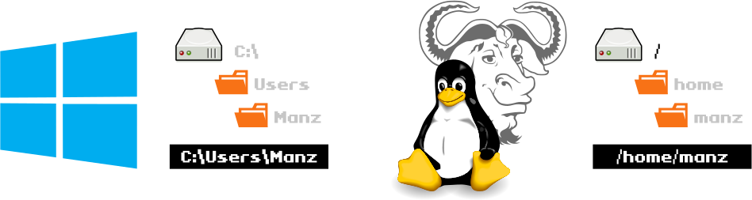

> Cuando se está en la carpeta home del usuario en Linux, el prompt no lo indica en la ruta. Se puede llegar desde cualquier lugar usando el comando *cd*.

### Manejo de directorios/ficheros

Los comandos para **operaciones generales** de manejo de directorios y ficheros en consola son los siguientes:

| **Comando** | **Acción**                              | **Ejemplo**                |
|-------------|-----------------------------------------|----------------------------|
| **cp**      | copia archivos o directorios            | cp \*.txt correspondencia/ |
| **mv**      | mueve o renombra archivos o directorios | mv palabras.txt texto.txt  |
| **rm**      | borra archivos o directorios            | rm -R cosas/basurilla      |
| **rmdir**   | borra directorios                       | rmdir Viejo                |

Borrar un fichero o directorio: 

```bash
    ~$ rm fichero
``` 

Renombrar un fichero: 

```bash
   ~$ mv ficheroorig ficherofinal
``` 

Mover de sitio un fichero: 

```bash
    ~$ mv ficheroorig path/ficherofinal
```

Copiar un fichero/directorio:

```bash
    ~$ $ cp dir_origen/fichero_orig dirfinal/ficherofinal
```

### Cambio de usuario

Cambiar de usuario en sistemas Linux y utilizar privilegios de administrador, conocido como **root**, es algo habitual. Para ello se utiliza el comando **sudo**.

**sudo** viene de "**s***witch* **u***ser* **do**" y permite a los usuarios ejecutar comandos que requieren privilegios de seguridad del **root**, de una manera segura.

> Por defecto Ubuntu trae desactivada la cuenta del "root", por seguridad. Para administrar el sistema existe un grupo de usuarios denominado "sudoers users" (administradores o admin), los cuales pueden obtener permisos de root, mediante la utilización de "sudo" lo que veremos en unidades posteriores.


### Listado de directorios/ficheros

Para obtener la lista de los ficheros en el directorio actual se utiliza el comando **ls**:

    ls [directorio\|fichero]

Parámetros:

\-l: Información detallada
\-a: Todos (incluidos ocultos)
\-t: Ordenar por fecha de modificación
\–r: Ordenación inversa

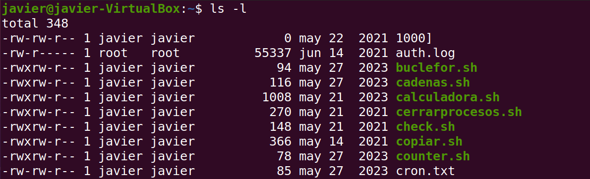

> ls –l puede abreviarse a ll

Significado de los **colores** para el comando **ls** en la terminal bash de Ubuntu:

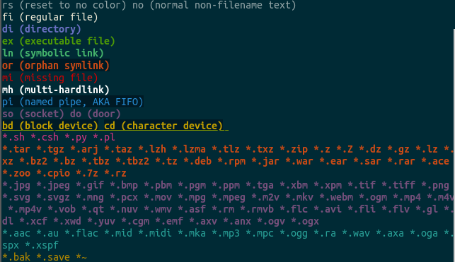

### Mostrar el contenido de ficheros

Para mostrar el contenido de un fichero de texto se usa el comando *cat*:

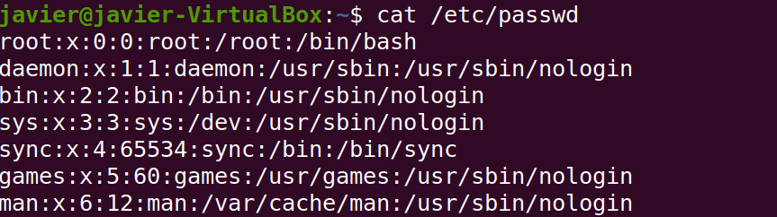

Si queremos mostrar solamente las **primeras** líneas de un fichero o las **últimas** utilizaremos los comandos *head* o *tail*:

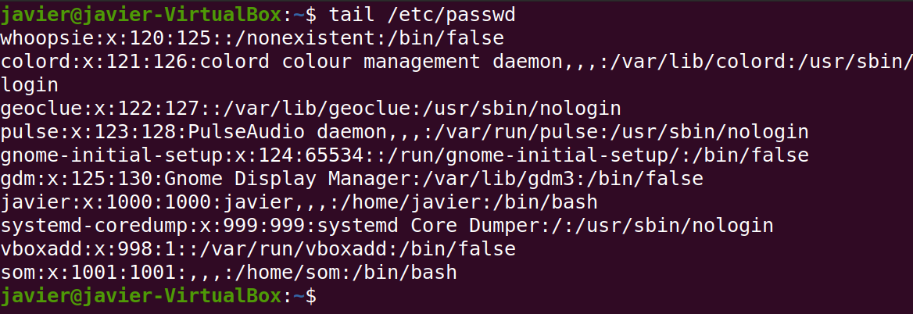

### Ficheros ocultos

**Ocultar** archivos y directorios en Linux es una operación relativamente sencilla.

La forma más habitual de hacerlo consiste en colocar un punto al inicio del nombre del archivo o directorio.

Desde un terminal de consola procederíamos de la siguiente forma:

    mv fichero.txt .fichero.txt

La segunda opción de ocultar archivos sería creando un archivo llamado *.hidden*. En este archivo colocaremos los nombres de todos los archivos y directorios que queramos ocultar.

### Creación/redirección ficheros

Para crear un fichero de texto vacío utilizaremos el comando `touch nombrefichero`

```bash
    ~$ touch fichero.txt
```
Si lo que queremos es volcar el contenido de un comando en otro lo haremos utilizando el símbolo >. Veremos más adelante cómo funcionan las operaciones de redireccionamiento en Linux con más detalle. Por ejemplo, para volcar el contenido del resultado del comando date, que muestra la fecha y la hora en Linux lo haremos de la siguiente forma:

Si lo que queremos es volcar el contenido de un comando en otro lo haremos utilizando el símbolo **\>**. Veremos más adelante cómo funcionan las operaciones de redireccionamiento en Linux.

Por ejemplo, para volcar el contenido del resultado del comando date, que muestra la fecha y la hora en Linux lo haremos de la siguiente forma:

```bash
    ~$ date > fechayhora.txt
```

Si lo que queremos en cambio es añadir contenido a un fichero de texto ya existente utilizaremos el operador **\>\>**.

### Comando date

El comando date sirve para mostrar la fecha y la hora actual. Dicha salida puede formatearse con una secuencia de caracteres de control de formato precedidos por el signo + entre "". Los controles de formato comienzan con el % y se sustituyen por los caracteres de control de dicho formato de salida.
Listado de los caracteres de formato más comunes:

| Carácter control | Descripción            |
|------------------|------------------------|
| %d               | Día del mes            |
| %H               | Hora (formato 24h)     |
| %m               | Mes                    |
| %M               | Minuto                 |
| %s               | Segundo                |
| %Y               | Año completo           |
| %u               | Día de la semana       |

Por ejemplo:

    ~$ date +"%d %Y" 
    02 2024

### Agregar/eliminar paquetes

Para la instalación/desintalación de paquetes de software en Ubuntu se utiliza el comando **apt**.

Para instalación de un nuevo componente/paquete antes usaremos el comando **apt install [nombre del paquete]**

Antes de hacerlo, se suele actualizar la lista de paquetes usando **apt update.**

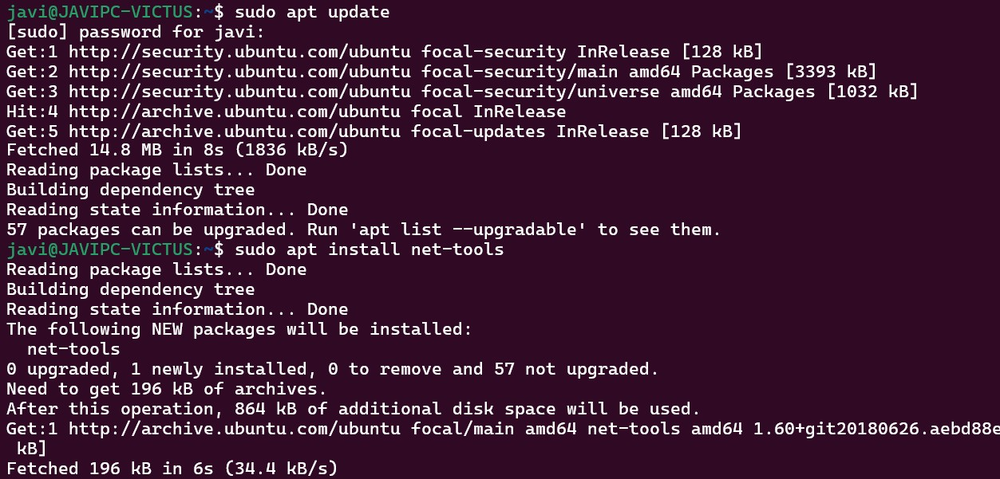


## Variables de entorno

Las **variables de entorno** son porciones de memoria que guardan datos.

En la terminal Bash las variables de entorno tienen un nombre alfanumérico. Para referirse al valor de la variable se utiliza el carácter dólar \$ como prefijo del nombre.

Para ver las variables se usa el comando **env**. Algunas de las importantes son:

| **Variable** | **Descripción**                                                               |
|--------------|-------------------------------------------------------------------------------|
| \$HOME       | Directorio personal del usuario actual.                                       |
| \$HOSTNAME   | Nombre de la máquina.                                                         |
| \$PATH       | Lista de directorios donde buscar los programas ejecutables (separados por ;) |
| \$SHELL      | Intérprete de comandos por defecto.                                           |
| \$TERM       | Tipo de terminal.                                                             |
| \$USER       | Nombre del usuario.                                                           |
| \$PWD        | Ruta del usuario actual.                                                      |
| \$PS1        | PROMPT principal                                                              |

Se pueden cambiar el valor de las variables según necesidad o añadir variables propias para que sean utilizadas por otros programas o desde la línea de comando.

Por ejemplo para crear una nueva variable: HOY=viernes

Se podrá ver el valor de esa variable escribiendo: echo \$HOY *(no olvidar el \$ delante)*

Si ahora se empleara el comando **set** la variable aparecerá ahí, sin embargo usando el comando **env** no aparecerá. La variable ha sido creada localmente y solo podrá ser referenciada localmente.

Para que sea accesible por subrutinas o procesos hijos se deberá utilizar el comando

**export** que hará que pase de ser local a ser una variable del entorno: **export** HOY

Para que el valor sea permanente debes añadir la definición a un perfil, por ejemplo puedes cambiar el valor de PATH para todos los usuarios del sistema, conectándote como root y editando el archivo /etc/profile modificando la línea donde se define la variable PATH.

Si fuese necesario eliminar una variable se utilizaría el comando **unset**.

### Gestión de almacenamiento en Linux

En Linux todo es un **archivo**, incluyendo dispositivos como discos duros, cdroms, memorias usb, etc., así como dispositivos de comunicación como puertos serial y paralelos, tarjetas de sonido, tarjetas de red etc, incluso también las consolas o terminales son dispositivos asociados a un archivo.

Estos dispositivos son enlazados (*linked*) a un dispositivo de **archivo**, es decir un dispositivo físico representado o asociado a un archivo.

Dichos archivos se encuentran en el directorio **/dev** el cual veremos más adelante.


En la siguiente tabla se indica el *designador* de dispositivo y su descripción en **/dev**. Se numeran secuencialmente de 0 hasta donde la arquitectura de hardware lo limite.

| **Tipo**    | **Dispositivo**                                                                                                                                          |                                                                   |
|-------------|----------------------------------------------------------------------------------------------------------------------------------------------------------|-------------------------------------------------------------------|
| /dev/hd     | Discos duros IDE y dispositivos IDE antiguos.                                                                                                            |                                                                   |
| **/dev/sd** |                                                                                                                                                          | Dispositivos de almacenamiento SATA como discos duros, SSDs, etc. |
| /dev/dsp    | Digital Signal Processor. Interfaz entre el software y la tarjeta de sonido.                                                                             |                                                                   |
| /dev/fd     | Unidades de disquetes.                                                                                                                                   |                                                                   |
| /dev/loop   | Se utiliza como abstracción de dispositivos en bloques para el montaje de sistemas de archivos como imágenes ISO. No confundir con el loopback de redes. |                                                                   |
| /dev/lp     | Puertos paralelos.                                                                                                                                       |                                                                   |
| /dev/mcblk  | Tarjetas SD/MMC de almacenamiento.                                                                                                                       |                                                                   |
| /dev/md     | Grupo de metadiscos. Utilizado en sistemas RAID.                                                                                                         |                                                                   |
| /dev/null   | Llamado bit bucket (cubo de bits). Usado para redirigir y descartar información .                                                                        |                                                                   |
| /dev/tty    | Terminales o consolas. *tty0* hace referencia a la propia terminal del usuario.                                                                          |                                                                   |
| /dev/pty    | Terminales remotas o de red, incluyendo las abiertas en Window X.                                                                                        |                                                                   |
| /dev/ttyS   | Puertos serial.                                                                                                                                          |                                                                   |
| /dev/random | Generador de números aleatorios del kernel.                                                                                                              |                                                                   |
| /dev/eth    | Tarjetas o interfaces de red Ethernet.                                                                                                                   |                                                                   |

### Formateo de discos

El comando **mkfs** se utiliza para dar **formato** a un dispositivo de almacenamiento de bloque con un determinado **sistema de archivos**.

Su sintaxis es la siguiente:

    mkfs [parámetros] [-t sistemas archivos\*] dispositivo [tamaño]

Así por ejemplo:

```bash
    #Formatear y crear sistema de ficheros ext4
    mkfs -t ext4 /dev/sdd1
    #Otra variación de mkfs para formateo a ext4
    mkfs.ext4 /dev/sdd1
    #Formatear un disco usb
    mkfs -t exfat /media/usb
```

### Particionado de discos

El comando **fdisk** se utiliza desde la terminal de Ubuntu para realizar operaciones de particionamiento a través de comandos que veremos a continuación.

Para verificar las existentes utilizaremos fdisk –l y para mostrar las relativas a discos físicos sd usaremos fdisk –l /dev/sd?


Para usar **fdisk** en modo interactivo indicaremos la partición sobre la que realizar la operación y aparecerá el siguiente **menú**:


Las **opciones** más usadas del modo interactivo son las siguientes:

| **opción** | **Descripción**                              |
|------------|----------------------------------------------|
| d          | Borra una partición                          |
| l          | Lista los tipos de partición                 |
| m          | Muestra las opciones del menú                |
| n          | Crea una nueva partición                     |
| p          | Muestra las particiones actuales             |
| q          | Sale de fdisk sin guardar las modificaciones |
| t          | Cambia el tipo de partición                  |
| v          | Analiza la tabla de partición                |
| w          | Guarda los cambios y sale de fdisk           |

Creación de una nueva partición con **fdisk**:

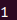

**Secuencia comandos:**
- n (nueva)
- p (primaria)
- 1 (posición)
- [enter]
- +2GB (tamaño)
- w (grabar)

Las particiones **primarias** en **MBR** se numeran de 1 a 4 y las **lógicas** de 5 a n:

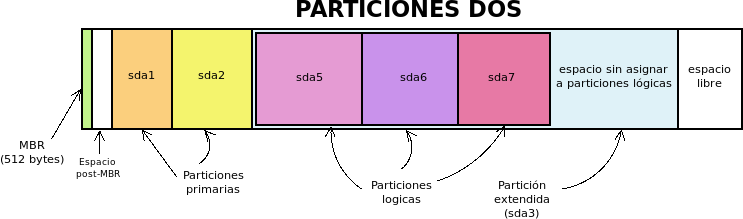

En **GPT** las particiones se numeran de 1 a n:

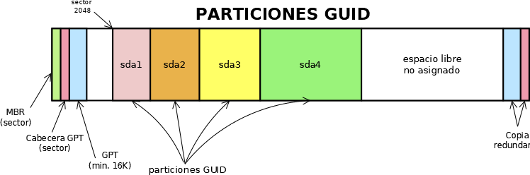

En SO como Android, basados en Linux, el sistema está particionado por defecto con hasta 5 particiones distintas para almacenar el arranque (*Boot*), el SO (System), el Recovery, los datos de las apps y el usuario (*Data*), y una cache con las apps:

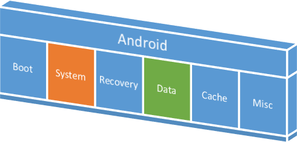

### Montaje de discos

El sistema de archivos de Linux tal y como vimos sólo tiene una **raíz** y su estructura es independiente de los dispositivos de almacenamiento existentes. Esto implica que el procedimiento a emplear para acceder a la información almacenada en los distintos sistemas de almacenamiento de un ordenador no es tan sencillo como en Windows, y requiere un proceso llamado **montaje**.

```note
El montaje de ciertos dispositivos desde la interfaz de muchas de distribuciones modernas está automatizado. Cuando introducimos un disco en la unidad de DVD o insertamos un dispositivo USB o tarjeta, aparecerán automáticamente en el escritorio de Ubuntu iconos que representan los nuevos dispositivos conectados.
```


Los comandos **mount** y **umount** se utilizan para **montar dispositivos o particiones,** previamente formateados, y enlazarlos al sistema principal de archivos:

| **Comando** | **Uso**                                                                              | **Sintaxis**                                         |
|-------------|--------------------------------------------------------------------------------------|------------------------------------------------------|
| mount       | Usado para montar o asociar dispositivos de almacenamiento en el sistema de archivos | mount [-fnsrvw] [-t vfstype] [-o options] device dir |
| umount      | Usado para desmontar dispositivos de almacenamiento asociados al sistema de archivos | umount [-dflnrv] device dir                          |
| mkfs        | Orden usada para formatear dispositivos de almacenamiento o extraíbles               | mkfs –t [fstype] –options –c –v –v –t                |

Cuando montamos un sistema de ficheros, indicamos un directorio del sistema de ficheros "padre", del cual va a colgar la estructura de directorios del sistema de ficheros "hijo". Así, por ejemplo:

    mount [-t sistema de ficheros] [dispositivo] punto_montaje

Con el comando **mount** no solo tenemos la posibilidad de montar discos duros, si no también podremos montar imágenes ISO, sistemas de archivo remoto, etc. Por ejemplo, para montar un CDROM:

```bash
    sudo mount -t iso9660 /dev/cdrom /media/cdrom
```

Para *montar/desmontar* una partición NTFS de Windows:

```bash
    sudo mount -t ntfs /dev/sda3 /mnt/windows
    sudo umount /mnt/windows/
```

Y para montar/desmontar una memoria USB:

```bash
    sudo mount –t vfat /dev/sdb1 /media/usb
    sudo umount /media/usb  
```

Montaje de un imagen ISO descargada en /home:

```bash
    sudo mount /home/usuario/Kalinux_64.iso /mnt/iso
```

> El directorio **/mnt/** se utiliza generalmente para montajes temporales y el **/media/** para extraíbles.

### Particionado, montaje, formateo

Pasos para el montaje de un disco desde su creación en la MV y formateo:

1. Crear un **disco Virtual** de tipo sd con la máquina de Linux apagada. A continuación, arrancarla normalmente.

2. Opcionalmente se puede hacer el **particionado** de dicho disco.

3. Se le da **formato** al disco en */dev/sd\** usando el comando *mkfs* y el sistema de archivos:

```bash
    sudo mkfs –t ext4 /dev/sdb
```

4. Se crea la carpeta o directorio en *mnt* donde desees montar dicho disco:

```bash
    sudo mkdir /mnt/midisco
```

5. Se proceder al **montaje** del disco en dicha carpeta volviendo a indicar el sistema de archivos:

```bash
    sudo mount –t ext4 /dev/sdb /mnt/midisco
```

### Montaje en el arranque

El archivo **fstab** (*File System Table*) se encuentra en el directorio /etc/fstab y se utiliza durante el arranque para leer distintos dispositivos de bloques o sistemas de archivos remotos deben ser montados e integrados en el sistema.

Su **formato** es el siguiente:

| Dispositivo <UUID \| file system> | Punto de montaje <dir> | Sistema de archivos <type> | Opciones sistema archivos <options> | Manejo backups <dump> | Orden chequeos <pass> |
|-----------------------------------|------------------------|-----------------------------|-------------------------------------|-----------------------|------------------------|
|                                   |                        |                             |                                     |                       |                        |


| \# \<file system\> | \<dir\> | \<type\> | \<options\> | \<dump\> | \<pass\> |
|--------------------|---------|----------|-------------|----------|----------|
| /dev/sda1          | /       | ext4     | defaults    | 1        | 1        |
| /dev/sdb1          | /usr    | ext4     | defaults    | 1        | 2        |
| /dev/sda5          | swap    | swap     | defaults    | 0        | 0        |

- **\<file system\>** ruta en dev
- **\<dir\>** directorio de montaje
- **\<type\>** ext2, ext3, reiserfs, xfs, jfs, smbfs, iso9660, vfat, ntfs, swap, and auto
- **\<options\>** auto, noauto, exec, noexec,ro, rw, async, flush, user, nouser, suid, nosuid, *defaults*
- **\<dump\>** usado por la utilidad *dump* para decidir si hacer backup en caso de 1
- **\<pass\>** fsck lee el número para determinar el orden en el que los sistemas de ficheros deberían chequearse.

Lo habitual es que el archivo **fstab** use el siguiente formato, usando un identificador *UUID* en lugar de los puntos de montaje vistos anteriormente:

| \# \<file system\>                              | \<dir\> | \<type\> | \<options\> | \<dump\> | \<pass\> |
|-------------------------------------------------|---------|----------|-------------|----------|----------|
| UUID=0a3407de-014b-458b-b5c1-848e92a327a3 /     | ext4    | defaults | 1           | 1        |          |
| UUID=b411dc99-f0a0-4c87-9e05-184977be8539 /home | ext4    | defaults | 0           | 0        |          |
| /                                               |         |          |             |          |          |

> El **UUID** (*Universally Unique Identifier*) es un identificador único para cada sistema de ficheros. Al utilizar el UUID en lugar de la referencia física de conexión podremos cambiar las conexiones de los discos sin que los puntos de montaje se vean afectados.

### Chequeo de discos

**fsck** (*file system check*) es el comando de Linux que permite verificar y reparar, en caso de ser necesario, un sistema de archivos de una forma segura.

Si se utiliza con el parámetro **–N,** sólo se desplegará la información de la unidad seleccionada:


No se debe de utilizar **fsck** en unidades montadas, ya que existen posibilidades de que el bloqueo de la unidad dañe permanentemente su sistema de archivos.

> ⚠ Antes de ejecutar fsck, se debe primeramente desmontar la unidad a analizar.

### Comando df (disk free)

El comando **df** (*disk free*) muestra detalles acerca de los sistemas de archivos montados, es decir, detalla el espacio total, ocupado y libre de nuestro sistema.

Al ejecutarse sin opciones, el comando muestra el espacio disponible en todos los sistemas de archivos montados al momento.

Es aconsejable el parámetro *-h*, para que facilite la lectura en Gb, Mb o Kb.

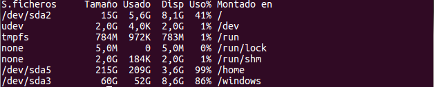

También podemos investigar el espacio libre y ocupado de determinados tipos de sistemas de archivos en particular. Para esto utilizamos la opción -t seguido del tipo de sistema de archivo que nos interese.

### Información de discos

El comando **lsblk** es útil ya que muestra información de todos los dispositivos de bloque del sistema y sus puntos de montaje:


Recuerda que en Linux las particiones en *MBR* se mostrarán de la siguiente forma:

-   Las nombradas de la 1 a la 4 son particiones **primarias**
-   Las nombradas a partir de la 5 son particiones **lógicas**

Los **loop devices** (*loop0, loop1*..) que aparecen listados en los comandos vistos anteriormente y en el directorio dev, son dispositivos virtuales que se utilizan para acceder a un fichero como un dispositivo de bloques.

Linux (y la gran mayoría de sistemas *UNIX*) dispone de un mecanismo que permite montar un fichero (previamente formateado) como si fuese un disco duro, normalmente sin tabla de particiones. Este tipo de archivos se usan a veces para almacenar imágenes ISO de discos y posteriormente montarlas.

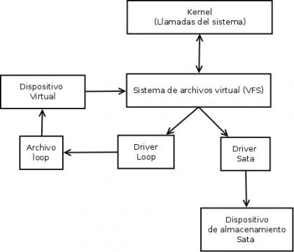

Listado de comandos de **administración de discos** destacados:

| **Comando** | **Descripción**                                                                   |
|-------------|-----------------------------------------------------------------------------------|
| **mount**   | Montar sistemas de ficheros en un punto de anclaje                                |
| **umount**  | Desmontar sistemas de archivos de un punto de anclaje                             |
| **mkfs**    | Dar formato a un dispositivo o partición                                          |
| **fsck**    | Chequear el estado de un sistema de archivos concreto                             |
| **du**      | Uso de espacio en disco.                                                          |
| **df**      | Mostrar espacio libre en disco.                                                   |
| **lsblk**   | Enumera información sobre los dispositivos de bloque disponibles o especificados. |
| **blkid**   | Información de UUID del disco.                                                    |

## Introducción  a los procesos en Linux

```note
Un **proceso** en Linux es una instancia de un programa que está en ejecución en memoria y que se identifican mediante un PID.
```

El **PID** (*Process Identificator*) es un número único que se asigna a un proceso cuando se inicia. Son números crecientes y los procesos que se terminan y luego se vuelven a iniciar van a tener un **PID** diferente.

El **PID** número 1 se asigna al primer proceso que inicia el sistema operativo al ser arrancado (que suele ser **systemd**).

Todo proceso en Linux tiene un Proceso Padre o *Parent ID* (**PPID**), generando un árbol jerárquico de procesos y estos a su vez siempre tendrán de padre al proceso 1.


En Linux existen principalmente **dos tipos de procesos**:

- **Procesos del sistema**. Son los procesos que actúan sin que el usuario los solicite. También reciben el nombre de demonios (*daemon*). Hay de dos tipos:

    - **Procesos permanentes o de larga duración**. Se crean cuando se arranca el sistema y permanecen activos hasta que se desconecta. Su función es soportar las actividades del sistema.
    -  **Procesos transitorios**. Nacen y mueren cuando el sistema efectúa tareas propias, independientes de los usuarios.

-   **Procesos de usuario**. Son los procesos asociados a cada usuario como consecuencia de la interpretación de sus órdenes.

### PID y BCP de un proceso

Cada proceso al crearse se le asocia un número único (**PID**) que lo identifica.

Además, a un proceso están asociadas otras informaciones (*BCP*) como:

-   Un **identificador** o identificadores (USER, PID, UID, GID, PPID)
-   La **hora** de inicio en que comenzó.
-   Un **estado**; *running, sleep, zombie, stopped*, que veremos a continuación.
-   Tanto por cierto % de uso de memoria y CPU
-   Una **prioridad relativa** que indica la facilidad del proceso para acceder a la CPU:
    -    Oscila entre -20 y 19, donde -20 es la **mayor** prioridad.
-   La terminal asociada (*tty*) desde donde fue invocado (en el caso que esté asociado a una terminal)

    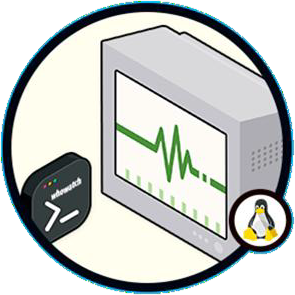

### Estados de un proceso


Estado de los procesos en Linux

Los **estados** en los que puede estar un proceso en Linux son los siguientes:

| **Estado** | **Descripción del estado**                                                                                                                                                                       |
|------------|--------------------------------------------------------------------------------------------------------------------------------------------------------------------------------------------------|
| **D**      | **Espera ininterrupible** *(sleep).* Generalmente el proceso se encuentra esperando una operación de entrada/salida con algún dispositivo. El proceso no se puede interrumpir.                   |
| **R**      | Proceso **ejecutándose** (*running*), corriendo en el procesador.                                                                                                                                |
| **S**      | **Espera interrumpible**, el proceso está ejecutándose, pero en espera de que se planifique para su ejecución en la CPU.                                                                         |
| **T**      | Proceso **esperando** (*stopped*) mediante el envío de alguna señal.                                                                                                                             |
| **Z**      | **Zombie**. Proceso terminado, pero cuyo padre aún sigue «vivo» y no ha capturado el estado de terminación del proceso hijo, y por tanto no lo ha eliminado de la tabla de procesos del sistema. |
| **X**      | Proceso **terminado** esperando eliminarse de la tabla de procesos                                                                                                                               |

### Listados de procesos

El comando habitual para mostrar los procesos del sistema es **ps**


Para mostrar **todos los procesos** se utiliza el parámetro: **ps -aux**


Para mostrar **todos los procesos** y su **prioridad**, que veremos a continuación, podemos utilizar el parámetro: **ps –el**


Para conocer el PID de un proceso en concreto usaremos el comando **pidof**


Para mostrar determinadas columnas utizaremos: **ps –eo [columnas]**

Así, por ejemplo: **ps –eo pid,user,%cpu,comm**

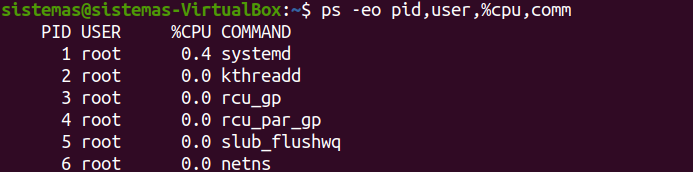

Los valores de las columnas pueden ser los siguientes:

| pid  | ID del proceso.                       |
|------|---------------------------------------|
| user | Usuario que ejecuta el proceso        |
| uid  | ID del usuario que ejecuta el proceso |
| comm | Nombre del comando                    |
| %mem | Porcentaje de uso de memoria          |
| pri  | Prioridad del proceso                 |
| stat | Estado del proceso                    |
| nice | Valor niceness del proceso            |

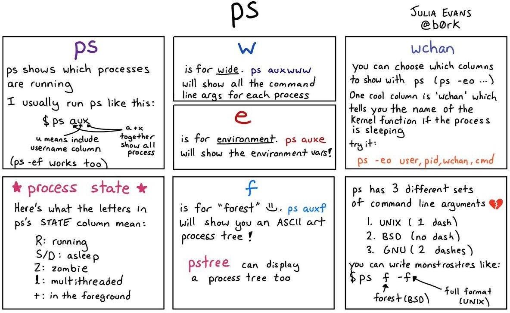

## Introducción a los servicios (daemons) en Linux

### Systemctl

En **Linux** el comando **systemctl** se utiliza para controlar y administrar **servicios (o daemons)** del sistema, durante el **arranque** y durante la sesión actual.

El comando `systemctl` admite los siguientes **parámetros** de uso:

| **Acción**                                                               | **systemd**               |
|--------------------------------------------------------------------------|---------------------------|
| **Listar** todas las unidades de servicios y sus estados                 | systemctl list-unit-files |
| **Arrancar** un servicio                                                 | systemctl **start** foo   |
| **Detener** un servicio                                                  | systemctl **stop** foo    |
| **Reiniciar** un servicio                                                | systemctl **restart** foo |
| Mostrar **estado** de un servicio                                        | systemctl **status** foo  |
| **Activar** un servicio para que sea ejecutado durante el arranque       | systemctl enable foo      |
| **Desactivar** un servicio para que no sea ejecutado durante el arranque | systemctl disable foo     |

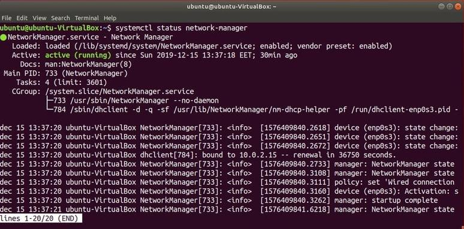

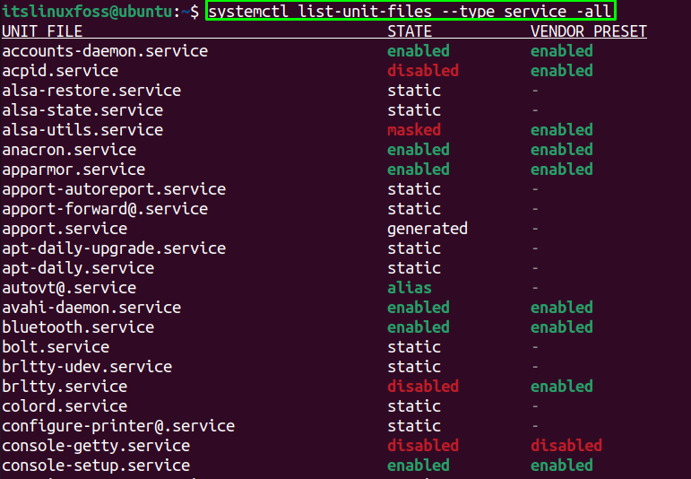
