# UT5.5 Administración de redes en consola Windows y Linux

## Configuración y comandos de red Windows

Los **requisitos hardware** necesarios para instalar una red Windows son muy básicos. Cada equipo contará con uno o más adaptadores de red (*máximo 4*), y tendremos que disponer del cableado y los componentes hardware específicos para que los equipos se puedan comunicar entre ellos.

Para poder integrar nuestro equipo en una red, es necesario tener en cuenta algunas consideraciones previas:

-   El **nombre de cada equipo** de la misma red física tiene que ser diferente.
-   La **dirección IP** de cada equipo dentro de una misma red física no puede ser la misma.
-   La **máscara de subred** de los equipos en una misma red física debe ser, en principio, la misma.
-   Puerta de enlace y un servidor DNS. \*

### Interfaces de red

La configuración global de **redes** para nuestras interfaces de red se centraliza desde el apartado de configuración *Red e Internet*

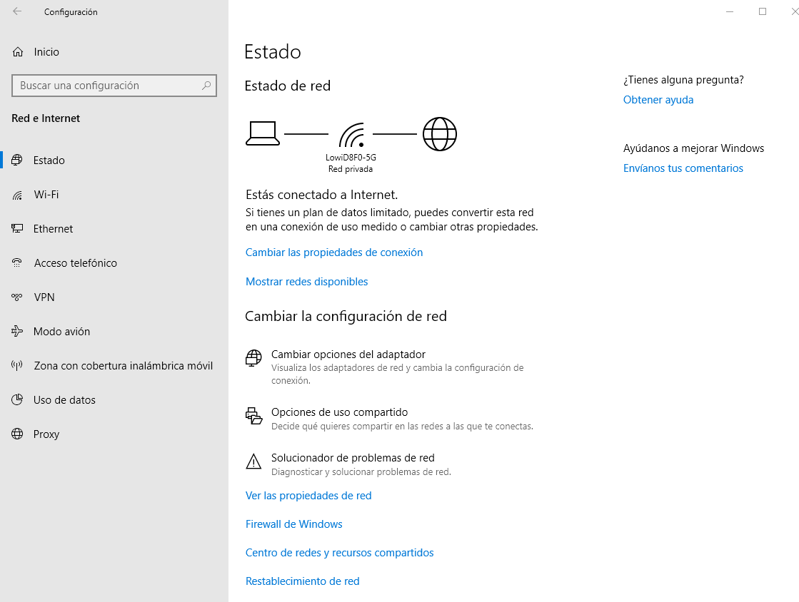
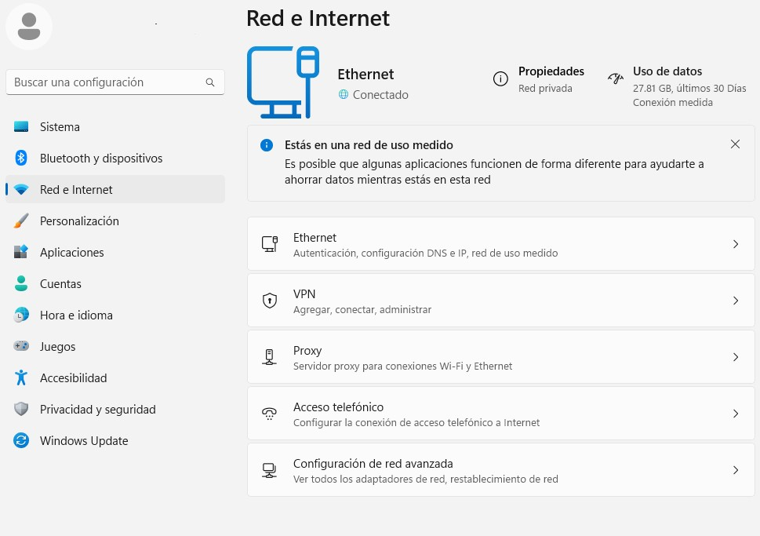

Para acceder directamente a las interfaces de red podremos hacerlo con el comando *ncpa.cpl*

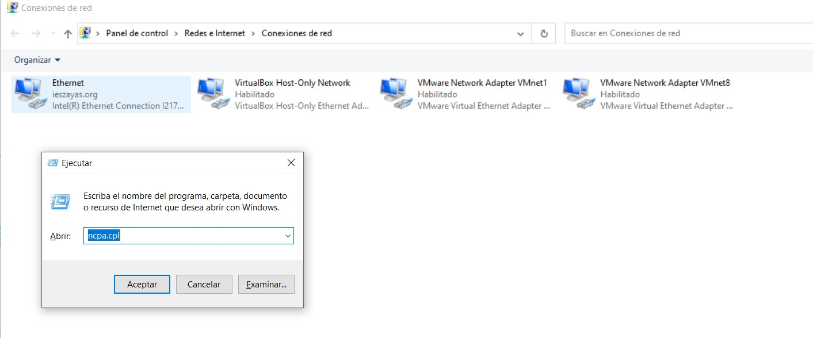

### Nombre del equipo

El **nombre del equipo** se utiliza para identificar un equipo en una red (no confundir con *descripción del equipo*). Se puede acceder desde propiedades del sistema.

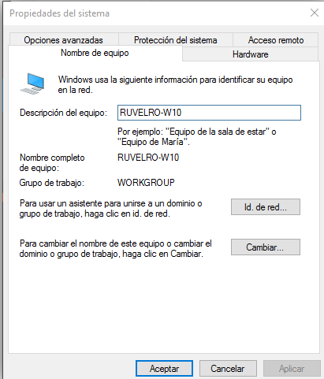
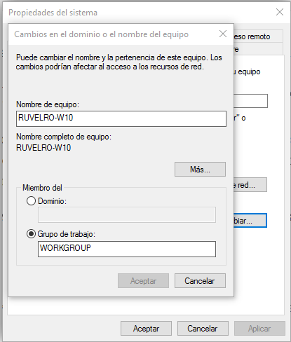

El **nombre del equipo** también se puede cambiar en el apartado *Acerca De* dentro del apartado Sistema en la configuración de Windows 10 o desde el apartado Sistema\> *cambiar nombre* en Windows 11:

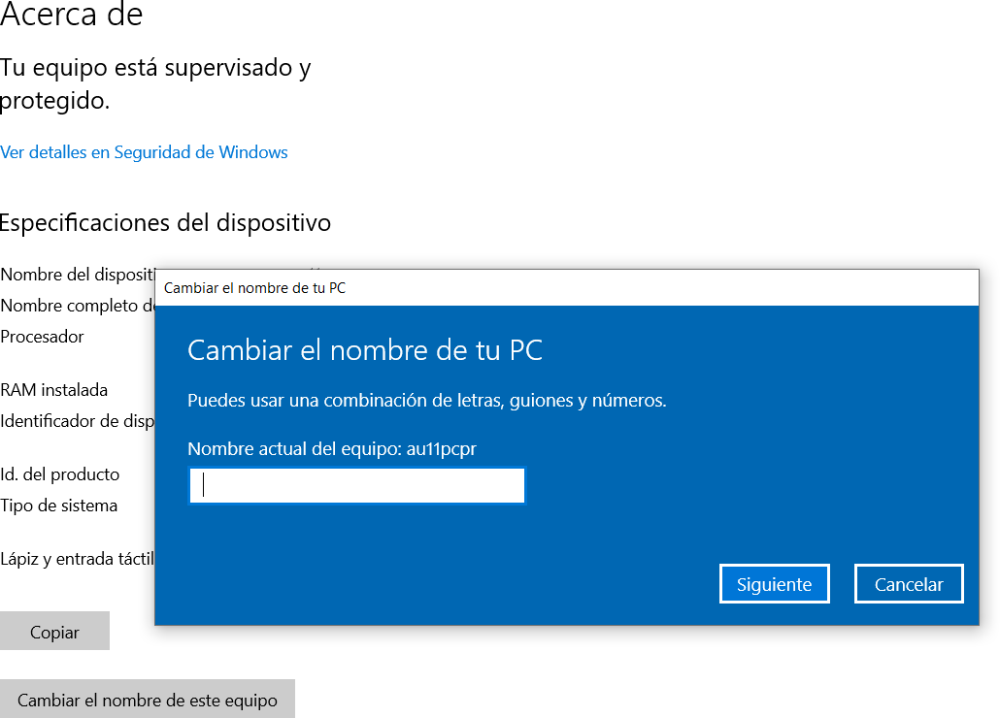

### Grupos de trabajo

```note
Un grupo de trabajo permiten unir diferentes equipos usando grupos lógicos y a partir de allí tener la opción de compartir archivos e impresoras.
``` 

Las características de un grupo de trabajo son:

-   La relación entre todos los equipos de un grupo de trabajo es de igual a igual, es decir, ningún equipo en el grupo tiene control sobre otro.
-   El número de equipos no debe superar los 20 equipos, por razones de control y recursos, si pasa de este límite se recomienda un dominio.
-   Con el fin de que los usuarios de un grupo de trabajo estén en la posibilidad de verse entre ellos, todos deben estar en la misma red local.
-   Cada equipo perteneciente al grupo de trabajo debe disponer de su propia cuenta de usuario local.

Para unirnos a un grupo de trabajo basta con **cambiar** el nombre predeterminado de **WORKGROUP** en propiedades del sistema, pero es necesario también que todos los equipos en el grupo de trabajo posean un **nombre de equipo único**.

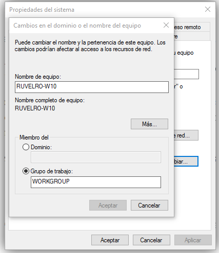

### Dominios

Las redes basadas en **Dominios** son comunes en empresas y organizaciones, donde el proceso requiere que varios equipos sean controladas en red a través de un solo nodo llamado servidor de dominio, los cuales veremos más adelante.

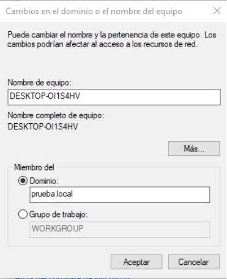

### Dirección IP

Una vez identificados los equipos en la red, tendremos que configurar el protocolo *TCP/ IP* para que los equipos puedan comunicarse entre ellos. Por defecto en Windows siempre que dispongamos de adaptador de red el protocolo TCP/IP, se instalará automáticamente e iniciarán los servicios de red correspondientes.

Recordemos la distinción entre las IP públicas y las IP privadas en una red de ordenadores locales:

-   Una **IP privada:** es la que utiliza cada dispositivo dentro de su red local dentro de los siguientes rangos para IPv4:
    -   De 10.0.0.0 a 10.255.255.255 (clase A)
    -   172.16.0.0 a 172.31.255.255 (clase B)
    -   192.168.0.0 a 192.168.255.255 (Clase C)
-   Una **IP pública**: Es la que tendrá asignada cualquier equipo o dispositivo conectado de forma directa a Internet (como nuestro router)

### PING

El conocido comando PING sirve para probar el estado de la comunicación del host local con uno o varios equipos remotos accesibles por una dirección IP.

Por medio del envío de paquetes *ICMP*, diagnostica el estado, velocidad y calidad de una red determinada.

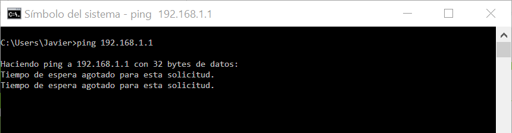

### GETMAC

Obtiene la dirección **MAC** de todas las interfaces de red del equipo donde se ejecuta. La dirección MAC es un identificador único de 48 bits determinado y configurado por el IEEE y el fabricante (24 bits cada uno).

### IPCONFIG

El comando **IPCONFIG** muestra todos los valores de configuración de red *TCP/IP* actuales de las interfaces de red indicadas. También permite reasignar las direcciones dinámicas *DHCP* y del sistema de nombres de dominio o *DNS*. 

Utilización de sus parámetros:

| **Comando / parámetro**        | **Uso**                                                                          |
|--------------------------------|----------------------------------------------------------------------------------|
| IPCONFIG /all                  | Muestra toda la información disponible en el adaptador o tarjeta de red empleado |
| IPCONFIG /release              | Libera la dirección IP del adaptador especificado                                |
| IPCONFIG /renew                | Renueva la dirección IP del adaptador especificado                               |
| IPCONFIG /displaydns           | Muestra el contenido de la caché de resolución DNS                               |
| IPCONFIG /flushdns             | Vacía la memoria caché de resolución DNS                                         |
| IPCONFIG /registerdns          | Actualiza todas las concesiones DHCP y vuelve a registrar los nombres DNS        |
| IPCONFIG /showclassid          | Muestra todas las identidades (ID) permitidos para este adaptador                |
| IPCONFIG /setclassid           | Modifica el identificador de clase                                               |
| IPCONFIG /allcompartments /all | Muestra información detallada sobre todos los compartimientos                    |

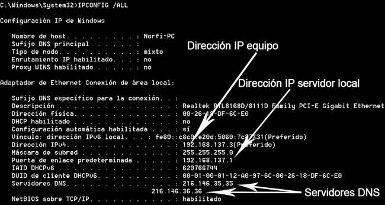

En una red local cuando sea necesario renovar una dirección IP, habrá que utilizar los comandos: **IPCONFIG /RELEASE** y a continuación **IPCONFIG /RENEW**.

Esto solo funciona si se encuentra habilitada la configuración dinámica de host (*DHCP*), es decir que se genera de forma dinámica la dirección IP necesaria.

    IPCONFIG /release *
    IPCONFIG /renew *

Windows también almacena la **cache de resolución DNS**, es decir la relación que existe entre las direcciones IP de sitios visitados y los nombres de dominio, de forma predeterminada 24 minutos. Para mostrarla utiliza:

    IPCONFIG /displaydns

### Tablas ARP

El comando **ARP** en Windows se usa para gestionar y visualizar la tabla ARP, que asocia direcciones IP con direcciones MAC en la red local.

El comando más habitual es *arp –a*

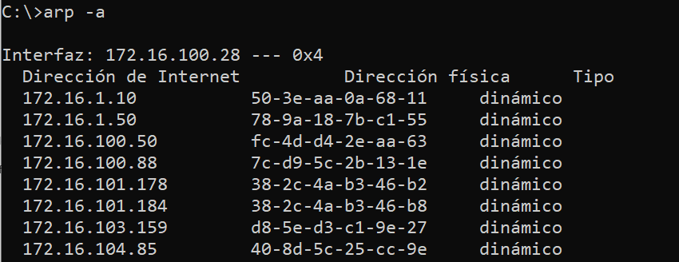

Se puede mostrar la tabla ARP de una interfaz específica o borrar dicha tabla usando el parámetro **-d**

### NSLOOKUP

El comando **NSLOOKUP** se emplea para conocer si el DNS está resolviendo correctamente los nombres y las IPs. También nos permite averiguar la dirección IP detrás de un determinado nombre de Dominio.

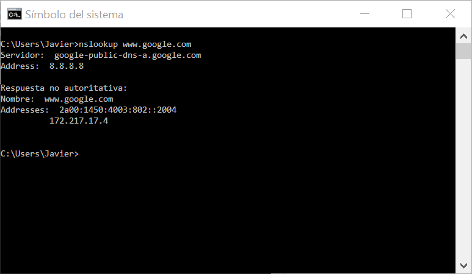

Cuando se hace una consulta mediante NSLOOKUP, aparecen de forma frecuente estos dos términos que tratamos en temas anteriores:

-   **Authoritative Answer:** significa que la respuesta DNS se ha producido desde un servidor DNS que tiene todo el archivo de información disponible para esa zona.
-   **Non Authoritative Answer:** significa que la respuesta DNS se ha producido desde un servidor DNS que tiene en caché una copia de las consultas realizadas para esa zona.

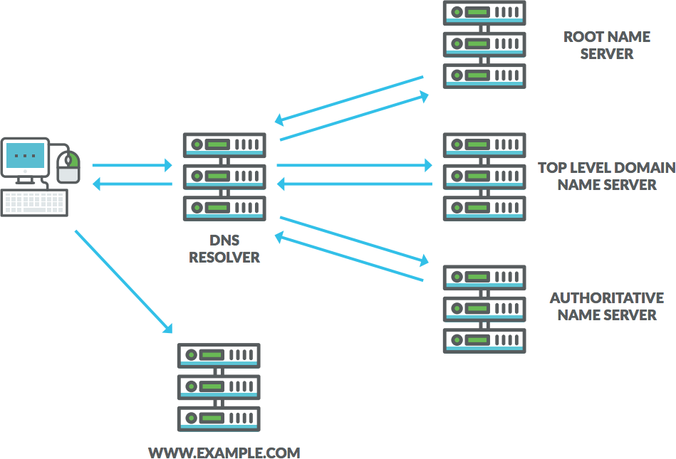

### NETSTAT

NETSTAT es otro potente comando que sirve para mostrar estadísticas de la red y permite diagnósticos y análisis.

Por defecto, muestra un listado de las conexiones activas de una computadora, tanto entrantes como salientes. Incluye el protocolo en uso, las tablas de ruteo, las estadísticas de las interfaces y el estado de la conexión.

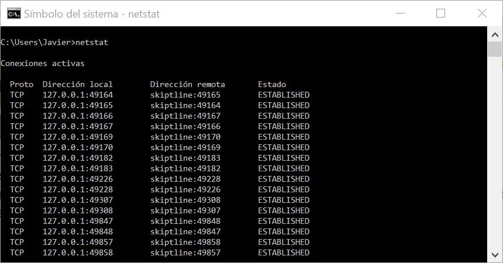

### TRACERT

Permite conocer los paquetes que vienen desde un host (punto de red). También se obtiene una estadística del RTT o latencia de red de esos paquetes, ofreciendo una estimación de la distancia a la que están los extremos de la comunicación.

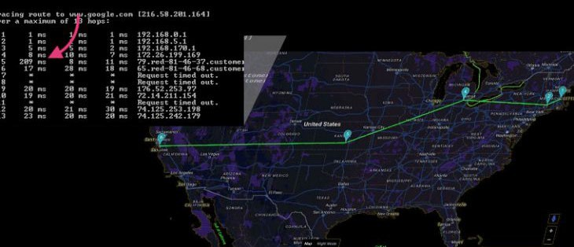

### NETSH

**NETSH** (*Network Shell*) es otra potente herramienta de la línea de comandos de Windows que nos permite consultar, diagnosticar y/o modificar la configuración de la red local o Wifi de nuestro ordenador.

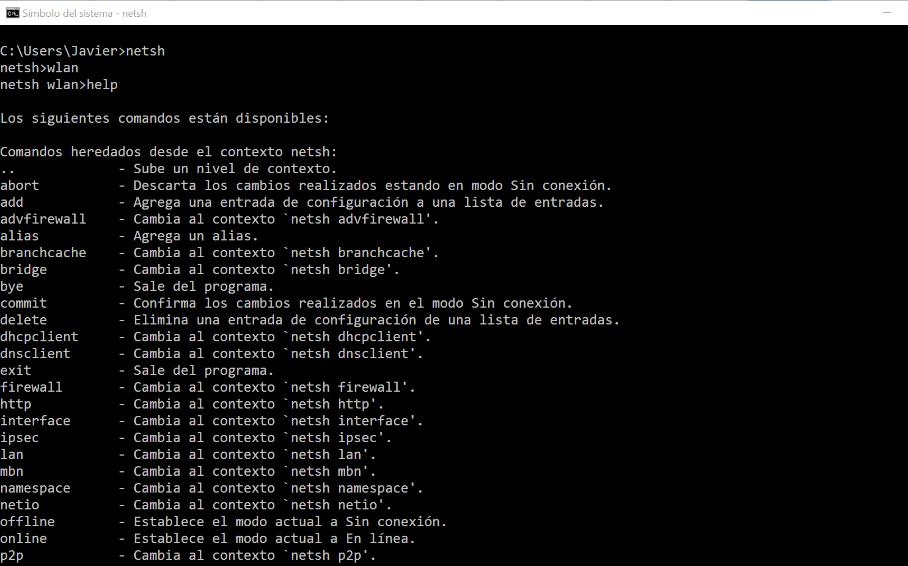


El comando **NETSH** ofrece multitud de opciones a la hora de obtener información sobre la conexión de red, así como configurarla:

-   Para mostrar las estadísticas del protocolo IP:

        NETSH interface ip show ipstats

-   Para ver la relación de direcciones MAC que se corresponden con las direcciones IP de todos los interfaces de red:

        NETSH interface ip show ipnet

-   Para ver los nombres de las interfaces de red de nuestro sistema:

        NETSH interface show interface

-   Para modificar la configuración de la red a una dirección estática:

        NETSH interface ip set address name="Ethernet" source=static addr=192.168.1.10 mask=255.255.255.0 gateway=192.168.1.1

-   Para volver al direccionamiento dinámico (*DHCP*) o automático:

        NETSH interface ip set address name="Ethernet" source=dhcp

-   Otro uso importante sería para modificar el servidor DNS principal y secundario
    -   Para el principal:

            NETSH interface ipv4 set dnsservers "Nombre_red" static IP_DNS primary

    -   Para el secundario:

            NETSH interface ipv4 add dnsservers "Nombre_red" IP_DNS index=2

| **Operaciones (Acciones)**                                                           | **Comando** | **Ejemplo uso**                                                                     |
|--------------------------------------------------------------------------------------|-------------|-------------------------------------------------------------------------------------|
| Nombre del equipo                                                                    | HOSTNAME    | HOSTNAME                                                                            |
| Carpetas compartidas en red                                                          | NET SHARE   | NET SHARE                                                                           |
| Verificar comunicación entre equipos                                                 | PING        | PING 192.168.1.21                                                                   |
| Obtener direcciones MAC                                                              | GETMAC      | GETMAC                                                                              |
| Tablas ARP del equipo                                                                | ARP         | ARP –A –N 192.168.1.5                                                               |
| Obtener valores de configuración de interfaces de red y reasignar valores DHCP o DNS | IPCONFIG    | IPCONFIG /RENEW \*                                                                  |
| Conocer si el DNS está resolviendo correctamente los nombres y las IPs               | NSLOOKUP    | NSLOOKUP [www.google.com](http://www.google.com/)                                   |
| Mostrar estadísticas de la red y ver diagnósticos y análisis.                        | NETSTAT     | NETSTAT                                                                             |
| Determina la ruta a un destino especificado                                          | TRACERT     | TRACERT [www.google.com](http://www.google.com/)                                    |
|   Herramienta de **configuración avanzada** de red en línea                          |   NETSH     | NETSH interface ip show  NETSH interface ip set address name="Ethernet" source=dhcp |


## Configuración y comandos de red en Linux

Para crear la infraestructura de una red en Linux como mínimo, tenemos que tener en cuenta los siguientes aspectos:

- **Configuración de la red**. Para empezar, necesitamos configurar las diferentes interfaces de red de nuestro equipo.
- **Servidor DNS**. Configurar un servidor dns permitirá mantener una equivalencia entre un nombre de Dominio y su dirección IP. 
- **Servidor DHCP**. Permite asignar automáticamente la configuración IP de los equipos clientes de nuestra red. Este servicio es muy importante ya que nos facilita
la conexión de los equipos a nuestra red. Por ejemplo, cuando un portátil se conecta a nuestra red a través del servidor DHCP obtiene su configuración IP.
- **Configurar nuestro router (firewall)**. Para permitir la comunicación entre dos o más redes; y nos permite establecer el tráfico de entrada y de salida que permite
nuestro equipo.


### Interfaces de red

Las interfaces de red también conocidas como NIC (*Network Interface Card*) utilizaban un identificador en Linux que solía llamarse:

| **Interfaz** | **descripción**                                 |
|--------------|-------------------------------------------------|
| eth0         | Primera interfaz de red Ethernet cableada local |
| eth1         | Segunda interfaz de red Ethernet cableada local |
| wlan0        | Primera interfaz de red inalámbrica             |
| lo           | Interfaz loopback (localhost)                   |

A partir de la versión **15.10** de Ubuntu estas nomenclaturas han cambiado y reciben el nombre de *Ethernet Interface Logical Name*. Sus nuevas nomenclaturas son:

| **Interfaz** | **equivalencia**        |
|--------------|-------------------------|
| enp0s3       | El equivalente de eth0  |
| enp0s8       | El equivalente de eth1  |
| wlp1s0       | El equivalente de wlan0 |

### Comando ifconfig

Para identificar, mostrar y configurar las redes de las interfaces del sistema se utiliza el comando **ifconfig.**

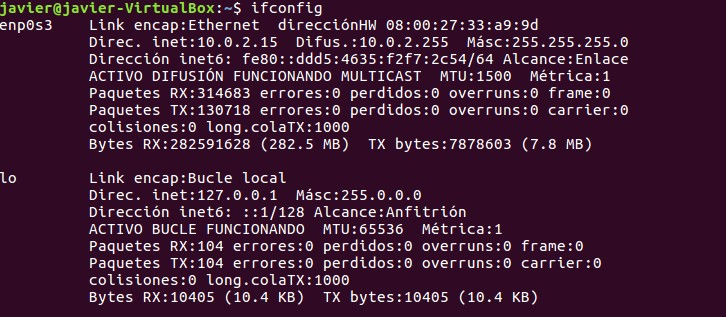

Si a **ifconfig** se le añade el nombre de la interfaz, presentará la información de dicha interfaz. Si indicamos una dirección IP le asignaremos una dirección estática.

La sintaxis del comando es la siguiente:

```bash
    ifconfig interfaz [dirección [parámetros]]
```

Ejemplos de utilización del comando **ifconfig.**

```bash
    #Obtener información de un adaptador de red:
    ifconfig enp0s3
    #Deshabilitar un adaptador de red:
    ifconfig enp0s3 down
    #Habilitar un adaptador de red:
    ifconfig wlp1s0 up
    #Asignar una nueva dirección IP a un adaptador de red:
    sudo ifconfig wlp1s0 192.168.1.10
    #Asignar una nueva máscara de red a un adaptador de red:
    sudo ifconfig enp0s3 netmask 255.255.255.0
    #Para asignar una nueva dirección de broadcast:
    sudo ifconfig enp0s3 broadcast 192.168.1.255
``` 

### Comando ip

El comando **ip** es una actualización del comando ifconfig utilizado en la mayoría de las distribuciones modernas.

Forma parte del paquete *iproute2* y sustituye/mejora a los siguientes comandos o herramientas de red:

- ifconfig
- route
- arp
- netstat (parcialmente)

Ejemplos de uso del comando ip:

```bash
#Muestra todas las interfaces de red y sus direcciones IP:
ip addr

#Activar/desactivar interfaz:
sudo ip link set enp0s3 down
sudo ip link set enp0s3 up

#Asignar IP manualmente:
sudo ip addr add 192.168.1.50/24 dev enp0s3

#Ver la table de rutas:
ip route

#Para añadir puerta de enlace:
sudo ip route add default via 192.168.1.1
```
> La configuración aplicada por el comando ip es provisional. Si queremos que los cambios se mantengan al reiniciar el equipo hay que usar la herramienta netplan.


### Utilidad netplan (Ubuntu)

La utilidad **netplan** se usa para configurar fácilmente la red usado en distribuciones Ubuntu. Se basa en crear un fichero de texto siguiendo especifaciones *yaml* en la carpeta **/etc/netplan**.

> Antiguamente se usaba el fichero /etc/network/interfaces pero ya no funciona. 

Deberemos modificar el fichero **/etc/netplan/01-network-manager-all.yaml**

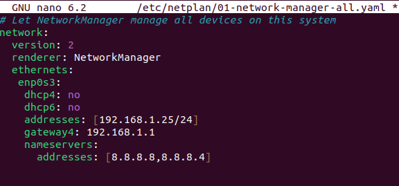

Al hacer cambios en dicho fichero deberemos luego usar los siguientes comandos:

```bash
# Probar que los cambios funcionan
sudo netplan try
# Aplicar definitivamente los cambios
sudo netplan apply
```

El fichero *yaml* tiene un formato concreto que debemos conocer.

Veamos el siguiente ejemplo típico de una configuración para el fichero *yaml*:

    IP 192.168.1.50/24
    Gateway: 192.168.1.1
    DNS: 192.168.1.1
    Search Domain: mytcpip.local

Bastará con añadir las siguientes líneas al archivo **/etc/netplan/01-netcfg.yaml**

```warning
No usar nunca tabuladores a la hora de rellenar los ficheros *yaml*
``` 

```yaml
network:
    version: 2
    renderer: networkd
    ethernets:
        enp0s3:
            addresses: [192.168.1.50/24]
            gateway4: 192.168.1.1
            nameservers:
                search: [mytcpip.local]
                addresses: [8.8.1.1]
```

### Configuración dns

El fichero `/etc/resolv.conf` es el archivo de configuración que indica al sistema qué servidores DNS debe utilizar para resolver nombres de dominio.

    nameserver 8.8.8.8
    

No obstante, si utilizamos la herramienta **netplan** para la configuración la red, al usar el comando `netplan apply` el sistema generará automáticamente su contenido y se generará un fichero que enlaza a otro.


### Configuración dhcp

Cuando el equipo debe obtener una IP automáticamente:

```bash
sudo dhclient enp0S3
```

Este comando:
- Solicita IP al servidor DHCP
- Recibe IP, máscar, Gateway y DNS
- Modifica automáticamente la configuración del sistema


### Comando ping

El archiconocido comando **ping** data de los años 70 y es conocido por ser uno de los comandos de red más básicos. Sin embargo, no es tan simple como podemos creer y tiene muchos más usos de los que ya conocemos.

Está basado en el protocolo ICMP y se utiliza para determinar:

-   Si hay conectividad entre nuestra máquina y otra máquina en la red.
-   Sirve para medir la “velocidad” o el tiempo de latencia.

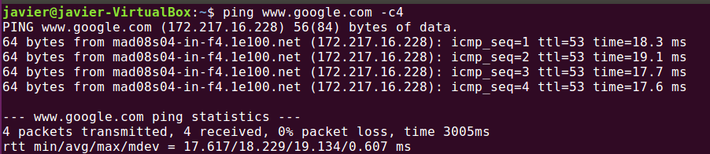

### Comando nmap

El comando **nmap** es la abreviatura de la herramienta *Network Mapper*. Es una herramienta de línea de comandos de Linux de código abierto que se utiliza para escanear direcciones IP y puertos en una red y para detectar aplicaciones instaladas.

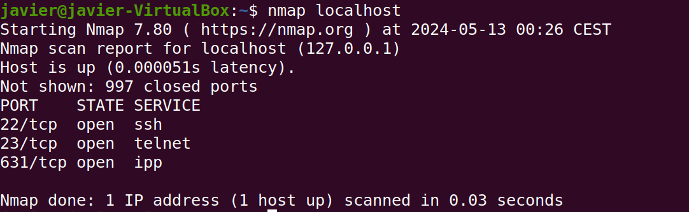


### Comando dig

Aunque Linux también utiliza el comando nslookup, existe un comando más potente que se recomienda para realizar su función de forma más completa.

    dig google.es


El comando permite ver:
- IP devuelta
- Tiempo de respuesta
- Servidor DNS consultado

### Comando nmap

El comando **nmap** es una herramienta de código abierto utilizada para la exploración y auditoría de redes. Permite analizar uno o varios equipos de una red mediante el envío de paquetes y el análisis de las respuestas recibidas.

Se emplea principalmente para:
- Detectar equipos activos en una red.
- Identificar puertos abiertos, cerrados o filtrados.
- Determinar los servicios que se están ejecutando en dichos puertos.
- Obtener información sobre el sistema operativo y versiones de software.
- Realizar tareas básicas de auditoría de seguridad.


### Comando netstat

El comando **netstat** es otro comando de red que se utiliza para identificar todas las conexiones *TCP* y *UDP* abiertas en una máquina. Además de esto, nos permite conocer la información siguiente:

-   Tablas de rutas para conocer nuestras interfaces de red y las salidas de las mismas.
-   Estadísticas Ethernet que nos muestran los paquetes enviados, los recibidos y los posibles errores.
-   Saber el id del proceso que está siendo utilizado por la conexión.

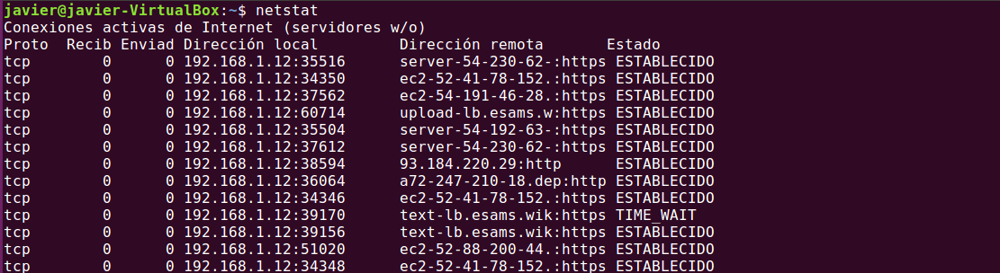

### Comando traceroute

Para conocer el camino que recorre un paquete a través de nuestra red se utilizará el comando **traceroute**.

Este comando de red nos permitirá saber por dónde pasa el paquete (máquinas, switches, routers) y comprobar que nuestra red funciona correctamente.

Su sintaxis:

    traceroute [opciones] host [tamaño del paquete].

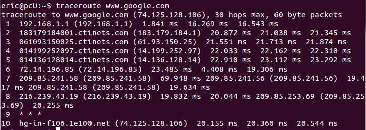


### Comandos wget y curl

Tanto **wget** como **curl** son herramientas de línea de comandos en Linux utilizadas para transferir datos desde o hacia un servidor.

El comando *wget* se utiliza para descargar archivos de la web utilizando los protocolos HTTP, HTTPS o FTP.

Su sintaxis:

    wget [OPCIONES] [URL]

El comando *curl* es una más versáti para interactuar con servidores ya que admite una mayor variedad de protocolos.

Por ejemplo:

    curl -O https://www.ejemplo.com/archivo.zip


Comandos de **gestión de redes** básicos en Linux:

| **Comando**    | **Acción**                                                         | **Ejemplo**                                         |
|----------------|--------------------------------------------------------------------|-----------------------------------------------------|
| **hostname**   | Muestra información del nombre de la máquina                       | hostname                                            |
| **ifconfig**   | Muestra información y configura las interfaces de red del sistema. | ifconfig enp0s3 192.168.4.2                         |
| **netplan**    | El gestor de redes en Ubuntu (editar fichero yaml)                 | sudo netplan apply                                  |
| **ping**       | Verificar estado de la conexión con un host concreto.              | ping [www.linux.org](http://www.linux.org/)         |
| **dig**        | Verificar la resolución de DNS                                     | dig linux.org                                       |
| **netplan**    | Para aplicar configuraciones de red en el equipo.                  | netplan apply                                       |
| **nslookup**   | Herramienta para verificar la resolución dns del equipo.           | nslookup educamadrid.org                            |
| **netstat**    | Identificar conexiones abiertas con el equipo.                     | netstat -e                                          |
| **traceroute** | Mostrar camino que recorre un paquete al destino.                  | traceroute [www.google.com](http://www.google.com/) |
