# UT6.1: Administración de recursos en red y Dominios en Windows 

## Introducción

El principal motivo por el que crear redes donde hay varios equipos funcionando y utilizar SO en red, es para compartir recursos entre ellos. Gracias a las redes informáticas, los usuarios pueden acceder a información y dispositivos ubicados en otros equipos sin necesidad de utilizar físicamente ese ordenador.

Un **recurso** de red es cualquier elemento de un sistema informático que puede ser utilizado por otros usuarios a través de una red.

Los recursos que más habitualmente se comparten en una red son: 

- Archivos
- Carpetas
- Impresoras


## Modelos de organización de redes Windows

### Grupo de trabajo

Un **grupo de trabajo** es un modelo de red en el que todos los equipos tienen el mismo nivel de administración y **no existe un servidor central que gestione la red**.

Cada equipo:

- Administra sus propios usuarios.
- Controla los recursos que comparte.
- Gestiona sus permisos de acceso.

Este modelo suele utilizarse en:
- Redes domésticas
- Pequeñas oficinas
- Entornos con pocos equipos

En Windows un Grupo de trabajo no puede tener más de 20 equipos unidos a la vez.

### Dominio

Un **dominio** es un modelo de red en el que existe uno o varios servidores centrales que gestionan la seguridad y la administración de todos los equipos de la red.

Estos servidores utilizan un servicio denominado Active Directory, que permite almacenar y gestionar información sobre:
- Usuarios
- Equipos
- Grupos
- Recursos de red

En un dominio:
- Los usuarios se autentican en el servidor.
- Los permisos se gestionan de forma centralizada.
- Las configuraciones del sistema pueden aplicarse automáticamente mediante políticas de grupo (GPO).

| Característica        | Grupo de trabajo | Dominio        |
|-----------------------|------------------|----------------|
| Administración        | Descentralizada  | Centralizada   |
| Servidor central      | No               | Sí             |
| Gestión de usuarios   | En cada equipo   | En el servidor |
| Seguridad             | Limitada         | Alta           |
| Escalabilidad         | Baja             | Alta           |

## Compartición de recursos de una red

### Requisitos de compartición recursos

Antes de poder compartir recursos en una red local es necesario comprobar que los equipos cumplen una serie de requisitos básicos.

**Configuración de red**

Todos los equipos deben:
- Estar conectados a la **misma red**.
- Tener direcciones IP válidas.
- Utilizar la misma máscara de subred.
- Poder comunicarse entre sí

> También es necesario que **cada equipo tenga un nombre único dentro de la red**, ya que Windows utiliza estos nombres para identificar los dispositivos.


### Habilitar compartición

Para poder **compartir** recursos como **carpetas en red** debemos primeramente tener habilitado la compartición de archivos e impresoras. 

Para ello se deberá acceder desde opciones de uso compartido y habilitar y según el acceso que se le quiera dar a esos recursos:

-   **Privado** (perfil actual): para usuarios identificados dentro de una misma red local.
-   **Invitado o público**: para usuarios dentro de una misma red local no identificados.
-   **Todas las redes**: para usuarios dentro o fuera de una red local.


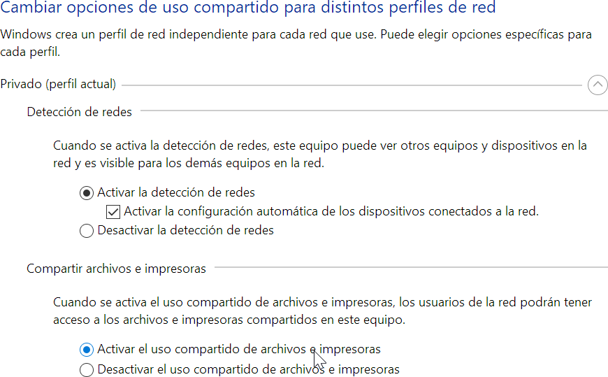 

### Compartición de carpetas

Para **compartir carpetas en red** y los ficheros que contiene, deberemos seleccionamos la carpeta o directorio que deseamos compartir en red y pulsar con el botón derecho del ratón seleccionando la opción de *Conceder acceso \> Usuarios específicos* o dentro de la pestaña *compartir* en *propiedades de la carpeta.*

 

Dentro del cuadro anterior deberemos elegir con que **equipos de nuestra red compartir la carpeta y su contenido**. Se puede compartir el contenido con todos los equipos conectados a nuestra red, seleccionando **Todos y Agregar**. Podemos asignarla dos niveles de permiso: *Lectura o Lectura y escritura.*


También podemos establecer una serie de permisos a los usuarios que se conecten a la carpeta compartida para según que permiso, tener unas prioridades con los archivos o no.


Al acceder a la carpeta compartida Windows pedirá un usuario y contraseña. Para configurar dicho comportamiento deberemos acceder desde el Panel de Control de nuestro equipo a las opciones del **Centro de redes y recursos compartidos**, y pulsar sobre *Cambiar configuración de uso compartido avanzado.*

Dentro de las opciones que se abren dentro de campo Todas las redes, podemos marcar la opción de **Desactivar el uso compartido con protección por contraseña**. De esta manera evitaremos que Windows solicite un usuario y contraseña cuando intentemos acceder a las carpetas compartidas.


### Acceso a los recursos

Los recursos compartidos se pueden acceder utilizando una ruta UNC de la forma:  

\\\\nombre_equipo\\nombre_recurso

También es posible **mapear una unidad de red**, lo que permite que el recurso compartido aparezca como una unidad del sistema y no tener que escribir siempre el UNC.

Para mapear una unidad de red en Windows, abrir el Explorador de archivos, haz clic derecho en Este equipo y selecciona Conectar a unidad de red. Una vez dentro indicar la letra de la Unidad a utilizar y la dirección UNC del recurso compartido.

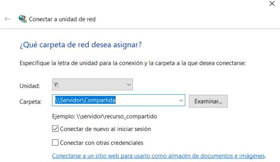

Para **mapear una unidad de red** en Windows, abrir el Explorador de archivos, haz clic derecho en *Este equipo* y selecciona *Conectar a unidad de red.*

Una vez dentro indicar la letra de la Unidad a utilizar y la dirección *UNC* del recurso compartido.

Windows permite administrar los recursos compartidos mediante herramientas del sistema.

Entre las tareas más habituales se encuentran:

-   Compartir impresoras en red
-   Conectar unidades de red
-   Controlar qué usuarios acceden a los recursos
-   Ver sesiones activas
-   Monitorizar archivos abiertos

### Comandos CMD

Para compartir carpetas en red desde la línea de comandos utilizaremos el comando **NET SHARE**.

NET SHARE \<sharename=drive:path\>

Por ejemplo, para compartir una carpeta denominada recurso situada en la unidad C, en la ruta de acceso \\Usuarios\\miNombre, escribe:

    NET SHARE myshare=C:\Users\Myname

Usando el comando sin parámetros nos mostrará los elementos en red compartidos:


## Introducción a Active Directory (AD)

```note
Active Directory (AD) o Directorio Activo, es una herramienta perteneciente a  Microsoft que proporciona servicios de directorio en una red de ordenadores.
```

Active Directory es el servicio de directorio de los servidores Windows desde Windows 2000. Almacena la información de los recursos de la red y permite el acceso a los usuarios y las aplicaciones a dichos recursos.

Lo que es capaz de hacer este directorio activo es proporcionar un servicio ubicado en uno o varios servidores capaz de crear **objetos** como: **usuarios**, **equipos** o grupos para administrar las **credenciales** durante el inicio de sesión de los equipos que se conectan a una red.


Pero no solamente sirve para esto, ya que también podremos administrar las **políticas** de absolutamente toda la red en la que se encuentre este servidor. Esto implica, por ejemplo, la gestión de permisos de acceso de usuarios, bandejas de correo personalizadas, etc.

### Protocolos utilizados

Para funcionar, Active Directory (AD) utiliza una serie de **protocolos** de red y seguridad que ya conocemos o nos suenan:

-   **DNS** *(Domain Name Service)* o servicio de nombres de dominio: este servicio realiza la traducción entre nombres de dominio y direcciones IP.
-   **DHCP** *(Dynamic Host Configuration Protocol).* protocolo de configuración dinámica de ordenadores, que permite la administración desatendida de direcciones de red.
-   **LDAP** *(Lightweight Directory Access Protocol).* protocolo ligero de acceso a directorio. El más importante. Es un protocolo libre, la base mediante el cual las aplicaciones acceden y modifican la información existente en el directorio.
-   **Kerberos v5**: protocolo utilizado para la autenticación de usuarios y máquinas.
-   **Certificados X.509**: estándar usado por los certificados digitales, entre otros.

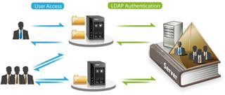

### Elementos lógicos de AD

Una de las mayores ventajas de Active Directory en la administración de dominios es la separación que hace entre la estructura lógica de la organización que veremos a continuación y la estructura física (topología de red). 

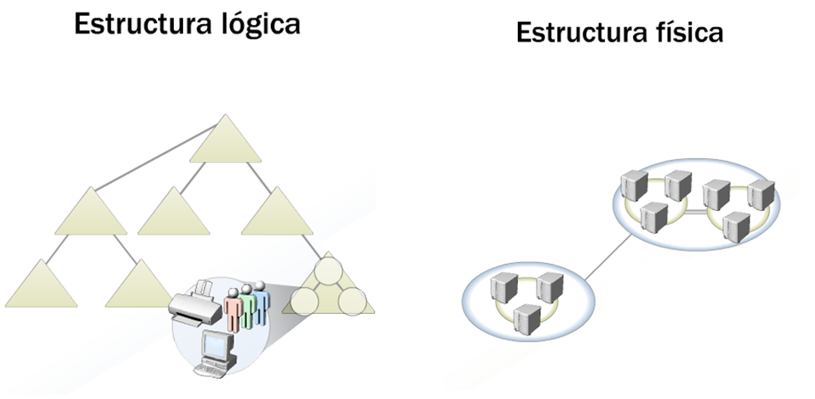

Los **elementos lógicos** de Active Directory son los siguientes:

-   Dominio
-   Objeto
-   Unidad organizativa (OU)
-   Árbol de dominios
-   Bosque


### Dominio

Los Dominios son las estructuras principales de Active Directory. Todos los objetos que formen parte de un mismo dominio tendrán la misma política de seguridad y compartirán características.

```note
Un **Dominio** en Active Directory es un conjunto de objetos como ordenadores que comparten un nombre conectados a una red los cuales cuentan con un equipo servidor para administrar las cuentas de usuario, directivas y credenciales de la red.
```
 
> Para poner nombre a los Dominios se usa el protocolo **DNS**. Cada Dominio se identifica unívocamente con un nombre de dominio DNS, que debe ser el sufijo DNS principal de todos sus equipos miembros. Es decir, si el equipo equipo1 pertenece al dominio *ieszayas.org*, el nombre completo del equipo será *equipo1.ieszayas.org* y si en el mismo dominio existe una impresora llamada *impresora1* esta tendrá como nombre completo *impresora1.ieszayas.org*
ieszayas.org

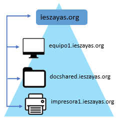

### Objetos de AD

Un **objeto** es el nombre genérico que utilizamos para referirnos cualquier componente dentro de un directorio activo. Los objetos se dividen en tres tipos:

-  **Usuarios**: son las credencias de acceso a estaciones de trabajo.
-  **Recursos**: serán los elementos a los que cada usuario podrá acceder según sus permisos. Pueden ser **carpetas** compartidas, **impresores**, etc.
-  **Servicios**: son las funcionalidades a las que cada usuario puede acceder, por ejemplo, el correo electrónico.

Existen objetos que pueden contener a su vez otros objetos, como es el caso de los **grupos** de usuarios y de las **Unidades Organizativas (OU).**

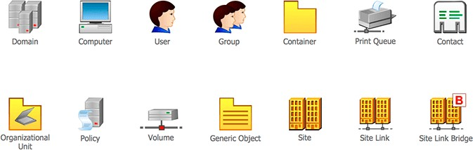

### Unidades organizativas en AD

Una **Unidad Organizativa** o **OU** (*Organizational Unit*) es un **contenedor de objetos** como impresoras, usuarios, grupos, etc. organizados en subconjuntos estableciendo una **jerarquía** dentro de un mismo dominio. Son el objeto más común en AD.

Con las Unidades Organizativas podremos ver de un vistazo la jerarquía de nuestro Dominio y poder asignar permisos fácilmente según los objetos contenidos.

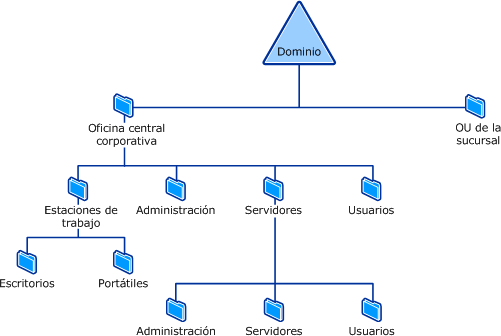

### Directivas de Grupo (GPO)

Una vez creadas Unidades Organizativas (UO) podemos aplicarles a todas ellas **directivas de grupo** (*GPO*).

Las GPO permiten personalizar:

-  **Ajustes concretos del sistema**: fondo de escritorio, aplicaciones pre-instaladas en los clientes, configuración personalizada de programas como Chrome o Edge, carpetas de perfil personalizadas, restricciones en el escritorio y en los menús de trabajo, configuración del panel de control (red, impresoras)...
-  **Configuraciones de seguridad**: configuraciones de contraseña, control de los cortafuegos de la red, bloqueo de aplicaciones, privilegios administrativos para usuarios y grupos, elevación automática de privilegios,...
-  **Auditorías del sistema**, para controlar los eventos que queramos en cualquier equipo de la red.

Las **GPO** se dividen en dos grandes categorías:

1. **Configuración del equipo:**

    Se aplica al ordenador **independientemente** del usuario que inicie sesión.

    Incluye configuraciones como:

    -   Seguridad del sistema
    -   Instalación de software
    -   Configuración del sistema operativo

2. **Configuración del usuario:**

    Se aplica cuando el usuario inicia sesión. Permite configurar aspectos como:

    -   Escritorio
    -   Panel de control
    -   Aplicaciones

    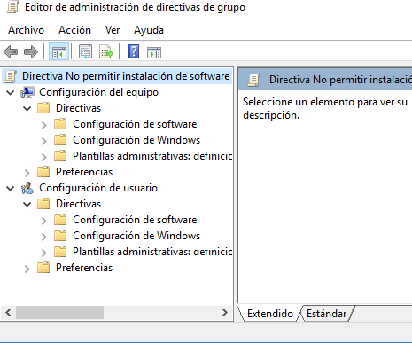

### Árbol de Dominios

```note
Un Árbol es una colección de Dominios que dependen de una raíz común y se encuentra organizados como una determinada jerarquía. Dicha jerarquía también quedará representada por un espacio de nombres DNS común.
```

De esta forma, sabremos que los dominios *ieszayas.org* e *informatica.ieszayas.org* forman parte del mismo árbol, mientras que *educamadrid.org* y *ieszayas.org* no.

El objetivo de crear este tipo de estructura es fragmentar los datos del Directorio Activo, replicando sólo las partes necesarias y ahorrando ancho de banda en la red.

Si un determinado usuario es creado dentro de un dominio, este será reconocido automáticamente en todos los dominios que dependan jerárquicamente del dominio al que pertenece.

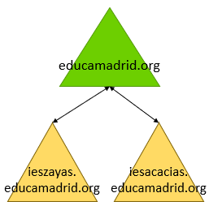


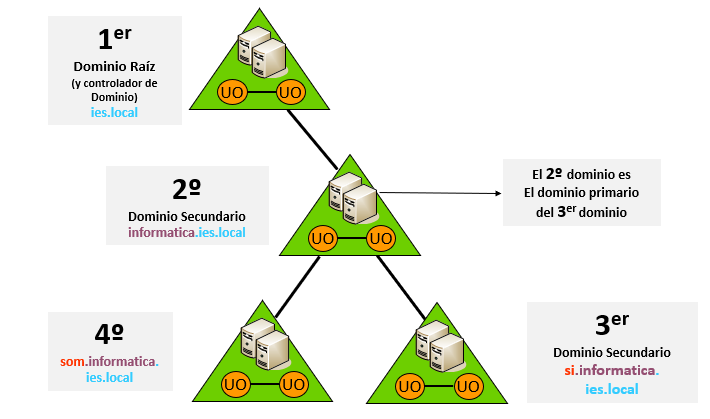


### Bosque

```note
Un bosque se define como un grupo de árboles que no comparten un espacio de nombres contiguo, y que se conectan mediante relaciones de confianza bidireccionales y transitivas.
```

En un bosque existirán distintos árboles de dominio con, por supuesto, diferentes nombres. No comparten espacio de nomenclatura *(pj dominio.org y dominio1.org)*

De forma predeterminada, un bosque contendrá al menos un dominio, que será su **dominio raíz del bosque.**

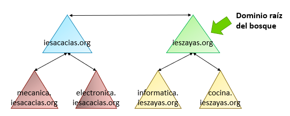


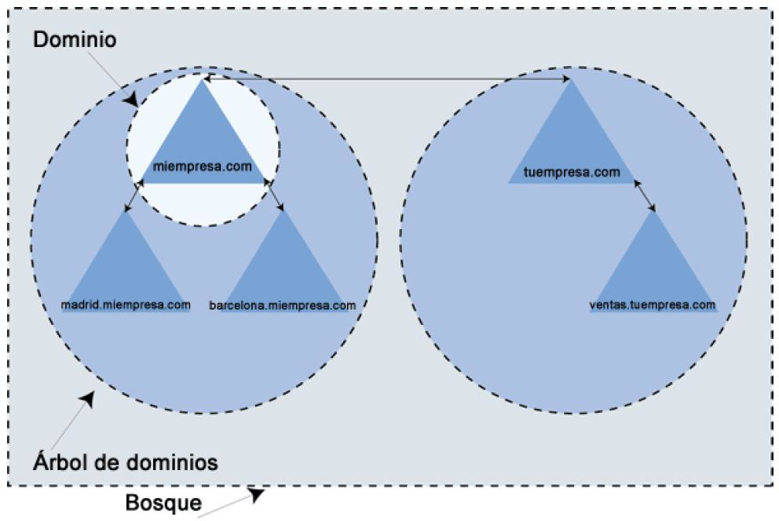

### Nombre completo

Tal y como comentamos en unidades anteriores, cada objeto necesita un nombre interno distinto para que todo elemento de Active Directory pueda identificarse de manera única (utilizado por el protocolo LDAP)

Aunque puede haber dos usuarios con el mismo nombre, deben existir en distintos lugares. Para satisfacer la necesidad de que cada objeto tenga un solo identificador, Active Directory utiliza el **nombre completo**. Para ello utilizado el siguiente esquema:

    CN  =  Nombre común          
    OU  =  Unidad organizativa   
    DC  =  Componente de dominio 

Por ejemplo, un usuario con un nombre común (**CN**), Rafael Pérez, que se ubica en una unidad organizativa (**OU**) que se llama Users que existe en un dominio (**DC**) llamado *ies.com*. Así, el nombre completo de un usuario podría ser este:

    CN=Rafael Pérez OU=Users DC=ies DC=com

## Preparación instalación Active Directory

Requisitos para crear **Active Directory** (AD) en un sistema Windows:

-   **Windows server**: vamos a necesitar una versión del sistema operativo orientado a servidores de Microsoft. Podremos utilizar las versiones desde Windows server 2000, 2003, 2008, 2012, 2016 y 2019 *(los 3 últimos recomendados).*
-   Cuenta de un usuario **administrador** con contraseña.
-   Protocolo **TCP/IP** instalado y con una dirección IP fija configurada en nuestro equipo servidor.
-   Tener instalado un **servidor DNS** en el servidor, esto normalmente ya viene disponible.
-   Tener un sistema de archivos compatible con Windows, en este caso **NTFS**.

    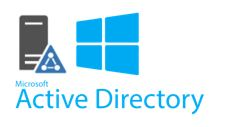

-   Para instalar el Directorio Activo se necesitará comprar una **licencia** del sistema operativo de servidor (Windows Server) y las licencias para que cada dispositivo o usuario accedan al servidor (**CALs**).
-   Además, es necesario que los equipos cliente cuenten con un sistema operativo versión Windows Pro (No vale la versión Home). Así es como pasaríamos a tener un controlador de dominio principal.
-   Por seguridad, convendría replicar este esquema a otro servidor con este rol (para tener un controlador de dominio secundario).

### Niveles funcionales de Dominio

Al instalar un Dominio se pregunta por su **nivel funcional de dominio**, es decir su nivel de **compatibilidad** con versiones anteriores de Windows Server.

Así, por ejemplo, cuando creemos un dominio desde un Windows 2000, este nivel funcional quedará en modo *Mixto* para darnos compatibilidad con controladores de dominio NT 4.0. Esto hará que no se aproveche todas las nuevas funcionalidades a partir de Windows 2000.

Lo mismo pasará con todos los dominios que se agreguen posteriormente al bosque. Si agregamos un nivel funcional de dominio de Windows Server 2008 R2, no podrán tomar todas las características nuevas a partir de esa versión.

| **Nivel funcional** | **Controladores compatibles**                      |
|---------------------|----------------------------------------------------|
| Windows 2000        | Windows NT 4, Windows 2000, 2003, 2008, 2012, 2016 |
| Windows 2003        | Windows server 2003, 2008, 2012, 2016              |
| Windows 2008        | Windows server 2008, 2012, 2016                    |
| Windows 2012        | Windows server 2012, 2016                          |

### Controlador de Dominio (DC)

Un **controlador de dominio** o Domain Controler (DC) es el servidor principal donde se ejecuta el servicio responsable de autenticar inicios de sesión de usuario. Además se guarda la copia principal del directorio.

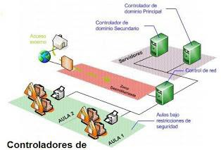

Active Directory está basado en un esquema de varios controladores de dominio donde cada uno tiene autoridad sobre el dominio y no hay ninguno más importante que otro (modelo multimaestro). Todo dominio debe contar con al menos un controlador de dominio.

También existen controladores de dominio de solo lectura llamados **RODC** (*Read Only Domain Controller*). Su objetivo es que los equipos de la sucursal dispongan de un acceso rápido al controlador de dominio por motivos seguridad y redundancia.

Así mismo, se denomina **PDC** (Primary Domain Controller) al servidor que responderá a las solicitudes de *Autenticación de Seguridad* dentro de un Dominio.

Hay que tener en cuenta que, una vez creado un dominio e insertado dentro de un árbol del bosque **durante la instalación.** Este ya no se puede mover a otro lugar dentro de la jerarquía ni eliminarse si contiene subdominios.

Por este motivo, es de gran importancia dedicar el tiempo necesario al diseño de la estructura de Active Directory. Las decisiones que tomemos de la estructura del servicio de directorio son fundamentales para ahorrar costes en el desarrollo futuro.

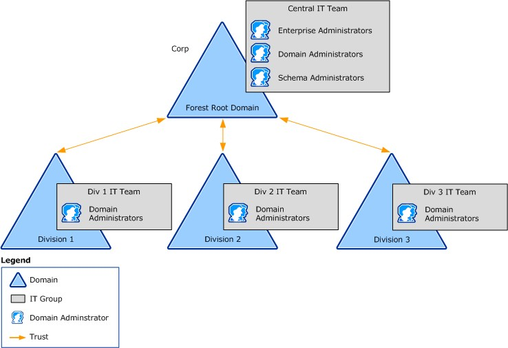

### Nombre de dominio NetBios

Normalmente, el **nombre de dominio NetBios** es el subdominio del nombre de dominio DNS.

> Por ejemplo, si el nombre de dominio es iberia.com, el nombre de dominio NetBIOS será iberia. Si el nombre de dominio DNS es corp.ibera.com, el nombre de dominio NetBIOS será corp.

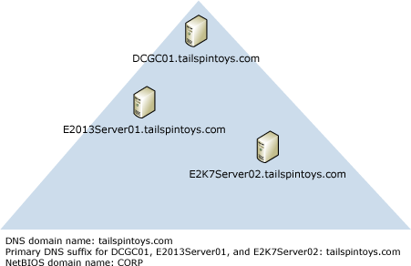

## Configuración post-instalación

1. Verificar controladores
2. Configuración horaria
3. Renombrar servidor
4. Renombrar y configurar redes
    - Configuración de red. IP ESTÁTICA.
    - Pertenencia a dominio.
    - Firewall: red publica o privada.
    - Activar o no gestión remota.
5. Configurar actualizaciones
6. Habilitar acceso remoto
7. Creación de UO y usuarios

> En el caso de querer configurar un Windows Server Core este no poseerá interfaz gráfica, con lo cual la configuración deberá hacerse por la línea de comandos.

### Administrador del servidor

```note
El **Administrador del servidor** es la herramienta desde donde tenemos el control centralizado de todas las tareas que ejecuta el servidor tales como roles y características.
```

Gracias al Administrador del servidor podremos realizar las siguientes tareas:
-   Analizar y **gestionar los roles y características** instaladas en Windows Server.
-   Ejecutar **tareas de administración** asociadas a los servicios implementados en el servidor tal como iniciar, detener o eliminar estos servicios.
-   Analizar el comportamiento de los roles y características de Windows Server 2016 con el fin de que se cumplan las buenas prácticas para el provecho del servidor.
-   Verificar el **estado** operativo del servidor en tiempo real.

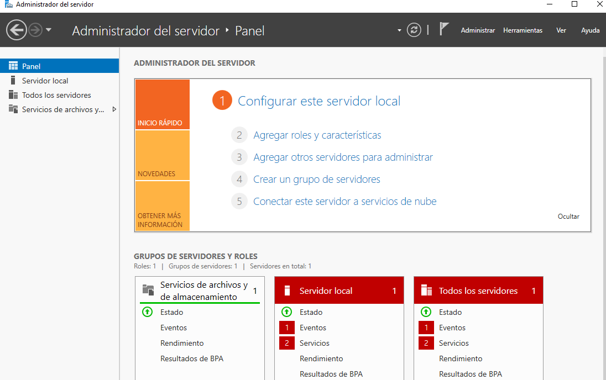

Dentro del menú **servidor local** de la herramienta de administración de servidor:

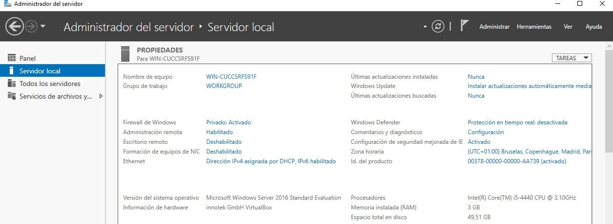

Tenemos las siguientes opciones básicas de configuración de nuestro servidor:
1.  Establecer el nombre de equipo y grupo de trabajo al que pertenece.
2.  Configuración de red: *Firewall, administración y escritorio remotos, dirección IP.*
3.  Configuración de las actualizaciones y Windows Defender
4.  Determinar y configurar la zona horaria y ver activación del producto

El menú **herramientas** tiene una recopilación de accesos directos, la mayoría de los cuales ya conocíamos de la unidad anterior de Windows 10 cliente como son entre otras:

-   Administración de equipos
-   Administración de impresión
-   Configuración del sistema
-   Copias de seguridad de Windows Server
-   Defragmentar y optimizar unidades
-   Diagnóstico de memoria de Windows
-   Directiva de seguridad local
-   Firewall de Windows con seguridad avanzada
-   Información del sistema
-   Abrir consolas de Powershell

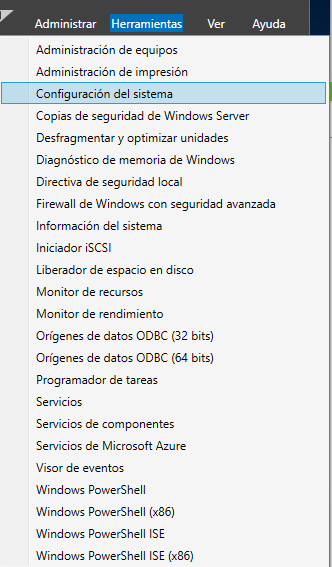

### Roles, servicios de rol y características

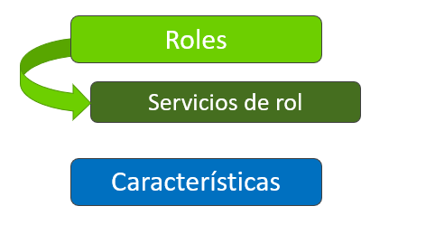

Una vez instalado Windows Server y configuradas algunas opciones básicas desde el administrador del servidor, la siguiente tarea que ha de realizarse es configurar el **rol** o funciones que debe desempeñar el servidor dentro de la infraestructura de red. Un solo servidor podrá realizar la labor de varios roles o funciones.

```note
Un **rol** es una capacidad que se agrega al servidor para que los equipos clientes de la red dispongan de un servicio que puedan aprovechar, como, por ejemplo, Active Directory, DHCP o DNS.
```

```note
Un **servicio de rol** son programas que proporcionan funcionalidades a un rol y que se instalan a la vez que el rol. Hay roles que no los necesitan y otros en cambio necesitan varios durante su instalación.
```

```note
Las **características** son programas que, aunque no forman parte directamente de los roles, complementan sus funcionalidades, independientemente de los roles que estén instalados.
```

El siguiente es un **listado de roles** por defecto en una instalación general de *Windows Server standard edition:*

| Acceso remoto                                  | Servicios de Escritorio Remoto              |
|------------------------------------------------|---------------------------------------------|
| Active Directoy Lightweight Directory Services | Servicios de federación de Active Directory |
| Active Directory Rights Management Services    | Servicios de implementación de Windows      |
| Hyper-V                                        | Servicios de impresión y documentos         |
| MultiPoint Services                            | Servidor de fax                             |
| Servicio de protección de host                 | Servidor DHCP                               |
| Servicios de acceso y directivas de redes      | Servidor DNS                                |
| Servicios de archivos y almacenamiento         | Servidor web (IIS)                          |
| Servicios de certificados de Active Directory  | Windows Server Update Services              |
| Servicios de dominio de Active Directory       |                                             |

En el siguiente listado vemos **servicios de rol** asociados a algunos **roles** específicos:

| **Rol**                          | **Servicio de rol asociado**                     |
|----------------------------------|--------------------------------------------------|
|  Acceso remoto                   | DirectAccess y VPN (RAS)                         |
|                                  | Enrutamiento                                     |
|                                  | Proxy de aplicación web                          |
|   Servicios de Escritorio remoto | Agente de Conexión a Escritorio remoto \*        |
|                                  | Administración de licencias de Escritorio remoto |
|                                  | Host de virtualización de escritorio remoto      |
|  Windows Server Update Services  | Conectividad WID                                 |
|                                  | Servicios WSUS                                   |
|                                  | Conectividad SQL Server                          |

El siguientes es un **listado algunas de características** por defecto en una instalación general de *Windows Server 2016 standard edition:*

| Administración de directivas de grupo        | Equilibrador de carga de software              |
|----------------------------------------------|------------------------------------------------|
| Almacenamiento mejorado                      | Equilibrio de carga de red                     |
| Asistencia remota                            | Herramientas de administración remota servidor |
| BranchCache                                  | Herramientas de migración de Windows Server    |
| Características de NET 3.5 y NET 4.6         | Réplica de almacenamiento                      |
| Características de Windows Defender          | Servidor DHCP                                  |
| Cliente de impresión en Internet             | Servidor DNS                                   |
| Cliente para NFS                             | Servidor web (IIS)                             |
| Cliente Telent                               | Windows Server Update Services                 |
| Compatibilidad con el protocolo SMB 1.0/CIFS | Servicio SNMP                                  |
| Contenedores                                 | Servicio WLAN                                  |
| Copias de seguridad de Windows Server        | Servicios simples de TCP/IP                    |

### Agregar un rol

Para **agregar un rol** desde el administrador del servidor:

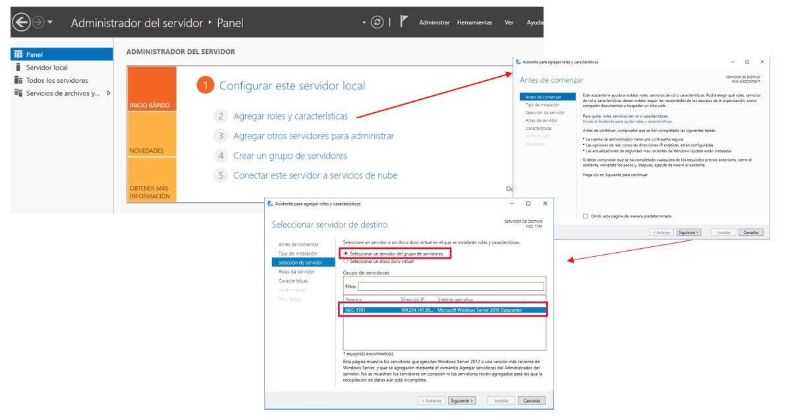

### Creación de una UO

Desde las Herramientas Administrativas ir al menú *herramientas* ir a **usuarios y equipos** y acceder al Dominio para crear una nueva Unidad organizativa:

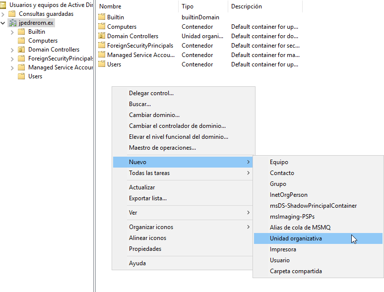

### Creación de usuarios y grupos

Dentro de una Unidad Organizativa concreta hacer clic en *Nuevo\>Usuario*

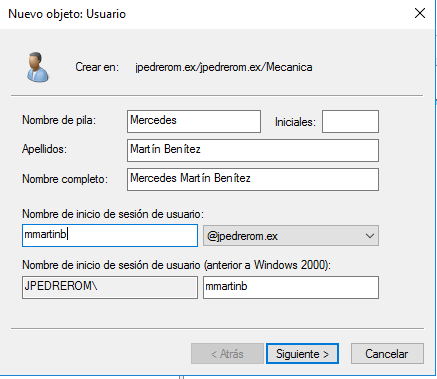 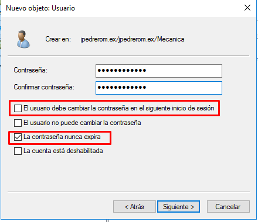

También podemos agrupar usuarios a través de **grupos** de usuarios, de los que hay tres tipos distintos:

- Domain Local: Se usa para asignar permisos a recursos (carpetas, impresoras) en el dominio donde se crea. Puede contener usuarios de cualquier dominio.
- Global: Se usa para organizar usuarios que comparten un rol (ej. "Contabilidad"). Solo puede contener miembros de su propio dominio.
- Universal: Se usa en redes grandes con múltiples dominios (Bosques). Sus miembros pueden ser de cualquier dominio y pueden acceder a recursos de cualquier dominio.

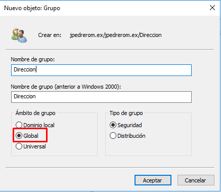

### Incorporación cliente al Dominio

El proceso de incorporación de un **equipo cliente** a un Dominio es relativamente sencillo, en caso de clientes Windows.

Para que la operación tenga éxito, es importante:

-   En la configuración **TCP/IP** del equipo que vamos a unir al dominio, hemos de establecer como servidor DNS preferido, la dirección IP del equipo que funciona como servidor DNS en el dominio. El servidor **DNS** puede ser el propio **controlador de dominio**.**
-   Habrá que utilizar una **cuenta** perteneciente al grupo Administradores del dominio, no basta con ser Administrador del equipo local.
-   El **nombre del equipo** no se podrá cambiar una vez añadido.


