# UT6.4 Comandos de gestión de cadenas en Linux

## Tuberías y filtros

La terminal o shell de Linux tiene tres flujos de entrada/salida que deben conocerse:

- La **entrada estándar** (stdin): representa los datos que son necesarios para el correcto funcionamiento de una aplicación. Es el lugar del que se leen datos a no ser que se indique lo contrario. Por defecto, es el teclado.  
- La **salida estándar** (stdout): es el medio que utiliza una aplicación para mostrar información de sus procesos y/o resultados, estos pueden ser simples mensajes o datos de resultados. La salida estándar por defecto es la consola. 
- El **error estándar** (stderr): es la manera en que las aplicaciones nos informan sobre errores. La salida de error por defecto apunta a la consola en la que está trabajando.

```bash
# Redirección de stdout hacia un fichero de nombre salida 
echo "hola" > salida
# Redirección de salida de error (si lo hay) stderr a un fichero  
cat $fichero 2> salida_error
# Redirección de salida de error (si lo hay) a un fichero existente
cat $fichero 2>> salida_error
# Redirección de stdin hacia un fichero
less < /etc/passwd
```    

```tip
Desde la terminal de Linux posible introducir en una misma línea dos o más comandos separados por el carácter **tubería** o pipe ‘**\|**’ ,conectando la salida estándar de un comando con la entrada estándar de otro.
```

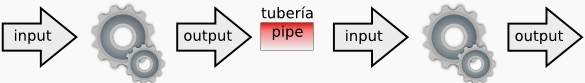

El uso más habitual es filtrar datos utilizando comandos que vamos a ir viendo, y que pueden actuar tanto como comandos como filtros.

    comando1 | comando2 | …

> 💡 La **salida** proporcionada por el comando1 se tomará como **entrada** para el comando2 y así sucesivamente.

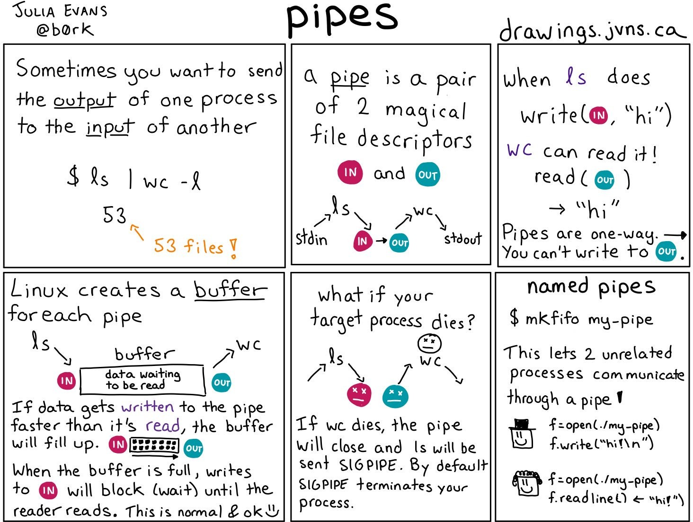

### Comando tee

El comando **tee** lee la entrada estándar y la escribe simultáneamente en uno o más archivos, mientras sigue mostrando la salida en la terminal. Es parecido a utilizar el redireccionamiento >, pero a diferencia de este, no pierde visualización en pantalla.

Así, por ejemplo:

    ls -l | tee lista_archivos.txt

Guarda la lista de archivos en lista_archivos.txt y la muestra en la terminal.

También podemos redirigir la salida de un comando a múltiples archivos:

    df -h | tee uso_disco.txt uso_disco_backup.txt
    
## Comandos de gestión de cadenas

### Comando wc

```tip
El comando **wc** cuenta el número de **líneas, palabras y caracteres** de uno o más fichero(s), incluye espacios en blanco y caracteres de salto de línea.
```

Su sintaxis es la siguiente: 

    wc [parámetros] [fichero]

Donde sus parámetros pueden ser:

    -l visualiza el número de líneas del fichero.
    -w visualiza el número de palabras del fichero.
    -c visualiza el número de caracteres del fichero.


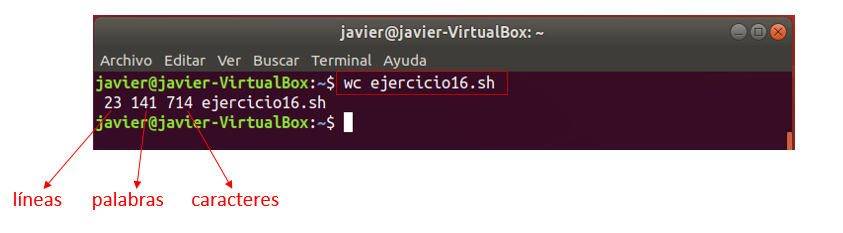

### Comandos head y tail

```tip
El comando **head** muestra las 10 **primeras líneas** de un fichero
```


Si queremos especificar las líneas a mostrar lo haremos con *head –n número*

```tip
El comando **tail** funciona de la misma forma, pero mostrando las 10 **últimas líneas** de un fichero.
```

### Comando grep

```tip
El comando **grep** permite **buscar** dentro de archivos, directorios o texto las líneas que concuerden con el elemento que especifiquemos (un patrón de búsqueda).
El comando grep localiza el patrón  resaltándolo en rojo.
```

La sintaxis básica del comando es la siguiente:

    grep [parámetros] [patrón_búsqueda] [fichero]

Donde parámetros puede ser:

    -c visualiza el nº total de líneas donde se localiza el patrón.
    -n Visualiza el nº de línea donde aparece el patrón y línea completa
    -i Elimina la diferencia entre mayúsculas y minúsculas.
    -l Visualiza el nombre de los ficheros donde se localiza el patrón.
    -v Visualiza las líneas del fichero donde no aparece el patrón.
    -w obliga a que patrón coincida solamente con palabras completas.
    -E Sirve para indicar que queremos definir una expresión regular de búsqueda.

Algunos ejemplos usando el comando **grep**:

```bash
# Buscar la cadena Texto en el fichero texto.txt
grep "Texto" texto.txt
# Visualizar el contenido de texto.txt y buscar la cadena hola
cat texto.txt | grep "hola"
# Cuenta las veces que aparece la cadena "hola" en el fichero log.txt
grep -c "hola" log.txt
# Verificar si un usuario existe en el sistema
grep nombre_usuario /etc/passwd
# Visualizar los archivos con permisos 777 (rwxrwxrwx)
ls –l | grep rwxrwxrwx
```

### Expresiones regulares en grep

Se puede usar el comando grep con el parámetro **-E** para buscar con un patrón usando lo que se conoce como **expresiones regulares básicas**. Las expresiones regulares están formadas por letras y números, así como por caracteres.

Las **expresiones regulares** incluyen:

| **Símbolo** | **Descripción**                                                     |
|-------------|---------------------------------------------------------------------|
| .\*         | Para representar cero o más caracteres.                             |
| . (punto)   | Para representar un solo carácter.                                  |
| [a e i o u] | Para representar algunos caracteres.                                |
| [A-Z][0-9]  | Para presentar un rango de caracteres.                              |
| **\^**      | Para representar el inicio de una línea de texto.                   |
| **\$**      | Para representar el fin de línea de texto.                          |
| **+**       | Que el carácter o conjunto previo aparezca al menos una vez.        |
| **{n,m}**   | Que el carácter o conjunto previo aparezca entre n y m veces.       |
| **\b**      | Se utiliza para marcar el límite de una palabra exacta (boundary)   |

El comando grep también permite el uso de **clases de carácterer** para usar en expresiones regulares, como las que veremos a continuación:

| **Símbolo** | **Descripción**                                                     |
|-------------|---------------------------------------------------------------------|
| [:blank:]   | Caracteres en blanco, tales como un espacio o un tabulado.          |
| [:digit:]   | Caracteres numéricos (equivale a [0-9])                             |
| [:lower:]   | Caracteres alfabéticos en minúscula.                                |
| [:upper:]   | Caracteres alfabéticos en mayúscula.                                |
| [:punct:]   | Signos de puntuación tales como !, #, $ y @                         |

> La ventaja de este tipo de clases de carácter es que incluyen caracteres acentuados y otros símbolos Unicode en las expresiones que no hacen los rangos típicos [a-z].

Ejemplos de **expresiones regulares básicas** que podemos usar con *grep*: 

- Un signo de intercalación (\^) indica el **inicio de línea**:

    ```bash
        grep '^b' texto.txt 
    ```

- Un signo de dólar (\$) indica el **fin de línea**:

    ```bash
        grep 'a$' texto.txt
    ```

- Para representar un carácter se utiliza el **.** y para múltiples carácteres el .\*

    ```bash
        grep –E 'f.cher.' grep 'tex.*' 
    ```

- Para los rangos y caracteres individuales se utilizan los corchetes:

    ```bash
        grep '[A-Z][aeiou]'
    ```

- Que un caracter aparezca entre n y m veces:

    ```bash
        grep -E 'a{3,5}' texto.txt 
    ```

- El carácter 'e' aparece una o ninguna vez:

    ```bash
        grep -E 'e+' texto.txt 
    ```


### Comandos sort y uniq

```tip
El comando **sort** se utiliza para ordenar líneas de un fichero o un flujo, puede usarse como comando o como filtro.
```

Puede ordenar alfabética o numéricamente, teniendo en cuenta que cada línea del fichero es un registro compuesto por varios campos, los cuales están separados por un carácter denominado separador de campo (tabulador, espacio en blanco…)

Su sintaxis es: 

    sort [parámetros] [fichero]

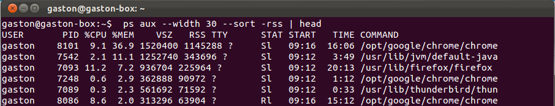

Donde parámetros puede ser:

    -n Para ordenación numérica
    -k Indicando un nº por qué columna ordenar
    -t Para indicar el separador de columnas
    -r Indica ordenación inversa
    

💡 Otro comando muy útil es **uniq.** Se usa en combinación con **sort** para eliminar las líneas que están repetidas, dejando la salida con líneas que no están repetidas. Para que funcione correctamente las líneas o ficheros deben estar ordenados, ya que trabaja con líneas adyacentes.

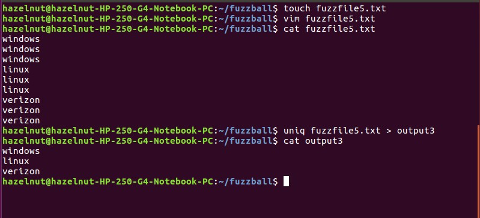

> uniq también admite parámetros interesantes como –c para mostrar el número de ocurrencias encontradas


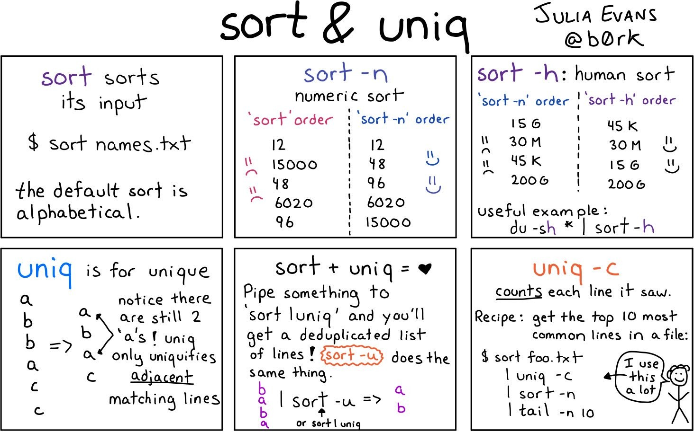

### Comando tr

```tip
El comando **tr** permite sustituir unos **caracteres** por otros dentro de un archivo. Primero especificamos lo que vamos a sustituir y seguidamente lo que lo sustituye.
```

Su sintaxis es:

    tr [parámetros] caracteres1 [caracteres2]

Donde parámetros puede ser:

    -d: elimina los caracteres indicados en caracteres1 .
    -s: reemplaza los caracteres repetidos duplicados.
    -c: los caracteres que no estén indicados en *caracteres1* los convierte a *caracteres2*.

Algunos ejemplos útiles con **tr**:

```bash
# Eliminar los caracteres emp de la palabra ejemplo
echo ejemplo | tr –d emp
# Cambiar las minúsculas por mayúsculas
echo 'Hola Mundo' | tr '[a-z]' '[A-Z]' 
# Suprimir espacios en blanco
echo "Hola que tal?" | tr –d ' ' 
# Suprimir espacios en blanco duplicados
echo "     espacio sobra      " | tr –s ' '
```

### Comando cut

```tip
El comando **cut** es utilizado para la extracción de **segmentos** (o columnas) de las líneas de texto. 
```

Dada una línea de texto la trocea según el **separador o delimitador** que le indiquemos.

Su sintaxis es:

    cut [parámetros] [fichero]

Donde parámetros puede ser:

    -d carácter separador o delimitador
    -f rango o columna a extraer
    -c carácter a partir del cual cortar

Por ejemplo:

```bash
# Coge las letras de las posiciones 2 a la 4 inclusive (esi)
echo "mesilla" | cut -c 2-4
# Cortar la cadena por la letra 'i' devolviendo la segunda parte (lla) 
echo "mesilla" | cut -di -f2
```

Vamos a ver más ejemplos típicos del uso de **cut.** Dado un fichero de texto separado por espacios llamado *listado.txt* con el siguiente contenido:

    2020:Junio:23:Carla:Martínez:Equipo-de-básquet
    2021:Abril:22:Yoel:Alonso:Clases-de-danza
    2019:Febrero:21:Miguel:Molina:Equipo-de-básquet
    2022:Enero:22:Noelia:Bernabeu:Equipo-de-básquet
    2020:Mayo:11:Alberto:Silvestre:Clases-de-judo


Mostrar la primera columna:

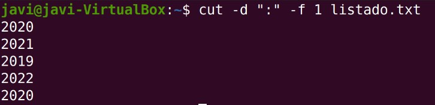

Mostrar la primera, cuarta y sexta columna:

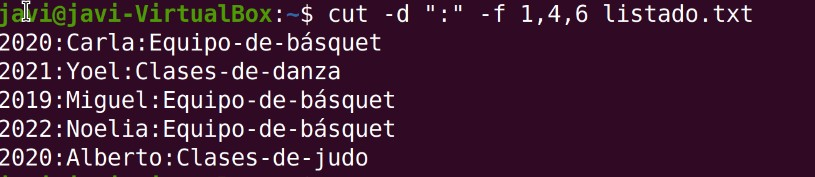

### Extraer subcadenas

Mediante la forma echo ${cadena:posicion:desplazamiento} podemos extraer una subcadena de otra cadena desde la posición indicada y las posiciones indicadas por desplazamiento. Si omitimos :desplazamiento, extraerá los caracteres hasta el final de cadena.

Por ejemplo, dado el texto en la siguiente variable:  `cadena=abcABC123ABCabc:`

```bash
echo ${cadena:0}  >abcABC123ABCabc
echo ${cadena:0:1}   >a 
echo ${cadena:3:5} >ABC12
echo ${cadena:7}  >23ABCabc
echo ${cadena:7:3}   >23A  
```

### Comando sed

El comando sed se utiliza generalmente para sustituir cadenas por otras, pero también para añadir o borrar líneas particulares (aunque se pueden usar otros comandos). 
La sintaxis básica para sustituciones de cadenas de textos, que es para lo que más se utiliza este comando, es la siguiente:

    sed "s/<antiguo_texto>/<nuevo_texto>/g"

La **g** final permite realizar una sustitución en toda la línea en caso de haya varias coincidencias. Si se utiliza en su lugar un número N realizará la sustitución de la n-aparición del patrón en la línea y si se indica al principio, el nº de línea.

Si quisiéramos **modificar el fichero original** con nuestros cambios, deberemos de utilizar el parámetro –i.

```bash
# Sustituir todas las apariciones de la palabra Windows por Linux del fichero:
sed 's/Windows/Linux/g' fichero.txt
```

El comando sed permite direccionar en qué líneas o rango de la entrada se aplica dicho comando. Se puede hacer mediante un número especificando el número de línea de la entrada, o especificando una expresión regular entre caracteres /

```bash
# Actuar sobre la línea 3 sustituyendo dichas palabras
sed '3 s/Windows/Linux' fichero.txt
# Eliminar las líneas 2 a 7 del fichero
sed '2,7 d' fichero > fichero2
```

También se puede mostrar una línea/s completa/s usando sed –n nº p

```bash
sed –n 3p
# Para varias líneas
sed –n '3p;5p'
```


| **Parámetro**        | **Descripción**                                                           | **Ejemplo**                                                       |
|----------------------|---------------------------------------------------------------------------|-------------------------------------------------------------------|
| -i                   | Modifica el archivo original en su lugar (inplace)                        | sed -i 's/foo/bar/g' archivo.txt                                  |
| s/patrón/reemplazo/g | Sustituye todas las ocurrencias de "patrón" por "reemplazo" en cada línea |  sed 's/hola/adiós/g' archivo.txt                                 |
| /\^patrón/d          | Borra las líneas que coincidan con el patrón                              | sed '/\^\#/d' archivo.txt (borra comentarios)                     |
| p                    | Imprime las líneas que coincidan con el patrón                            | sed 's/foo/bar/p' archivo.txt                                     |
| d                    | Borra las líneas que coincidan con el patrón                              | sed '/error/d' archivo.txt                                        |
| i\\ texto            | Inserta "texto" antes de una línea coincidente                            | sed '/\\[ndbd\\]/i ---- SECCIÓN ' archivo.txt                     |
| a\\ texto            | Añade "texto" después de una línea coincidente                            | sed '/\\[ndbd\\]/a ---- FIN ' archivo.txt                         |
| c\\ texto            | Reemplaza la línea completa si coincide con el patrón                     | sed '/error/c\\ ERROR DETECTADO' archivo.txt                      |
| y/abc/xyz/           | Sustituye caracteres individuales (como tr)                               | sed 'y/aeiou/AEIOU/' archivo.txt (convierte vocales a mayúsculas) |


## Comparación de ficheros

### Comando diff

El comando **diff** sirve para **comparar** las diferencias entre ficheros línea a línea. Es un comando muy útil para desarrolladores o administradores de sistemas cuando queremos comprobar las diferencias entre archivos o incluso directorios.

Su sintaxis básica es:

    diff [opciones] fichero1 fichero2

Donde *opciones* puede ser:

| **Parámetro**       | **Descripción**                                                        |
|---------------------|------------------------------------------------------------------------|
| -u                  | Formato unificado: muestra diferencias con algunas líneas de contexto. |
| -c                  | Formato contexto: similar a -u, con más contexto y diferente estilo.   |
| -i                  | Ignora diferencias entre mayúsculas y minúsculas.                      |
| -w                  | Ignora todos los espacios en blanco.                                   |
| -b                  | Ignora diferencias en la cantidad de espacios en blanco.               |
| -y o --side-by-side | Muestra los archivos comparados uno al lado del otro.                  |
| --color=always      | Resalta en color rojo los faltantes o en verde los añadidos            |

La salida del comando **diff** a la hora de comparar 2 ficheros tiene el siguiente formato:

| **Símbolo** | **Aparece en** | **Significado**                                             |
|-------------|----------------|-------------------------------------------------------------|
| \<          | archivo1       | Línea que está en el primer archivo, pero no en el segundo  |
| \>          | archivo2       | Línea que está en el segundo archivo, pero no en el primero |

Y el siguiente código de símbolos:

| **Símbolo** | **Significado**       | **Ejemplo** | **Traducción**                                                       |
|-------------|-----------------------|-------------|----------------------------------------------------------------------|
| a           | **add** (añadir)      | 3a4         | Después de la línea 3 del archivo1, se añade la línea 4 del archivo2 |
| d           | **delete** (eliminar) | 4d3         | La línea 4 del archivo1 fue eliminada para coincidir con el archivo2 |
| c           | **change** (cambiar)  | 2c2         | La línea 2 del archivo1 fue cambiada por la línea 2 del archivo2     |

Por ejemplo, a la hora de comparar dos archivos en formato estándar:

    diff archivo1.txt archivo2.txt

Y aparece el siguiente resultado:

    2c2
    < Hola mundo
    ---
    > Hola Mundo
    4d3
    < Esta línea solo está en el archivo1


Comparación visual en columnas:

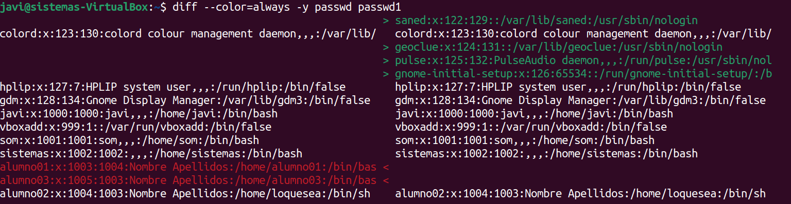

Significado de las líneas resaltadas:

-   El color **rojo** indica las líneas eliminadas en el primer fichero
-   El color **verde** indica las líneas añadidas en el segundo fichero


## Comando awk

El comando **awk** es una herramienta avanzada de procesamiento de **patrones** en líneas de texto. Su utilización estándar es la de filtrar ficheros o salida de comandos de Linux, tratando las líneas para, por ejemplo, mostrar unas determinadas columnas de información.

Se utiliza principalmente para:
- Filtrar información.
- Extraer columnas.
- Aplicar condiciones.
- Realizar cálculos.

La sintaxis básica de awk es:

    awk [condicion] { comandos }

Por ejemplo:

```bash
# Mostrar sólo los nombres y los tamaños de los ficheros:
ls-l | awk'{ print$8 ":" $5 }'
# Mostrar sólo los nombres y tamaños de ficheros .txt:
ls-l | awk'$8 ~ /\.txt/ { print$8 ":" $5 }'
```

Dependiendo de la implementación concreta, awk reconoce varias opciones:

    awk [parámetros] 'condición {acciones}' fichero

> Un programa de awk es una secuencia de reglas (sentencias patrón-acción) con el formato que se describe a continuación. Las **acciones** se ejecutarán si en el registro actual se cumple el patrón o **condición**:

    condición {acciones;acciones}

-   Las llaves son necesarias para awk, por lo que suele ser necesario encerrar los programas de awk entre comillas, para evitar que el shell las interprete como caracteres especiales.
-   Si no hay condición que se cumpla, se ejecutarán las acciones en todos los registros. Para indicar un **patrón** en una condición se usa entre **/ /**
-   Si no hay **acciones**, se ejecuta la acción por defecto: copiar el registro en la salida estándar.

> Idea clave: cada **línea** se reconoce como un **registro** y cada **palabra/columna** como un **campo** *($1, $2..)*

### Parámetros

Los **parámetros previos** más utilizados de awk son los siguientes:

-   awk -f \<*fichero_programa.awk*\> fichero

    Con este parámetro, se puede especificar un archivo que contenga un **script** en **awk**, en lugar de escribirlo directamente en la línea de comandos. Esto es útil para scripts más largos o complejos.

-   awk –F ':' **'condición** {acciones}'

    Este parámetro permite especificar el **separador de campos**. Por defecto, el separador es el espacio en blanco.

-   awk –v variables **'condición** {acciones}'

    Se utiliza para definir variables previamente en awk (por ejemplo, *lista=3*)

### Condiciones

Listado de varias **condiciones** de búsqueda que se pueden utilizar por **awk**:

    awk 'condición {acciones}'

| **Condición**          | **Significado**                                              |
|------------------------|--------------------------------------------------------------|
| /cadena/               | Búsqueda de cadena.                                          |
| /\^cadena/             | Búsqueda de cadena al principio de la línea                  |
| /cadena\$/             | Búsqueda de cadena al final de la línea.                     |
| **\$N** \~ /cadena/    | Búsqueda de cadena en el campo **N**                         |
| **\$N** !\~ /cadena/   | Búsqueda de **no** coincidencia de cadena en el campo **N**. |
| /(cadena1)\|(cadena2)/ | Búsqueda de cadena1 o cadena2                                |
| /cadena1/,/cadena2/    | Todas las líneas entre cadena1 y cadena2                     |

> awk también permite la utilización de algunas **funciones** propias como *length*, *substr*, *tolower* o *toupper*.

### Acciones

Listado de **variables de tratamiento de línea** para las **acciones** específicas que se pueden utilizar por **awk**:

    awk 'condición {acciones}'

| **Variable**    | **Uso**                                                      |
|-----------------|--------------------------------------------------------------|
| \$0             | mostrar la línea completa.                                   |
| \$1, \$2 .. \$N | mostrar los campos (columnas) de la línea especificados.     |
| **NR**          | número de línea actual (registro) que está siendo procesado. |
| NF              | número de campos (columnas) de la línea actual.              |
| FNR             | Índice del registro actual relativo al archivo en curso.     |
| FILENAME        | nombre del archivo en curso.                                 |

Un ejemplo sencillo para mostrar los campos de la salida de un comando concreto (en este caso ps -ef):

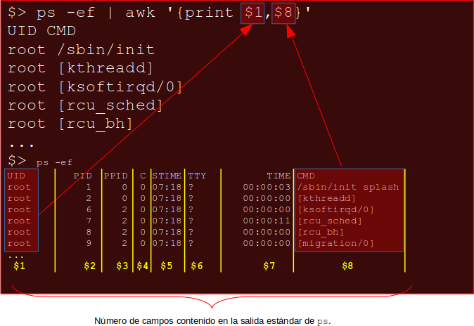

En relación con print se suele usar awk '/patron/ {print}'

El ejemplo más sencillo que podemos ver de uso de awk es el de imprimir la cadena "*Hola mundo*“ gracias a la **función** integrada **print**:

    awk '{ print "Hola mundo"}'

En el caso de ficheros con múltiples columnas separadas por espacios en blanco ya hemos dicho que se identifican como **campos.** En el siguiente ejemplo se muestran las columnas 1 y 3 (campos) de un fichero con 4 columnas:

    awk '{ print $1, $3}' fichero.txt

Estas variables se pueden **manipular** (sumar, restar, cambiar, etc.) como cualquier otra variable, por ejemplo:

    awk '{ $1 = $2 + $3; print $0 }' archivo

Sumará los campos 2 y 3 en el campo 1, e imprimirá el nuevo registro (la línea completa).

### Operadores lógicos

El comando awk también permite la utilización de **operadores lógicos** ya conocidos por nosotros:

| **Operador** | **Uso**                                   |
|--------------|-------------------------------------------|
| \<           | Menor que                                 |
| \>           | Mayor que                                 |
| !            | Negación                                  |
| ==           | Igual que                                 |
| !=           | Distinto de                               |
| \~           | Correspondencia con una expresión regular |
| &&           | Operador AND                              |
| \|\|         | Operador OR                               |

Si queremos seleccionar las líneas usando operadores lógicos **OR** podremos hacerlo de la siguiente forma:

    awk '$2 > 30 || $3 > 180' { print $1} datos.txt

Si queremos usar en cambio un operador **AND**:

    awk '$2 > 25 && $3 > 170' { print $1} datos.txt

### Ejemplos aplicados

Más ejemplos sencillos usando el comando **awk**:

```bash
# Imprimir último campo de cada línea del fichero indicado:
awk'{ print$NF }' fichero.txt
# Imprimir primeras N líneas:
awk'NR < 100 {print}’
# Filtrar líneas basadas en la condición de que el 2º campo sea mayor que 10
awk '$2 > 10 {print}' archivo.txt
# Mostrar campos/líneas que cumplan determinadas condiciones entre campos junto con la utilización de la función length:
awk'$2 > $3 {print$3}' fichero
awk'$1 > $2 && $3 > 1 {printlength($1)}' fichero
```

Se puede utilizar el comando awk del siguiente modo para que solo muestre solo **la línea** cuya columna **contenga la expresión regular** dato5:

    awk '/dato5/ { print }' ejemplo.txt

Por ejemplo, las siguientes líneas dentro del comando awk contienen dos reglas:

    /12/ { print $0 }
    /21/ { print $0 }

La primera regla tiene la cadena ‘12’ como patrón y realiza la acción ‘*print \$0*’. La segunda regla tiene la cadena ‘21’ como patrón y también realiza la acción ‘*print \$0*’.

La función **print**, también puede aceptar cadenas de caracteres como argumento, así como la utilización del carácter **tabulación** "\\t" o "\\n" entre comillas dobles:

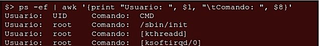

### Condicionales

En awk se pueden usar **condicionales** dentro de sus **condiciones** para controlar el flujo de ejecución del script basado en ciertas condiciones. La estructura básica de un condicional en awk es similar a la de otros lenguajes de programación, usando el patrón if-else y entre { }

Así, por ejemplo:

```bash
awk '{
if ($1 >= 60) {
print $1, "Aprobado"
} else {
print $1, "Suspenso"
}
}' puntuaciones.txt
```

### BEGIN Y END

**BEGIN** y **END** son otros dos patrones especiales se pueden utilizar para indicar a awk qué hacer antes de empezar a procesar y después de haber procesado los registros de entrada. La regla **BEGIN** se ejecuta una vez, antes de leer el primer registro de entrada. Y la regla **END** se ejecuta una vez después de que se hayan leído todos los registros de entrada.

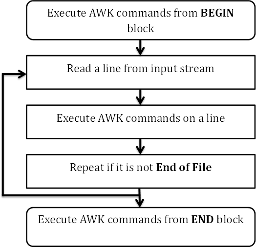

La sintaxis de las palabras clave **BEGIN** y **END** es la siguiente:

    BEGIN {
        acciones iniciales
        }
    <condición1> {acciones}
    <condición2> {acciones}
    ...
    END {
        acciones finales
    }

## Resumen comandos de gestión de cadenas

Listado de comandos de **gestión de cadenas** destacados:

| **Comando** | **Acción**                                                 | **Ejemplo**             |
|-------------|------------------------------------------------------------|-------------------------|
| **tee**     | Leer la entrada estándar y escribir en uno o más archivos. | date \| tee -a log.txt  |
| **wc**      | Contar el nº de líneas, caracteres y de palabras.          | wc –l fichero.txt       |
| **grep**    | Buscar un patrón en un fichero.                            | grep javier /etc/passwd |
| **sort**    | Ordenar el contenido de un fichero/listado.                | sort –r fichero.txt     |
| **uniq**    | Elimina filas duplicadas.                                  | cat fichero \| uniq     |
| **find**    | Buscar ficheros que concuerden con un patrón.              | find –name '\*.jpg'     |
| **tr**      | Sustituir grupos de caracteres por otros indicados.        | tr 'abc' '123'          |
| **cut**     | Cortar o extraer elementos de una línea de un fichero.     | cut –d “:” -f 2         |
| **sed**     | Sustituir (entre otras opciones) texto u ocurrencias*.*    | sed /s/hola/adios/      |
| **awk**     | Herramienta de filtrado y procesado avanzado de texto.     | awk '{print \$8"}'      |
