# UT6.5 Administración de Linux. Gestión de procesos y servicios

## Procesos en Linux

Recordar que un proceso al crearse se le asocia un número único (**PID**) que lo identifica. Además, a un proceso están asociadas otras informaciones (BCP) como: 

-   Un **identificador** o identificadores (USER, PID, UID, GID, PPID)
-   La hora de inicio en que comenzó.
-   Un **estado**; *running, sleep, zombie, stopped*, que veremos a continuación.
-   Tanto por cierto % de uso de memoria y CPU
-   Una **prioridad relativa** que indica la facilidad del proceso para acceder a la CPU: ⚠️Oscila entre **-20 y 19**, donde -20 es la **mayor prioridad**
-   La terminal asociada (*TTY*) desde donde fue invocado (en el caso que esté asociado a una terminal)


### Estados de un proceso

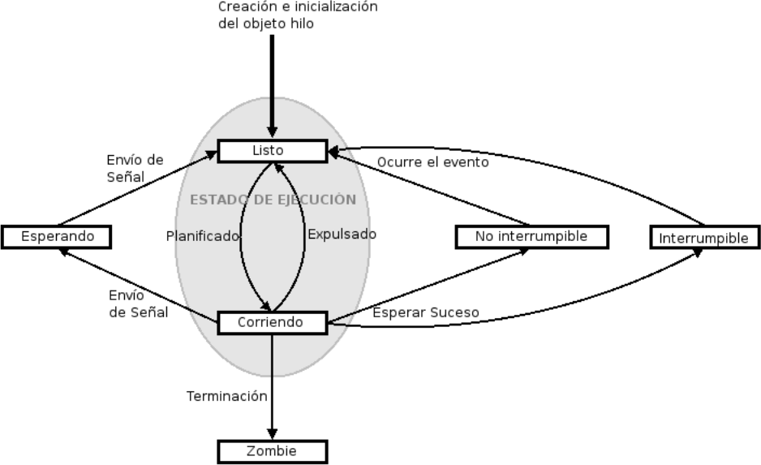

Los **estados** en los que puede estar un proceso en Linux son los siguientes:

| Estado | Nombre                    | Descripción del estado |
|--------|---------------------------|------------------------|
| R      | Running                   | Proceso **ejecutándose (running)** o listo para ejecutarse. |
| D      | Sleeping (no interrumpible)  | Generalmente el proceso se encuentra **esperando** una operación de entrada/salida con algún dispositivo. El proceso no se puede interrumpir. |
| S      | Sleeping (interrumpible)  | **Espera interrumpible**, el proceso está **bloqueado** en espera de un evento. |
| I      | Idle                      | Proceso inactivo del kernel (habitual en sistemas modernos). |
| T      | Stopped                   | Proceso **detenido** por el envío de alguna señal. |
| Z      | Zombie                    | Proceso **terminado**, pero cuyo padre aún sigue «vivo» y no ha capturado el estado de terminación del proceso hijo. |                                                                                                                        |

> El comando *ps* puede mostrar combinaciones de estados como Ss, R+, etc. La primera letra indica el estado principal y las siguientes aportan información adicional (por ejemplo, si es un proceso en primer plano o líder de sesión).


### Listado de procesos

```tip
El comando habitual para mostrar los procesos del sistema es **ps**
```

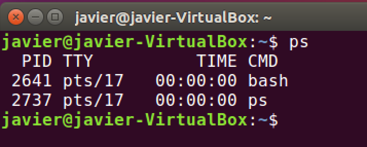

Para mostrar **todos los procesos** se utiliza el parámetro: **ps -aux**

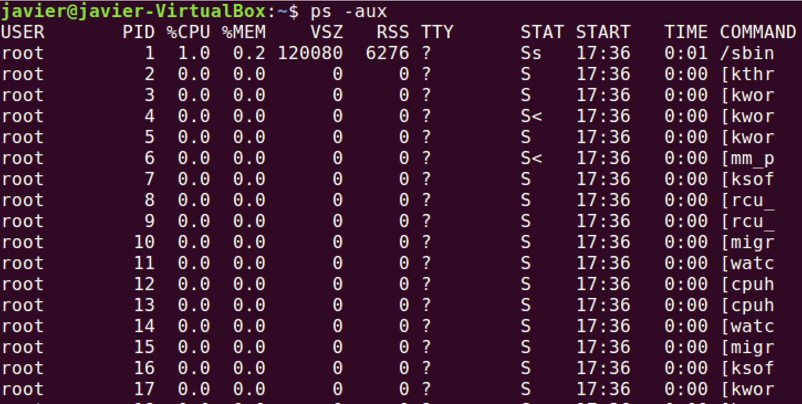

Para mostrar todos los procesos y su prioridad, que veremos a continuación, podemos utilizar el parámetro: **ps –el**

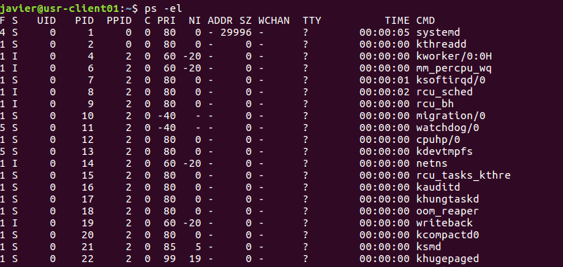

Para conocer el *PID* de un proceso en concreto usaremos el comando **pidof**

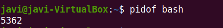

Para mostrar determinadas columnas utizaremos: 

    ps –eo [columnas]

Así, por ejemplo: 

    ps –eo pid,user,%cpu,comm

Los valores de las columnas pueden ser los siguientes:

| Columna | Descripción                                   |
|--------|-----------------------------------------------|
| pid    | ID del proceso.                               |
| user   | Usuario que ejecuta el proceso                |
| uid    | ID del usuario que ejecuta el proceso         |
| comm   | Nombre del comando                            |
| %mem   | Porcentaje de uso de memoria                  |
| pri    | Prioridad del proceso                         |
| stat   | Estado del proceso                            |
| nice   | Valor niceness del proceso                    |

Para mostrar el árbol de procesos (con sus dependencias) utilizaremos **pstree**:

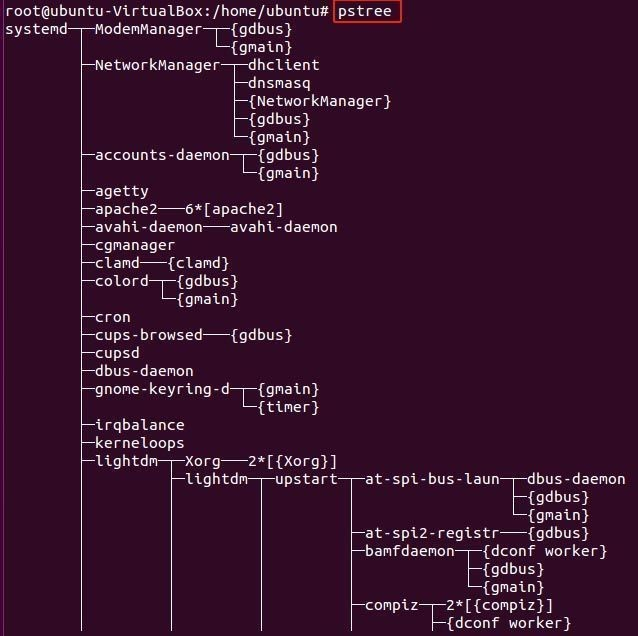

> Usando el parámetro pstree –ps podremos ver también su PID asociado.

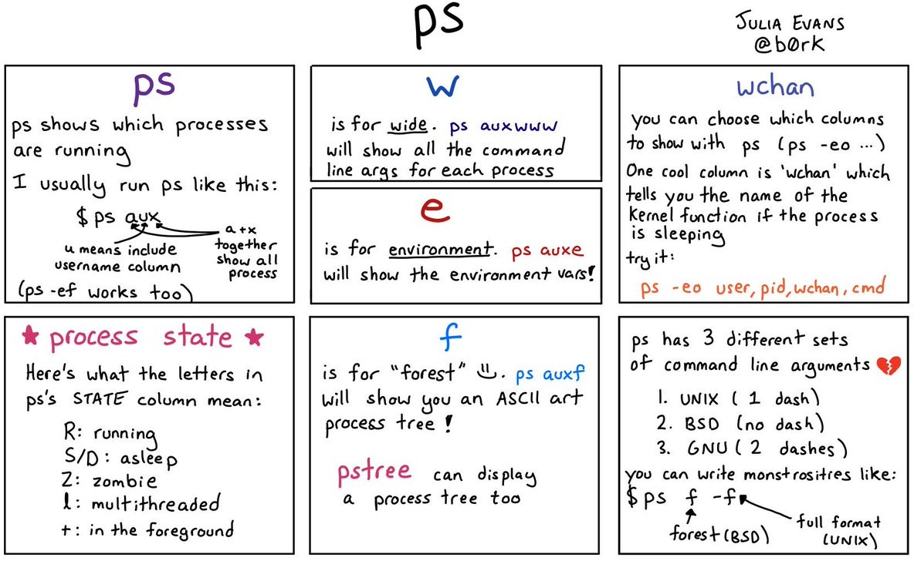

### Monitorización sobre procesos

```tip
El comando **top** se utiliza para conocer los procesos de ejecución del sistema en tiempo real y es una de las herramientas más importantes para un administrador.
```

Muestra una interfaz en modo texto que se va a ir actualizando cada 3 segundos por defecto. Muestra un resumen del estado de nuestro sistema y la lista de procesos que se están ejecutando.

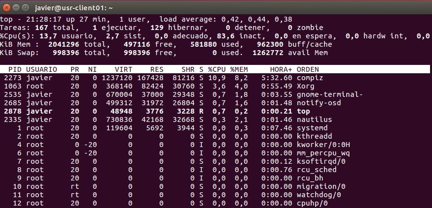

Las diferentes <u>columnas</u> que nos encontramos al ejecutar el comando **top** son:

    PID USUARIO PR NI VIRT RES SHR S %CPU %MEM HORA+ ORDEN
    4436 mario 20 0 982792 154512 91896 S 3,0 0,9 0:56.36 spotify

- *PID*: es el identificador de proceso. Cada proceso tiene un identificador único.
- *USER (USUARIO):* usuario propietario del proceso.
- *PR*: prioridad del proceso (20 por defecto). *RT* significa que se ejecuta en tiempo real.
- *NI*: asigna la prioridad relativa. Si tiene un valor bajo (hasta -20) quiere decir que tiene más prioridad que otro con valor alto (hasta 19).
- *VIRT*: cantidad de memoria virtual utilizada por el proceso. 
- *RES*: cantidad de memoria RAM física que utiliza el proceso. 
- *SHR*: memoria compartida.
- *S (ESTADO):* estado del proceso.
- *%CPU:* porcentaje de CPU utilizado desde la última actualización.
- *%MEM*: porcentaje de memoria física utilizada por el proceso.
- *TIME+ (HORA+) :* tiempo de vida del proceso.

Por defecto, los procesos mostrados por el comando top, estarán ordenados por la columna de consumo de CPU (%CPU).

Si queremos ordenarlos por otra columna podremos pulsar las siguientes teclas:
- M Ordenar por la columna %MEM 
- N Ordenar por la columna PID 
- T Ordenar por la columna TIME+ 
- P Ordenar por la columna %CPU 


El comando **htop** es un comando interactivo que supone una mejora de la interfaz de **top**:

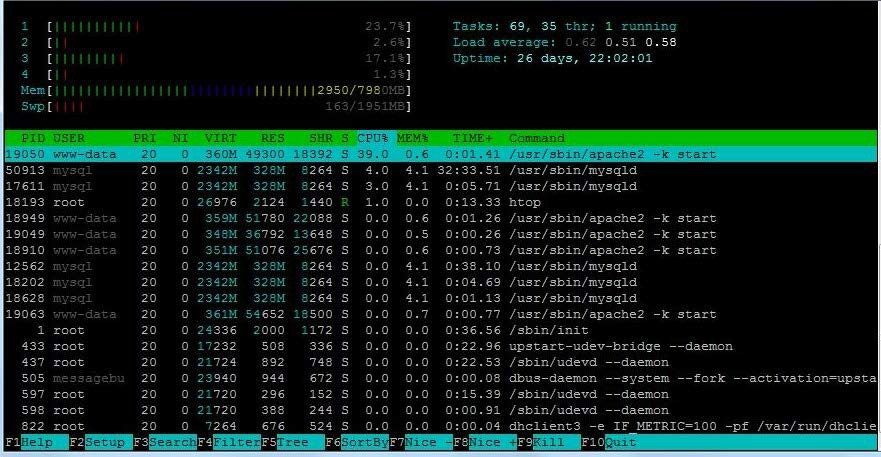 

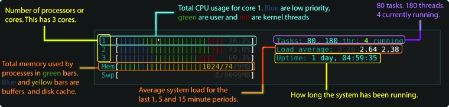 

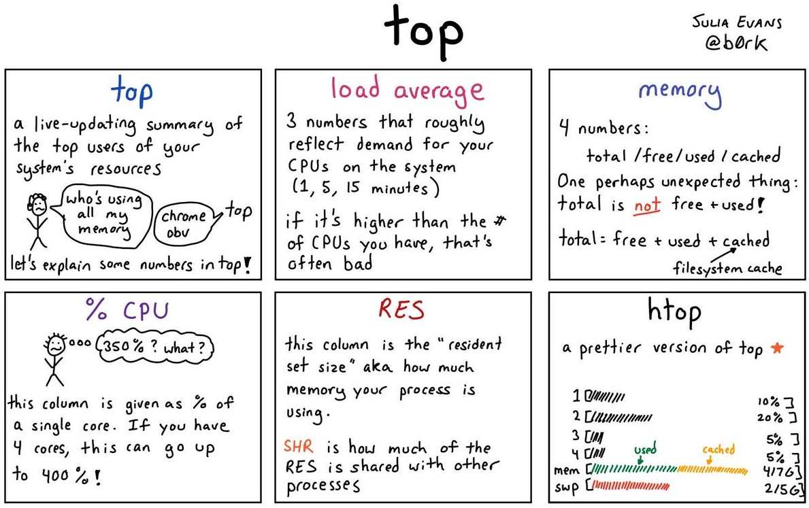

### Acciones sobre los procesos

Acciones posibles sobre los procesos en Linux:

-   **Detener Proceso**: Parar la ejecución de un proceso sin eliminarlo (es posible reanudar su ejecución con continuar). Comando **pkill**
-   **Finalizar o Matar proceso**: Elimina este proceso. Se usa **Kill**. (killall para subprocesos)
-   **Cambiar la prioridad**: A valores entre *-20* y *19*. Los valores negativos sólo los puede ejecutar el administrador. Se utiliza el comando **nice** o **renice**

### Procesos en primer y segundo plano

Linux es un SO operativo multiusuario y la consola no es una excepción. Ello implica que aún dentro de ella no hace falta lanzar comandos y esperar a sus resultado en primer plano, ya que siempre podremos lanzarlos en **segundo plano**.

Para ello se ejecuta el comando correspondiente seguido del símbolo **&**: 
    
    comando &

**Ejecución del comando en primer plano:** hay que esperar hasta que termine el programa o proceso abierto.

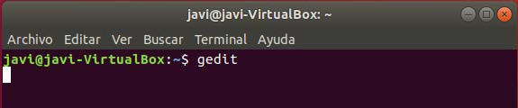

**Ejecución del comando en segundo plano:** se recupera el control de la línea de comandos mientras se ejecuta el programa o proceso.

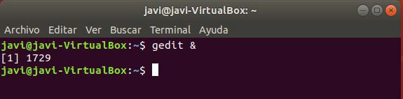

- 💡 Con el comando **bg** se pueden ver los procesos en segundo plano.
- 💡 Con **fg** envío a primer plano los procesos que se encuentran en segundo plano

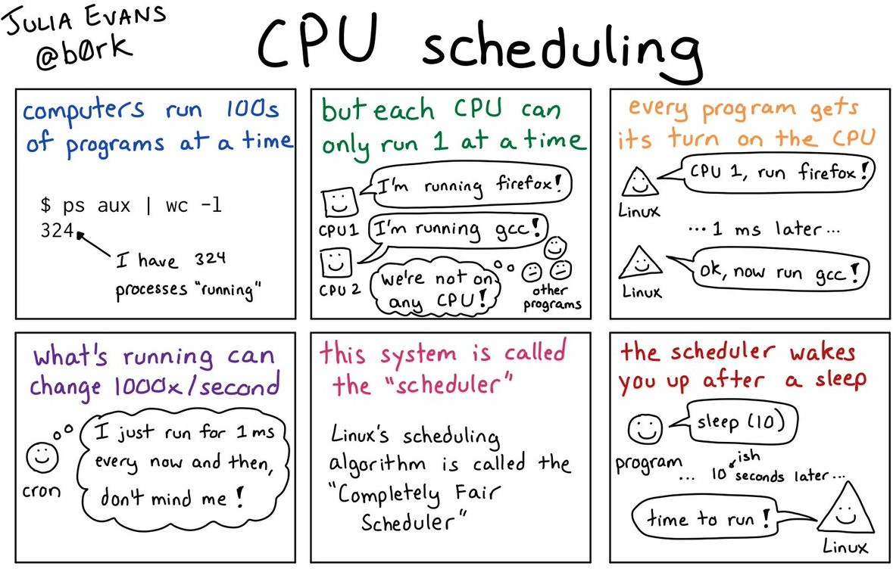

## Prioridad de procesos

Todo proceso en Linux tiene dos valores de prioridad asociados:

- Su valor **nice** (*NI*), que es su **prioridad relativa** respecto al resto de procesos:
    - Es establecida por su propietario o por el usuario root.
    - Aparece en la columna **NI** (prioridad relativa)
    - Valores de -20 a 19 (0 si no se le especifica ninguna al comando nice)

- Su valor de **prioridad de ejecución (PR)**
    - Calculada y actualizada dinámicamente por la CPU (Kernel scheduler de Linux)
    - Se puede ajustar a nivel del kernel alterando su comportamiento (según distribución)
    - Para procesos normales PR= 20 + (-20 a 19) 
    - Aparece en la columna **PR**.

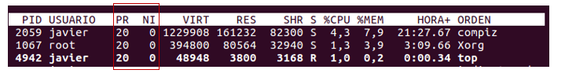


```tip
Podemos cambiar la **prioridad relativa** de cualquier proceso que vayamos a lanzar a través del comando **nice**. 
```

Su sintaxis:

    nice –n \<prioridad\> comando

💡 El rango de asignación de **prioridad** disponible es de **-20** (mayor) a **19** (menor)

Para procesos que ya están corriendo en el sistema se utiliza el comando **renice**, con la siguiente sintaxis:

    renice prioridad [[-p] pid …] [[-g] pgrp …] [[-u] usuario …]

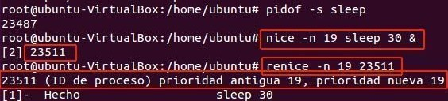

Dentro del comando **ps** se visualiza en la columna NI:

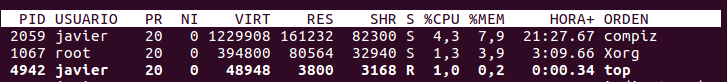

Veamos, como ejecutar el comando yes \> /dev/null & con una prioridad baja de \+10:

    nice -n10 yes \> /dev/null &

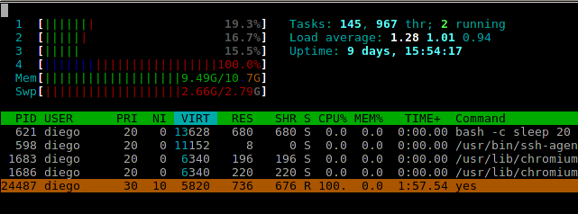

Si ahora necesitamos volver aumentar su prioridad en 5 habrá que utilizar **renice** indicando el PID de dicho proceso ya creado:

    renice -5 24487

## Comunicación entre procesos

```note
La comunicación entre procesos en Linux se lleva a cabo mediante el **envío de señales**. Las señales son notificaciones que un proceso le envía a otro.
```

El proceso receptor puede realizar varias tareas con una señal que recibe:

-   Ignorar la señal, el proceso no hará nada con la señal que reciba. Algunas señales como la **9** (*SIGKILL*) no pueden ser ignoradas.
-   Realizar la acción por defecto en el sistema, es decir, las acciones predeterminadas que el sistema le otorga a cada señal.
-   Realizar una acción particular, programada por el programador del programa que dio origen al proceso.

Para poder ver la lista de señales que un proceso puede enviarle a otro, se utiliza el comando **kill** de la siguiente forma: *kill -l*

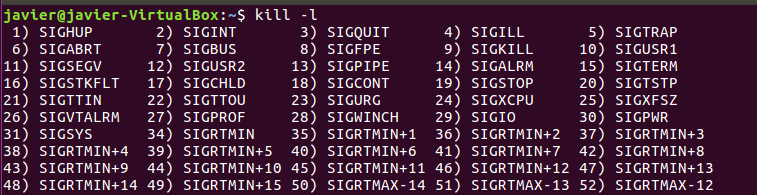

Las **señales** más comunes del sistema Linux son las siguientes:

| **Valor** | **Nombre** | **Descripción**                                                   |
|-----------|------------|-------------------------------------------------------------------|
| **1**     | SIGHUP     | Cuelga el proceso.                                                |
| **2**     | SIGINT     | Interrupción de un proceso (interrupción procedente del teclado)  |
| **3**     | SIGQUIT    | El proceso sale o se detiene (terminación procedente del teclado) |
| **9**     | SIGKILL    | Terminación de un proceso inmediatamente.                         |
| **15**    | SIGTERM    | Terminación del proceso.                                          |
| **17**    | SIGSTOP    | El proceso se detiene sin terminar.                               |
| **18**    | SIGTSTP    | El proceso se detiene o se pausa sin terminar.                    |
| **19**    | SIGCONT    | El proceso continúa después de terminar.       

>💡 Las señales **SIGKILL** y **SIGSTOP** no pueden ser capturadas, bloqueadas o ignoradas.

```tip
Las señales más conocidas se lanzan con **kill** y **killall**:
```

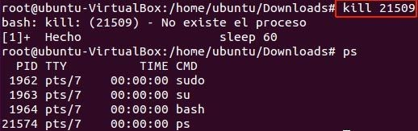

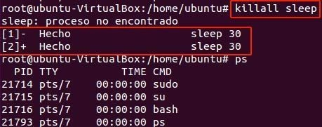

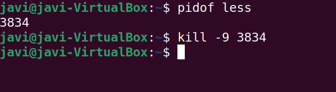

### Comando nohup

El comando nohup permite mantener la ejecución de un comando (el cual le pasamos como un argumento) pese a salir de la terminal (logout), ya que hace que se ejecute de forma **independiente a la sesión**.

Básicamente, lo que hace es ignorar la señal SIGHUP (señal que se envía a un proceso cuando la terminal que lo controla se cierra), esto implica que, aunque cerremos la terminal o le enviamos dicha señal, dicho proceso seguirá en ejecución.

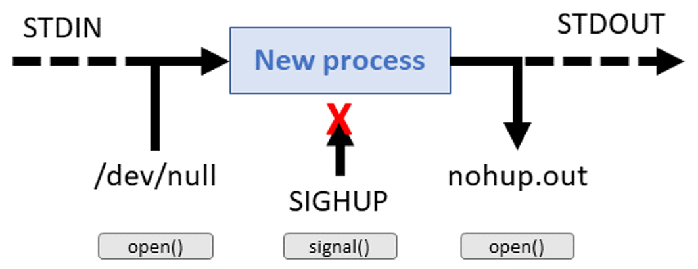

### Comando sleep

Cuando se necesita pausar o retrasar la ejecución de un comando dentro de un script bash se suele utilizar la herramienta **sleep**, la cual por defecto toma un parámetro que representa la cantidad de segundos a "dormir“.

    sleep NUMERO [SUFIJO]...

Los sufijos disponibles son:

- s Segundos
- m Minutos
- h Horas
- d Días

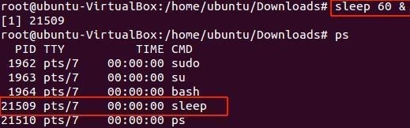

## Servicios (demonios)

### Systemctl

```tip
En **Linux** el comando **systemctl** se utiliza para controlar y administrar **servicios o demonios** en el sistema, durante el arranque o durante la sesión actual.
```
El comando systemctl admite los siguientes **parámetros** de uso:

| **Acción**                                                               | **systemd**               |
|--------------------------------------------------------------------------|---------------------------|
| **Listar** todas las unidades de servicios y sus estados                 | systemctl list-unit-files |
| **Arrancar** un servicio                                                 | systemctl **start** foo   |
| **Detener** un servicio                                                  | systemctl **stop** foo    |
| **Reiniciar** un servicio                                                | systemctl **restart** foo |
| Mostrar **estado** de un servicio                                        | systemctl **status** foo  |
| **Activar** un servicio para que sea ejecutado durante el arranque       | systemctl enable foo      |
| **Desactivar** un servicio para que no sea ejecutado durante el arranque | systemctl disable foo     |

### Estado servicios

El **estado** de los diferentes servicios según systemctl list-unit-files:

-   **Enabled**: El servicio está habilitado, se está usando. También indica que se iniciará de forma automática cuando iniciemos el equipo.
-   **Disabled**: El servicio está deshabilitado en este momento. No se inicia de forma automática al reinicio.
-   **Masked**: El servicio está completamente deshabilitado y no se puede iniciar de ningún modo sin previamente desenmascararlo.
-   **Static**: Servicios que únicamente se usarán en el caso que otro servicio o unidad lo precise. Estos servicios pueden estar activos o inactivos, pero siempre están disponibles para cuando se necesite usarlos. Estos servicios no se pueden activar ni desactivar, pero se pueden enmascarar.

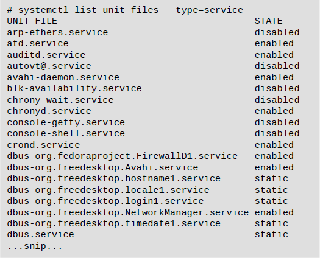

## Log del sistema

### journalctl

La herramienta **journalctl permite** acceder y gestionar registros o logs de eventos del sistema y de los servicios. Utiliza el sistema de registro journald, que es el servicio encargado de recopilar y almacenar registros en la mayoría de sistemas Linux modernos.

Si ejecutamos journalctl sin argumentos, veremos todos los registros del sistema desde el arranque.

La sintaxis del comando journalctl es la siguiente:
    journalctl [opciones] [unit]

Donde opciones puede ser:
    -n limita el número de entradas mostradas
    -u para mostrar el log del servicio que le indiquemos a continuación
    -k mostrar el log del kernel de Linux
    -p para filtrar por prioridad (pj warning, 2)
    _PID para mostrar el log de dicho PID
    -since -until para filtrar por fechas (por ejemplo --since='2024-02-29 00:01’      --until='2024-03-29 00:01)

### dmesg

**dmesg** (diagnostic message) es otro comando, mucho más específico, que sirve para listar el buffer de mensajes del kernel de Linux generados durante el arranque o el funcionamiento del sistema y que puede ser utilizado para ver un log de sucesos importantes ocurridos en el sistema.

El comando dmesg por tanto:
- Muestra los mensajes de arranque del sistema.
- Muestra eventos relacionados con la memoria.
- Muestra los mensajes del kernel de Linux.
- Permite ver mensajes en tiempo real.


## Resumen de comandos 

| **Comando**   | **Acción**                           | **Ejemplo**          |
|---------------|--------------------------------------|----------------------|
| **ps**        | mostrar procesos                     | ps –aux              |
| **top**       | monitoreo en tiempo real de procesos | top                  |
| **htop**      | interfaz de monitorio basada en top  | htop                 |
| **kill**      | matar un proceso                     | kill 11428           |
| **pkill**     | detener un proceso                   | pkill 11428          |
| **pidof**     | conocer el PID de un proceso         | pidof bash           |
| **nice**      | prioridad para lanzar programa       | nice –n–10 script.sh |
| **renice**    | cambiar prioridad proceso corriendo  | renice +19 890       |
| **pstree**    | mostrar el árbol de procesos         | pstree               |
| **sleep**     | retrasar la ejecución                | sleep 1m 2           |
| **systemctl** | Comando de gestión de servicios      | systemctl stop foo   | 
| **journalctl**| Mostrar log de servicios             | journalctl –p 2      | 