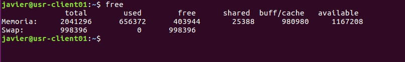
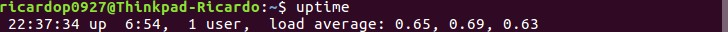
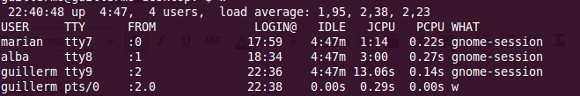
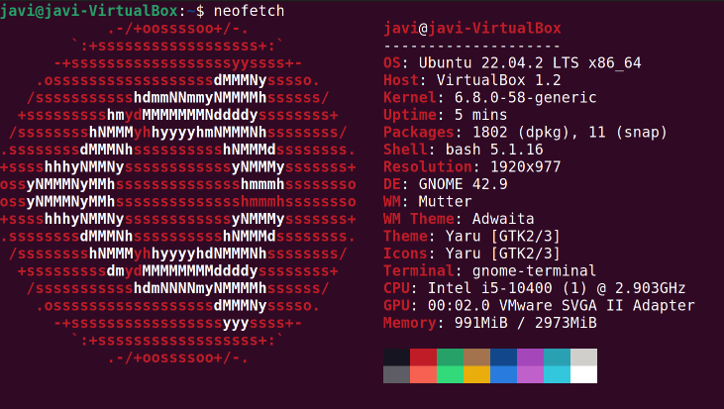
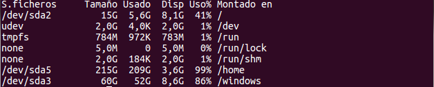
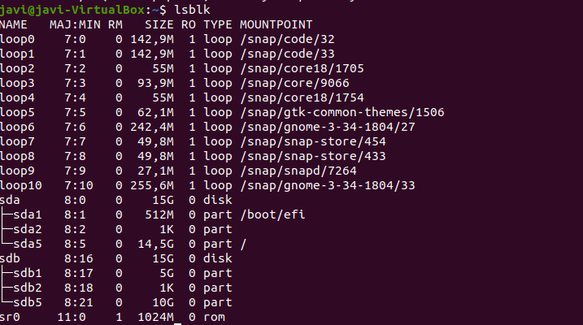
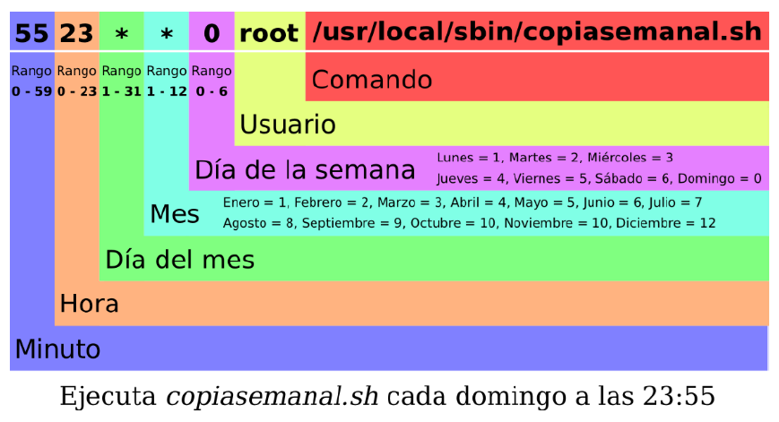

# UT 12.2 Administración de Linux. Información y programación de tareas

## Información del sistema

**uname**

Muestra información del sistema *(versión del SO, Kernel, procesador)*

```bash
# Procesador instalado en el equipo 
uname -p
 > Intel(R) Core(TM) Duo CPU T2450  @ 2.00GHz
# versión del kernel
uname -r
 > 2.6.22.9-laptop-1mdv
# Toda la información de uname a través de la opción -a
uname -a
 > Linux segolap 2.6.22.9-laptop-1mdv #1 SMP Thu Sep 27 04:17:10 CEST 2007 i686 Intel(R) Core(TM) Duo CPU T2450  @ 2.00GHz GNU/Linux
```

**free**

Estado de la memoria ram y swap del equipo.



**uptime**

Este comando indica la hora actual el tiempo que el sistema está en marcha, el número de usuarios conectados y la carga promedio del sistema para los últimos 1, 5 y 15 minutos.



**last y lastb**

El comando **last** muestra un listado de los últimos usuarios logueados al sistema e información relevante, mientras que **lastb** (*last bad*), muestra los últimos intentos de logueo al sistema que fracasaron.

**w o who**

Muestra que usuarios están logueados actualmente en el sistema y lo que están haciendo.



**date**

Comando ya conocido, que muestra la fecha y hora del sistema, pudiendo cambiar su formato de salida.


**neofetch**

**neofetch** es una utilidad escrita en lenguaje bash, que permite ver en la terminal la información básica del hardware y del software instalado de forma visual.




### Comando df (disk free)

El comando **df** (*disk free*) muestra detalles acerca de los sistemas de archivos montados, es decir, detalla el espacio total, ocupado y libre de nuestro sistema.

Al ejecutarse sin opciones, el comando muestra el espacio disponible en todos los sistemas de archivos montados al momento.

Es aconsejable el parámetro *-h*, para que facilite la lectura en Gb, Mb o Kb.



También podemos investigar el espacio libre y ocupado de determinados tipos de sistemas de archivos en particular. Para esto utilizamos la opción -t seguido del tipo de sistema de archivo que nos interese.

### Comando du (disk usage)

El comando du (disk usage) es el comando estándar de Linux para estimar el uso de espacio en disco de un archivo, directorio en particular o archivos.

El comando se desplazará de forma recursiva a través de todos los archivos y subdirectorios dentro del directorio especificado.

Por ejemplo, el espacio gastado en disco usando du –shc ./* desde la raíz


### Información de discos

El comando **lsblk** es útil ya que muestra información de todos los dispositivos de bloque del sistema y sus puntos de montaje:



Recuerda que en Linux las particiones en *MBR* se mostrarán de la siguiente forma:

-   Las nombradas de la 1 a la 4 son particiones **primarias**
-   Las nombradas a partir de la 5 son particiones **lógicas**


Listado de comandos de **información del sistema** vistos:

| Comando | Descripción |
|--------|------------|
| uname  | Mostrar información del sistema: versión, kernel de Linux y otros detalles. |
| free   | Estado de la memoria RAM y swap ocupados. |
| uptime | Tiempo e información desde que el sistema ha estado funcionando. |
| last   | Últimos accesos al sistema. |
| lastb  | Últimos accesos erróneos al sistema. |
| w, who | Usuarios logueados en el sistema. |
| du     | Uso de espacio en disco. |
| df     | Mostrar espacio libre en disco. |
| lsblk  | Enumera información sobre los dispositivos de bloque disponibles o especificados. |


## Programación de tareas

Para la programación de tareas en el tiempo se suele utilizar **cron**, que es un administrador regular de procesos en segundo plano. El demonio de cron, llamado **crond** se despierta una vez cada minuto, examina los ficheros de control, que se encuentran en */etc/crontab* en algunos sistemas o en */etc/spool/cron/crontabs*. 


**Crontab** es un simple archivo de texto que guarda una lista de comandos a ejecutar en un tiempo especificado por el usuario.

El demonio de cron, llamado **crond** se despierta una vez cada minuto, examina los ficheros de control, que se encuentran en /etc/crontab en algunos sistemas o en */etc/spool/cron/crontabs*

En estos ficheros se almacenan los trabajos planificados mediante **crontab.** Si encuentra algún trabajo que deba ser ejecutado en ese minuto los ejecuta y si no los hay, vuelve a dormir hasta el siguiente **minuto**.

En la actualidad existen otras herramientas muy utilizadas para tareas como **systemd.timer**, que en esencia funcionan igual que cron.

En Linux además existen varias formas de programar tareas en respuesta a diversos eventos como *udev* o *inotify*.


### Crontab

Para programar de forma periódica la ejecución de determinados procesos y aplicaciones se utiliza el comando **crontab**. El fichero de configuración de crontab se almacena en */etc/crontab*.

Para agregar una tarea se usa el comando **crontab –e** y se agregan líneas usando el siguiente formato de 5 campos:



Rango de valores aceptados para cada campo:

| **1** | **2** | **3** | **4** | **5** | **comando** |
|-------|-------|-------|-------|-------|-------------|

| **Campo** | **Significado**  | **Valores válidos** | Otros valores \*            |
|-----------|------------------|---------------------|-----------------------------|
| 1         | Minuto           | 0-59                |                             |
| 2         | Hora             | 0-23                |                             |
| 3         | Día del mes      | 1-31                |                             |
| 4         | Mes              | 1-12                |                             |
| 5         | Día de la semana | 0-6                 | mon,tue,wed,thu,fri,sat,sun |

-   Si queremos ejecutar una tarea cada **x tiempo** utilizaremos la barra inclinada **/** para indicarlo: /10
-   Si queremos indicar un **rango** entre números utilizaremos el guion: 1-5
-   Si queremos indicar varios valores usaremos las comas: 1,3,6

Existen también una serie de **palabras reservadas** para simplificar la creación de tareas:

| **Entrada** | **Descripción**                | **Equivale a** |
|-------------|--------------------------------|----------------|
| @yearly     | Se ejecuta una vez al año      | 0 0 1 1 \*     |
| @monthly    | Se ejecuta una vez al mes      | 0 0 1 \* \*    |
| @weekly     | Se ejecuta una vez a la semana | 0 0 \* \* 0    |
| @daily      | Se ejecuta una vez al día      | 0 0 \* \* \*   |
| @midnight   | (igual que @daily)             | 0 0 \* \* \*   |
| @hourly     | Se ejecuta una vez cada hora   | 0 \* \* \* \*  |


Ejecutar un programa llamado /home/user/backup.sh cada día a las 00:00:

    0 0 * * * /home/user/backup.sh

Apagar el ordenador todos los sábados a las 21.30:

    30 21 * * 6 shutdown –now

Chequear el disco sdb todos los meses:

    @monthly fsck /dev/sdb

El fichero **/etc/crontab** contiene información acerca de los trabajos que se van a ejecutar. Cada usuario tiene un archivo crontab que se guardará en el

directorio /var/spool/cron. Cada archivo tendrá un nombre que será el del usuario que creo cada tab. La única diferencia entre /etc/crontab y los *crontabs* de usuario es que el /etc/crontab agrega un campo adicional donde se especifica bajo que usuario se ejecutarán las tareas.

Cron así mismo permite controlar que usuarios pueden o no pueden usar los servicios de cron. Esto se logra de una manera muy sencilla a través de los siguientes archivos:

-   /etc/cron.allow
-   /etc/cron.deny

### Systemd timers

systemd timers son el mecanismo de programación de tareas de systemd que reemplaza (en gran parte) a cron en sistemas modernos.

Permiten lanzar unidades (.service) en momentos o intervalos definidos, con gran flexibilidad y mejor integración con el sistema.

Sus componentes básicos:
- .service: unidad que define la acción a ejecutar: `ExecStart=/usr/bin/rsync`
- .timer: unidad que define cuándo debe ejecutarse el .service: `OnCalendar=hourly, OnBootSec=5min`

### udev

Para generar una respuesta mediante scripts cuando se conecta o desconecta un dispositivo (USB, discos, etc.), se puede utilizar el comando **udev**.

Para ello se debe editar el fichero /etc/udev/rules.d/99-usb.rules para especificar las reglas concretas.

Por ejemplo:

    ACTION=="add", SUBSYSTEM=="usb", RUN+="/ruta/del/script.sh"
    
Una vez editado dicho fichero de reglas será necesario recargar las reglas mediante el comando:

    sudo udevadm control --reload-rules
    
### inotify / system.path

inotify es una API del kernel de Linux que monitoriza eventos del sistema de archivos que pueden utilizarse para lanzar un script de una tarea concreta.

También puede utilizarse systemd.path para ejecutar servicios en respuesta a cambios en archivos o directorios.

Para ello habría que crear un archivo de configuración dentro de */etc/systemd/system/mi-servicio.path*
