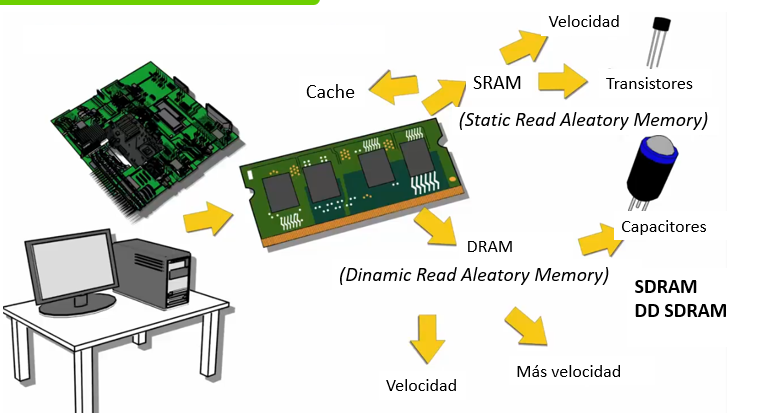

# UT7.2: Programación de shell script

## Introducción

```note
El shell scripting permite utilizar las capacidades de la shellpara automatizar multitud de tareas que, de otra forma, requerirían múltiples comandos introducidos de forma manual.
```

Existen diferencias importantes entre los lenguajes de programación tradicionales y el lenguaje de **scripts** que veremos en esta unidad.

-   Los lenguajes de programación son, en general, bastante más potentes y rápidos que los lenguajes de scripting.
-   Los lenguajes de programación comienzan desde el código fuente (de un lenguaje específico), que se compila para crear los ejecutables para cada plataforma específica.
-   Un lenguaje de scripting también comienza por el código fuente, pero no se compila en un ejecutable. En su lugar, un intérprete lee las instrucciones del fichero y las **interpreta** y ejecuta secuencialmente.

### Características

**Características propias de C-shell incorporadas:**

-   Control de trabajos.
-   Manipulación de directorios.
-   Expansión de llaves, para la generación de cadenas arbitrarias.
-   Carácter especial para referenciar al directorio home.
-   Alias, que permiten referenciar más convenientemente comandos y sus opciones.
-   Histórico de comandos, que posibilita reutilizar comandos previamente usados.

**Características propias:**

-   Características de programación integrada: la funcionalidad de comandos UNIX (*test*, *expr*, *getopt*, *echo*) se integraron en el shell, permitiendo que tareas comunes de programación sean realizadas de forma más clara y eficiente.
-   Estructuras de control, como *if* o *select* (para la generación de menús)
-   Variables para personalizar el entorno.
-   Arrays uni-dimensionales que permiten fácil acceso a listas de datos.

**Cuando NO usar scripts:**

-   Tareas de uso intensivo de recursos, especialmente cuando la velocidad es un factor importante (sorting, hashing)
-   Procedimientos que involucren cálculos matemáticos pesados, en especial los que involucren aritmética de punto flotante.
-   Portabilidad (utilizar C en su lugar)
-   Aplicaciones complejas donde se requiere programación estructurada
-   Aplicaciones muy críticas
-   Necesidad de operaciones de archivo intensivas
-   Necesidad de arrays multi-dimensionales
-   Necesidad de estructuras de datos como listas enlazadas o árboles
-   Necesidad de generar o manipular GUIs
-   Necesidad de acceso directo a hardware
-   Necesidad de realizar E/S a través de puertos o sockets
-   Aplicaciones de código-cerrado (Los shell scripts suelen ser Open Source)



### Formato

```note
Un script es un fichero que contiene comandos del shell(en este caso en bash) que llevan a cabo una tarea concreta.
```

Los scripts contienen a su vez:
-   Una estructura de datos: variables
-   Estructuras de control: secuencia, decisión, bucles.

Línea inicial *shebang* para un shell script:

    #!/bin/bash 
    #!/bin/sh

Para **ejecutar** un script:

1.  Hay que hacerlo ejecutable: `chmod +x script`
2.  Invocarlo (varias formas):`./script.sh` o `bash script.sh`

```bash
#! /bin/bash 
#! Primer script echo Hola Mundo
echo Hola Mundo
```

    >./hola.sh #Tiene que tener permisos de ejecución +x

### Comando echo

El comando **echo** sirve para mostrar una cadena de texto concreta con un mensaje para el usuario en la consola:

    Sintaxis: *echo [-n] [-e] cadenadetexto*

Parámetros:

**-n** Suprime la actuación normal de echo, que consiste en que añade una nueva línea a continuación de la salida.
**-e** Permite la interpretación de una serie de *secuencias de caracteres* en la cadena.

| **Formato** | **valor** | **Formato** | **valor** |
|-------------|-----------|-------------|-----------|
| Negrita     | \\e[1m    | Amarillo    | \\e[33m   |
| Negro       | \\e[30m   | Azul        | \\e[34m   |
| Rojo        | \\e[31m   | Blanco      | \\e[37m   |
| Verde       | \\e[32m   | Subrayado   | \\e[4m    |


## Caracteres especiales

### Entrecomillados

**Comillas simples [‘ ‘] (weak quote)**

Las comillas simples proporcionan la forma más estricta de citar. Todo lo que esté dentro de ellas se **interpreta literalmente**, sin ninguna expansión o sustitución.

Esto significa que las variables, los comandos y los caracteres especiales no se interpretan ni se expanden dentro de las comillas simples.

```bash
> echo 'El valor de $VAR es $VAR'
El valor de $VAR es $VAR    
```

**Comillas dobles [" "] (strong quote)**

Las comillas dobles permiten la **expansión de variables** y la sustitución de comandos, pero no interpretan ciertos caracteres especiales.

Dentro de las comillas dobles, se expanden las variables (precedidas por \$) y las sustituciones de comandos (precedidas por \`\$()\` o \`).

```bash
VAR="mi valor"
echo "El valor de \$VAR es $VAR“
El valor de $VAR es mi valor
```

> Como se puede ver, la variable se expande a su valor, pero el carácter \$ se escapa con una barra invertida \\ para que sea interpretado de forma literal.


**Comillas invertidas [\` \`] o \$( )**

Los acentos graves se utilizan para realizar la **sustitución de comandos**. El comando dentro de los acentos graves se ejecuta, y su salida se reemplaza en la línea de comandos.

La forma más actual de hacer lo mismo es mediante la forma *\$(comando)* y se recomienda usar esta forma en lugar de los acentos graves porque es más legible y se puede anidar.

Cuando se asignen datos carácter que contengan espacios en blanco o caracteres especiales, se deberá encerrar entre comillas simples o dobles.

Las dobles comillas harán que si, en su contenido se referencia una variable, ésta sea resuelta a su valor.

```bash
> var="cadena de prueba"
> nuevavar="El valor de var es $var"
> echo $nuevavar
El valor de var es cadena de prueba
```


| **Tipo de Comilla**              | **Descripción**                                          | **Permite Expansión de Variables** | **Permite Sustitución de Comandos** |
|----------------------------------|----------------------------------------------------------|------------------------------------|-------------------------------------|
| **Simples ('')**                 | Contenido tratado como texto literal                     | No                                 | No                                  |
|  **Dobles ("")**                 | Expanden variables, pero mantienen el contenido agrupado |  Sí                                |  Sí                                 |
| **Invertidas (\` \`) o \$(...)** | Ejecutan comandos y devuelven su salida                  | Sí                                 | Sí                                  |

### Comodines

| **Carácter** | **Significado**                                  |
|--------------|--------------------------------------------------|
| **\~**       | Directorio home                                  |
| **\`**       | Sustitución de comando                           |
| **\#**       | Comentario                                       |
| **&**        | Trabajo en background                            |
| **\***       | Estrella de kleene (expresiones regulares)       |
| **( )**      | Inicio/fin de subshell                           |
| **\\**       | Carácter de escape                               |
| **\|**       | Tubería (pipe)                                   |
| **[ ]**      | Inicio/fin conjunto caracteres                   |
| **{ }**      | Inicio/fin de bloque de comandos                 |
| **''**       | Comillas simples (weak quote)                    |
| **""**       | Comillas dobles (strong quote)                   |
| **\> \>\>**  | Redirección de salida                            |
| **\<**       | Redirección de entrada                           |
| **?**        | Reemplazo de un carácter (expresiones regulares) |
| **!**        | Negación de pipeline                             |

## Variables

Las **variables** son una forma de almacenamiento en la que depositamos un determinado dato.

Además, sirven de enlace entre el usuario remoto y el programa. Otra de sus utilidades es poder utilizarlas en distintas partes de nuestro código del script. La semejanza que se suele dar a una variable en informática es la de un contenedor en el que almacenar datos.

Existen dos tipos de variables en Linux de las que ya hablamos:

-   **Variables de entorno o del sistema.** Son las variables que crea el sistema y están disponibles para todos los scripts y programas. Se pueden visualizar usando el comando env.
-   **Variables locales o de usuario** son las que creamos nosotros mismos para su uso específico.

El *shell* permite realizar las siguientes **operaciones** básicas con las variables:

| Descripción                                | Ejemplo       |
|--------------------------------------------|---------------|
| Sólo Definición                            | VAR="" VAR=   |
| Definición y/o Inicialización/Modificación | VAR=valor     |
| Expansión (acceso al valor)                | \$VAR \${VAR} |
| Eliminación de la variable                 | unset VAR     |
| Exportar valor de la variable              | export VAR    |

-   Las variables sólo son accesibles desde el momento de su definición ‘*hacia abajo* del script’, esto es, siempre deben definirse primero e invocarse después.
-   Recordar que Linux es **case sensitive** (sensible a mayúsculas y minúsculas) con lo cual las variables VAR y var se tratarán como variables distintas.
-   Al **exportar** una variable conservará su valor al terminar el script desde donde se ejecutaba, si no se perderá.