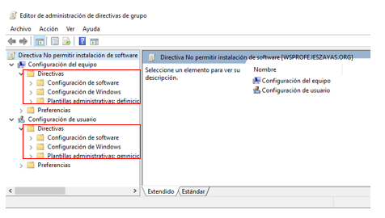
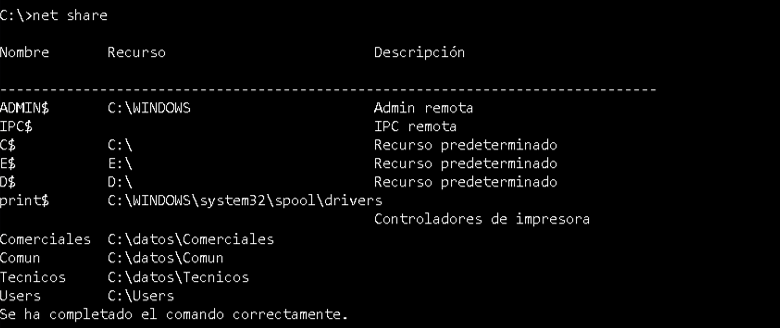

# UT7.3: Gestión de Dominios: perfiles, directivas, recursos. Powershell

## Perfiles de usuario

Un **perfil de usuario** es el conjunto de archivos y configuraciones que definen el entorno de trabajo de un usuario existente en Windows:
- Escritorio (iconos, fondo…) 
- Menú inicio 
- Documentos personales 

Existen los siguientes tipos de perfiles de usuario:
- **Perfil local**: se crea la primera vez que el usuario inicia sesión en un equipo concreto, se almacena en él y solo sirve en este equipo.
- **Móvil**: la configuración de un usuario se muestra en cualquier equipo del dominio.
- **Obligatorio**: un tipo de perfil que permite a los administradores disponer de escritorios para usuarios que no pueden modificarse. Al cerrar la sesión, se ignoran los posibles cambios que el usuario haya realizado.

### Perfil local

- Se crea la primera vez que el usuario inicia sesión en un equipo
- Se almacena en: C:\Users\usuario
- Solo funciona en ese equipo

Por ejemplo, si un usuario cambia el fondo de pantalla en un PC, ese cambio no aparece en otro equipo.

### Perfiles móviles

Los **perfiles móviles** permiten que el escritorio y otras características del entorno le aparezcan con la misma configuración al usuario siempre que se valide en el dominio, permitiendo que los usuarios puedan moverse de un equipo a otro dentro del dominio.

Cuando el usuario cierra la sesión, su perfil será copiado (**sincronizado**) en el servidor. Esto incluye, por ejemplo, las personalizaciones del menú Inicio, de su escritorio y del contenido de la carpeta de Mis documentos.

En un entorno con muchos equipos (aula, empresa, dominio), un usuario puede iniciar sesión en distintos ordenadores.

Sin utilizar perfiles móviles:
- Cada equipo tendría su propia configuración.
- El usuario “empieza de cero” en cada equipo.

### Perfiles obligatorios

Un **perfil obligatorio** en Windows Server es un tipo especial de perfil de usuario diseñado para garantizar que el entorno de trabajo permanezca siempre igual, independientemente de los cambios que intente realizar el usuario durante su sesión. A diferencia de un perfil móvil, que guarda las modificaciones al cerrar sesión, el perfil obligatorio funciona como una plantilla fija: el usuario puede interactuar con el sistema, abrir programas o cambiar configuraciones (como el fondo de pantalla), pero todos esos cambios son temporales y se descartan automáticamente al cerrar sesión. 

Técnicamente, esto se consigue convirtiendo el archivo de configuración del perfil (*NTUSER.DAT*) en un archivo de solo lectura (*NTUSER.MAN*).

Este tipo de perfil es útil en entornos donde se requiere un alto nivel de control y uniformidad, como aulas, bibliotecas o equipos de uso público, ya que evita que los usuarios alteren el sistema para el siguiente usuario. 


## Directivas de grupo (GPO)

```note
Las Directivas de Grupo (GPO, Group Policy Objects) son un mecanismo de administración centralizada que permite a los administradores configurar y controlar el comportamiento de usuarios y equipos dentro de un dominio de Active Directory.
```

Un GPO (Group Policy Object) es un contenedor donde se guardan configuraciones del sistema.

Las GPO se pueden vincular con:
- Sitios
- Dominios
- UO (Unidades Organizativas)

Estas configuraciones pueden afectar a:
- 👤 Usuarios 
- 💻 Equipos

Mediante las **GPO** se pueden personalizar muchísimos detalles dentro del Dominio de Active Directory:
- **Detalles personalizados del entorno de trabajo**: fondo de escritorio, aplicaciones pre-instaladas en los clientes, configuración personalizada de programas como Chrome o Edge, carpetas de perfil personalizadas, restricciones en el escritorio y en los menús de trabajo, configuración del panel de control (red, impresoras)...
- **Configuraciones de seguridad**: configuraciones de contraseña, control de los cortafuegos de la red, bloqueo de aplicaciones, privilegios administrativos para usuarios y grupos, elevación automática de privilegios,...
- **Auditorías del sistema**, para controlar los eventos que queramos en cualquier equipo de la red

A la hora de administrarlas, es importante tener en cuenta que hay GPOs que se aplican a usuarios, y otras que se aplican a equipos.

Se puede personalizar por completo cualquier equipo de la red con sólo hacerlo miembro de AD. 

### Editor de GPO

El editor de directivas de grupo en el Dominio de Windows Server tiene las siguientes opciones, según el objeto al que configuran:

1.  Configuración del equipo: 
- Configuración de software
- Configuración de Windows
- Plantillas administrativas

2.  Configuración del usuario,
- Configuración de software
- Configuración de Windows
- Plantillas administrativas



### Aplicar directivas

Después de hacer cualquier cambio en la directiva será necesario ejecutar en la consola el comando **gpudate**. 


## Introducción a los recursos compartidos

```note
Un recurso compartido es un punto de entrada de red para acceder a recursos de tipo archivo en un servidor. 
```
Se pueden crear múltiples puntos de recursos compartidos en un servidor, incluso una única carpeta puede corresponder a múltiples puntos de recursos compartidos llamados de distinta forma y con **permisos** diferentes.

Desde un punto de recursos compartidos, el usuario tiene acceso a todo el árbol de archivos que se encuentre debajo suyo. Por supuesto, si el volumen que contiene el árbol está formateado con el sistema de archivos NTFS, los permisos NTFS pueden impedir que el usuario tenga acceso a los objetos.

### Comandos consola

El comando **NET SHARE** se utiliza para mostrar información de todos los recursos compartidos en el equipo.



Con los parámetros apropiados se utiliza para asignar recursos del servidor a disposición de los usuarios de red.

    C:> NET SHARE compartida=c:\compartida /GRANT:usuario1,FULL /GRANT:usuario2,READ 
    

### Mapeo de unidades de red

El **mapeo de unidades de red** consiste en asociar un recurso de red a una letra de unidad para evitar tener que introducir su ruta *UNC* en el sistema.

    Z: → \\SRV-FILES\Usuarios

Podemos realizar el mapeo de unidades de red de las siguientes formas:
- Mediante comandos.
- Mediante el explorador de archivos.
- Mediante una GPO.

De esta forma se facilita al usuario acceder a estos recursos desde su perfil de usuario, en el explorador del archivos, dentro de Ubicaciones de red.

## Windows Powershell

```note
**Windows PowerShell** es un entorno de configuración y administración de Windows que permite un shell de línea de comandos y un lenguaje de scripts basado en .NET
```

Powershell es un motor de administración orientado a objetos basado en .NET Framework. Un “objeto” es un elemento del SO con un estado concreto y al que se le puede dar un comportamiento. En PowerShell todo son objetos, aunque veamos la salida por pantalla de la ejecución de comandos como una cadena de texto. 

Además de la consola por la línea de comandos, existe desde la versión 2.0 un excelente entorno de desarrollo de scripts PowerShell en modo gráfico llamado PowerShell ISE.
