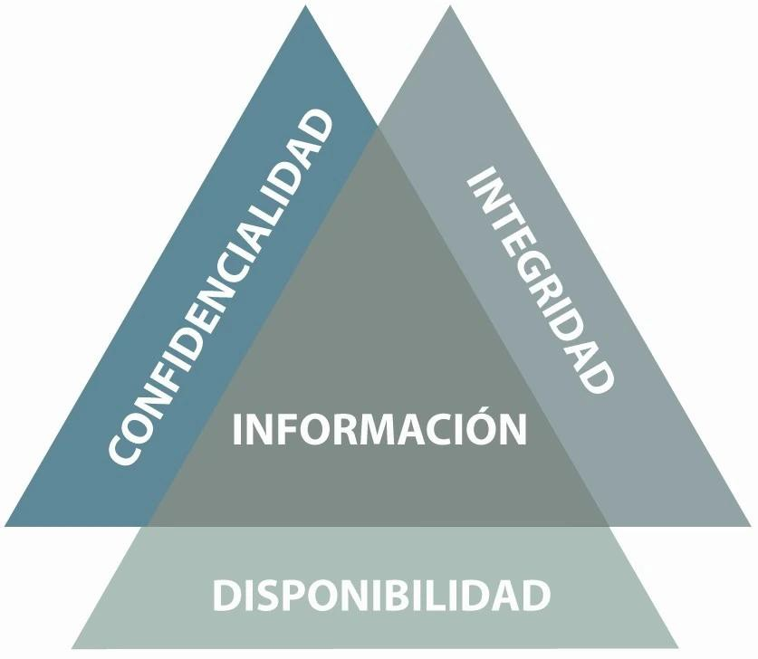

# UT8.1: Seguridad de sistemas informáticos

## Introducción

```note
La seguridad informática es una rama de la informática que se dedica a proteger los sistemas informáticos de amenazas externas e internas y daños causados de forma o no intencionada.
```

Las **amenazas externas** son aquellas que provienen del entorno exterior en el que se encuentra el sistema como, por ejemplo: ataques informáticos, virus, robos de información, etc.

Las **amenazas internas** son aquellas que provienen del propio sistema, como: errores humanos, exposición pública de credenciales, fallos o desactualizaciones en el software y fallos en el hardware, entre otros.

### Pilares de la seguridad informática

Estos son los **cuatro pilares** en los que se basa la seguridad informática:

-   **Disponibilidad**. Los sistemas deben permitir el acceso a la información cuando el usuario lo requiera, sin perder de vista la privacidad.
-   **Confidencialidad**. La información solo debe ser accesible para las personas autorizadas.
-   **Integridad**. Los sistemas deben garantizar la integridad de la información, sin errores ni modificaciones.
-   **Autenticación**. La información que procede de un usuario debe verificarse para garantizar que es quien dice ser.



### Tipos de seguridad informática

Existen tres tipos de seguridad informática: de **hardware**, de **software** y de **red**.

-   La **seguridad de hardware** se encarga de la protección de los datos y los equipos y sistemas de hardware de la entidad del robo o el sabotaje, entre otros daños.
-   La **seguridad de software** tiene como misión proteger la infraestructura relacionada con el software de una organización, así como los datos relacionados con ella. Es decir, intenta evitar ataques de malware, phishing o virus, entre otros peligros.
-   La **seguridad de red** protege la información y la infraestructura relacionada con la red de una entidad. Cualquier problema que haya en ella puede derivar en ataques al software y a los datos, por lo que proteger la integridad de la red es crucial.

### Factores de requisitos de seguridad

Antes de implementar cualquier medida de protección, es fundamental determinar qué aspectos del sistema y de los datos deben protegerse, por qué, y hasta qué punto, especialmente aquellos **factores** que afectan a los requisitos de seguridad.

- Tipo de datos que maneja el sistema: Datos sensibles (personales, financieros, clínicos...) requieren medidas estrictas.
- Entorno legal y normativo: RGPD, LOPDGDD, ISO 27001 pueden imponer requisitos obligatorios.
- Criticidad del sistema: Un servidor web público tendrá necesidades distintas a un servidor de copias de seguridad interno.
- Tamaño y estructura de la organización: No es lo mismo una pyme que una multinacional con sedes en varios países.
- Amenazas y riesgos detectados: Análisis de riesgos para determinar las prioridades de protección.